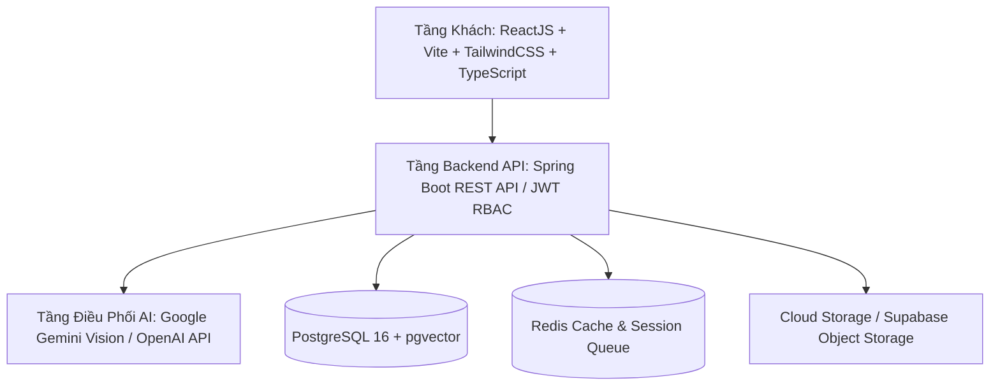

# KẾ HOẠCH & ĐẶC TẢ ĐỀ TÀI TỐT NGHIỆP CAPSTONE PROJECT (FPT UNIVERSITY)
## MediAssist-AI: Nền Tảng Y Tế Hỗ Trợ Phân Loại Triệu Chứng & Tóm Tắt Hồ Sơ Bệnh Án
### AI-Powered Telehealth Platform for Smart Symptom Triage & Medical Record Summarization

> **Trường:** Đại học FPT  
> **Ngành:** Kỹ thuật Phần mềm & Trí tuệ Nhân tạo (SE-AI)  
> **Chuyên ngành:** Information Systems (IS) / Software Engineering  
> **Mô hình triển khai:** Đặt lịch khám trực tiếp tại cơ sở y tế (Online-to-Offline: O2O Clinical Scheduling) kết hợp AI Sàng lọc triệu chứng & Bóc tách kết quả xét nghiệm đa phương thức (Multimodal Vision OCR).

---

## 1. Bối Cảnh & Mục Tiêu Dự Án (Context & Objectives)

Trong hệ thống y tế hiện nay tại Việt Nam và trên thế giới, người bệnh gặp phải 3 rào cản lớn:
1. **Rào cản thuật ngữ y khoa (Medical Jargon Barrier):** Kết quả xét nghiệm sinh hóa, huyết học, đơn thuốc chứa đầy chỉ số viết tắt và thuật ngữ chuyên ngành khó hiểu đối với người dân.
2. **Phân luồng ban đầu kém hiệu quả (Inefficient Triage):** Khi có triệu chứng mơ hồ, người bệnh không biết nên khám chuyên khoa nào (Tim mạch, Tiêu hóa, Thần kinh...), dẫn đến khám sai tuyến, quá tải bệnh viện tuyến trên và chậm trễ điều trị.
3. **Khớp nối Bác sĩ - Bệnh nhân thiếu chính xác (Patient-Doctor Matching):** Bệnh nhân đặt lịch ngẫu nhiên mà không dựa trên sự tương thích giữa triệu chứng lâm sàng và chuyên môn sâu của bác sĩ.

**Mô hình vận hành cốt lõi của MediAssist-AI:**
- **Không phải khám video call từ xa thuần túy:** Đây là nền tảng **Hỗ trợ tiền lâm sàng & Đặt lịch khám trực tiếp (O2O - Online to Offline)**.
- Người bệnh được AI hỗ trợ giải nghĩa phiếu xét nghiệm và sàng lọc triệu chứng online, gợi ý đúng bác sĩ chuyên khoa phù hợp qua tìm kiếm ngữ nghĩa (pgvector).
- Người bệnh đặt khung giờ hẹn đến **khám trực tiếp tại phòng khám/bệnh viện**.
- Bác sĩ trước khi tiếp đón bệnh nhân tại phòng khám có thể xem trước toàn bộ tóm tắt bệnh sử, mức độ khẩn cấp (SBAR) và tài liệu xét nghiệm đã được AI bóc tách sẵn trên màn hình làm việc (Doctor Clinical Workstation).

---

## 2. Kiến Trúc Hệ Thống (System Architecture)

Hệ thống được thiết kế theo mô hình 4 tầng dịch vụ phân tầng:

### 2.1. Phân Quyền 3 Vai Trò Người Dùng (RBAC)
1. **Admin (Quản trị viên hệ thống):**
   - Quản lý tài khoản toàn hệ thống (Bệnh nhân, Bác sĩ).
   - Kiểm duyệt chứng chỉ hành nghề và phê duyệt bác sĩ trước khi được hiển thị đặt lịch.
   - Giám sát chi phí API AI, lượng token tiêu thụ và tần suất gọi API.
   - Quản lý danh mục chuyên khoa và nhật ký kiểm toán hệ thống (Audit Logs).
2. **Doctor (Bác sĩ điều trị):**
   - Cấu hình lịch làm việc, ca khám trực tiếp theo ngày trong tuần.
   - Xem danh sách ca khám và lịch làm việc trực quan (Interactive Calendar / Grid).
   - Xem tổng quan ca bệnh trước giờ khám: giao diện chia đôi (Split-screen) xem tệp xét nghiệm gốc cạnh bản tóm tắt AI.
   - Cập nhật trạng thái ca khám, ghi nhận bệnh án ngoại trú (EMR) và kê đơn thuốc.
3. **Patient (Bệnh nhân):**
   - Tương tác với Chatbot AI sàng lọc triệu chứng bằng ngôn ngữ tự nhiên.
   - Tải lên tài liệu xét nghiệm (PDF/Ảnh) để nhận bản giải nghĩa ngôn ngữ bình dân.
   - Nhận danh sách bác sĩ chuyên khoa phù hợp theo độ tương đồng ngữ nghĩa pgvector.
   - Đặt lịch khám, nhận phiếu khám điện tử (STT, phòng khám, hướng dẫn chuẩn bị).
   - Quản lý hồ sơ bệnh án cá nhân (EMR Medical Passport).

---

## 3. Các Phân Hệ Tính Năng Cốt Lõi (Core Functional Requirements)

### Phân Hệ 1: Trợ Lý Chatbot Sàng Lọc Triệu Chứng (Conversational AI Triage)
- Giao diện dạng Chatbot hội thoại tự nhiên (Multi-turn conversational UI).
- Hệ thống nhắc câu hỏi làm rõ (Clarifying Questions) để người bệnh trả lời bổ sung.
- Hệ thống phân cấp độ khẩn cấp: `ROUTINE` (Thông thường), `URGENT` (Cần khám sớm), `EMERGENCY` (Cấp cứu khẩn cấp).
- Cảnh báo rào chắn an toàn y khoa (Medical Disclaimer): Khẳng định AI chỉ đóng vai trò thông tin tham khảo, không thay thế chẩn đoán y tế.
- Khớp nối danh sách bác sĩ chuyên khoa tương thích qua Vector Embeddings (`pgvector`).

### Phân Hệ 2: Bóc Tách & Tóm Tắt Tài Liệu Đa Phương Thức (Multimodal Document Summarizer)
- Tải lên tệp PDF hoặc Hình ảnh (PNG/JPEG) phiếu xét nghiệm, siêu âm, điện tim.
- Vision AI trích xuất (OCR) các chỉ số sinh hóa, đối chiếu khoảng tham chiếu sinh lý.
- Cảnh báo chỉ số bất thường (`ELEVATED`, `LOW`, `NORMAL`) và giải nghĩa dễ hiểu.
- Liên kết vĩnh viễn tài liệu xét nghiệm với ca khám khi đặt lịch (`medical_document_id`).

### Phân Hệ 3: Đặt Lịch Khám Trực Tiếp Tại Cơ Sở Y Tế (O2O In-Clinic Scheduling)
- Chọn bác sĩ, ngày khám và khung giờ còn trống (Available Slot).
- Rào chắn giờ hành chính y tế: `08:00 - 12:00` và `13:30 - 17:00` (Nghỉ Chủ Nhật).
- Tự động cấp Số thứ tự tiếp đón (`STT 01`, `STT 02`...).
- **Phiếu khám bệnh điện tử tiếp đón:**
  * Thông tin cơ sở khám: Tên bệnh viện, địa chỉ, số phòng khám, số tầng, tòa nhà.
  * Chỉ dẫn Google Maps vị trí bệnh viện.
  * Lời dặn trước khi khám (nhịn ăn xét nghiệm máu, mang CCCD/BHYT gốc, đến trước 15 phút).
  * Tiện ích xuất lịch hẹn Google Calendar / file `.ics`.
- Hỗ trợ bệnh nhân chủ động Dời lịch hẹn (`Reschedule`) và Hủy lịch có hoàn tiền.

### Phân Hệ 4: Bàn Khám Bác Sĩ (Doctor Clinical Workstation)
- Hàng đợi bệnh nhân theo số thứ tự tiếp đón trong ngày (Sequential Queue).
- **Giao diện Split-Screen xem bệnh án:** Xem tệp xét nghiệm gốc bên cạnh bản bóc tách AI và tóm tắt SBAR để bác sĩ đối chiếu lâm sàng nhanh chóng trước khi gọi bệnh nhân vào phòng.
- Ghi nhận diễn tiến lâm sàng, sinh hiệu, chẩn đoán mã ICD-10 và kê đơn thuốc ngoại trú.
- Đặt lịch hẹn tái khám trực tiếp cho bệnh nhân.

### Phân Hệ 5: Giám Sát Chi Phí Token AI & Kiểm Duyệt Admin (AI Cost Analytics & Admin Vetting)
- Bảng điều khiển theo dõi mức độ tiêu thụ Token API (Gemini/OpenAI): Tổng số lượt gọi, token prompt, token completion, ước tính chi phí ($ USD / VNĐ).
- Quy trình phê duyệt chứng chỉ hành nghề bác sĩ (Doctor Verification Pipeline).
- Giám sát toàn bộ lịch hẹn và phiên sàng lọc triệu chứng.
- Nhật ký kiểm toán hành vi (Audit Logs) đảm bảo an toàn dữ liệu y tế.

---

## 4. Công Nghệ & Chuẩn Mực Triển Khai (Technology Stack)

| Thành Phần | Công Nghệ Sử Dụng |
| :--- | :--- |
| **Frontend** | React 18 (Vite), TypeScript, TailwindCSS, Lucide Icons, Zustand Store |
| **Backend** | Java 21 LTS, Spring Boot 3.4.x, Spring Security 6 (JWT + Google OAuth2), Hibernate 6 |
| **Database** | PostgreSQL 16 LTS với Extension `pgvector` (Vector Cosine Similarity) |
| **Cache & Queue** | Redis Cluster (L2 Cache, Rate Limiting, Session State) |
| **Database Migration** | Flyway Migrations (V1 $\rightarrow$ V19) |
| **AI Models (API Only)**| Google Gemini 1.5 Flash (Vision OCR & Scribe) / OpenAI Embeddings |
| **Testing** | JUnit 5, Mockito, Spring Boot Test (158+ Unit Tests) |
| **DevOps** | Docker, Docker Compose, Nginx Reverse Proxy, Enforced HTTPS |
