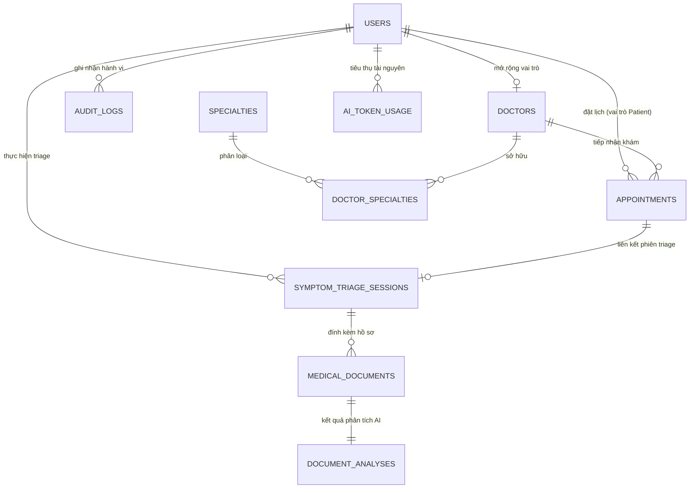

# Kiến Trúc Cơ Sở Dữ Liệu Chuyên Sâu - MediAssist-AI
## Enterprise Database Architecture Specification (PostgreSQL 16 + pgvector)

> **Mã tài liệu:** MEDIASSIST-DB-SPEC-2026  
> **Phiên bản:** 2.0 (Enterprise-Ready & Capstone Thesis Approved)  
> **DBMS:** PostgreSQL 16.x LTS với phần mở rộng vector `pgvector` (0.7+)  
> **Cache Tier:** 2-Layer Hybrid (L1 Caffeine in-memory + L2 Redis Cluster)  
> **Chuẩn tuân thủ:** HIPAA Security Rule, Bộ Y Tế Việt Nam (Thông tư 46/2018/TT-BYT về bệnh án điện tử)

---

## 1. Mô Hình Thực Thể Quan Hệ (Conceptual & Logical Data Model)

MediAssist-AI phục vụ hệ sinh thái khám chữa bệnh từ xa (Telehealth) kết hợp AI hỗ trợ phân luồng triệu chứng và giải nghĩa hồ sơ xét nghiệm. Cơ sở dữ liệu được thiết kế đạt chuẩn chuẩn hóa **3NF (Third Normal Form)** để đảm bảo tính toàn vẹn dữ liệu giao dịch y tế, đồng thời bổ sung **Vector Embeddings (1536 chiều)** phục vụ tìm kiếm ngữ nghĩa thông minh.



---

## 2. Chi Tiết Lược Đồ Bảng (Physical Database Schema DDL)

### 2.1. Cài Đặt Tiền Tố & Extension
```sql
-- Kích hoạt extension hỗ trợ sinh UUIDv4 và Vector Similarity Search
CREATE EXTENSION IF NOT EXISTS "uuid-ossp";
CREATE EXTENSION IF NOT EXISTS "vector";
CREATE EXTENSION IF NOT EXISTS "pg_trgm"; -- Hỗ trợ full-text search tiếng Việt
```

---

### 2.2. Nhóm Bảng Phân Quyền & Người Dùng (Identity & RBAC)

#### Bảng `users`
Lưu trữ định danh toàn bộ chủ thể truy cập (Admin, Bác sĩ, Bệnh nhân).

```sql
CREATE TABLE users (
    id UUID PRIMARY KEY DEFAULT uuid_generate_v4(),
    email VARCHAR(255) NOT NULL UNIQUE,
    password_hash VARCHAR(255) NOT NULL,
    full_name VARCHAR(150) NOT NULL,
    phone_number VARCHAR(20) UNIQUE,
    avatar_url TEXT,
    role VARCHAR(30) NOT NULL CHECK (role IN ('ADMIN', 'DOCTOR', 'PATIENT')),
    is_active BOOLEAN NOT NULL DEFAULT TRUE,
    is_email_verified BOOLEAN NOT NULL DEFAULT FALSE,
    failed_login_attempts INT NOT NULL DEFAULT 0,
    locked_until TIMESTAMPTZ,
    last_login_at TIMESTAMPTZ,
    created_at TIMESTAMPTZ NOT NULL DEFAULT CURRENT_TIMESTAMP,
    updated_at TIMESTAMPTZ NOT NULL DEFAULT CURRENT_TIMESTAMP
);

CREATE INDEX idx_users_email ON users(email);
CREATE INDEX idx_users_role ON users(role);
CREATE INDEX idx_users_phone ON users(phone_number);
```

---

### 2.3. Nhóm Bảng Hồ Sơ Bác Sĩ & Chuyên Khoa (Clinical Providers)

#### Bảng `specialties`
Danh mục chuyên khoa y tế chuẩn hóa (Tim mạch, Da liễu, Nhi khoa, v.v.).

```sql
CREATE TABLE specialties (
    id UUID PRIMARY KEY DEFAULT uuid_generate_v4(),
    code VARCHAR(50) NOT NULL UNIQUE,
    name VARCHAR(150) NOT NULL,
    description TEXT,
    icon_url TEXT,
    is_active BOOLEAN NOT NULL DEFAULT TRUE,
    created_at TIMESTAMPTZ NOT NULL DEFAULT CURRENT_TIMESTAMP
);

CREATE INDEX idx_specialties_code ON specialties(code);
```

#### Bảng `doctors`
Hồ sơ chứng chỉ hành nghề, học vị và vector biểu diễn chuyên môn lâm sàng.

```sql
CREATE TABLE doctors (
    id UUID PRIMARY KEY REFERENCES users(id) ON DELETE CASCADE,
    license_number VARCHAR(100) NOT NULL UNIQUE, -- Số Chứng chỉ hành nghề (CCHN)
    license_issued_date DATE NOT NULL,
    license_issued_by VARCHAR(200) NOT NULL,     -- Bộ Y Tế hoặc Sở Y Tế cấp
    title VARCHAR(100) NOT NULL,                 -- Thạc sĩ, Tiến sĩ, Bác sĩ CKI, CKII
    workplace VARCHAR(255) NOT NULL,             -- Bệnh viện công tác hiện tại
    biography TEXT NOT NULL,                     -- Quá trình công tác, thế mạnh lâm sàng
    bio_embedding vector(1536),                  -- Text-embedding-3-small vector
    consultation_fee NUMERIC(12, 2) NOT NULL DEFAULT 300000.00,
    vetting_status VARCHAR(30) NOT NULL DEFAULT 'PENDING' 
        CHECK (vetting_status IN ('PENDING', 'VERIFIED', 'REJECTED', 'SUSPENDED')),
    vetted_by UUID REFERENCES users(id),
    vetted_at TIMESTAMPTZ,
    rejection_reason TEXT,
    years_of_experience INT NOT NULL DEFAULT 0,
    rating_avg NUMERIC(3, 2) NOT NULL DEFAULT 5.00,
    review_count INT NOT NULL DEFAULT 0,
    created_at TIMESTAMPTZ NOT NULL DEFAULT CURRENT_TIMESTAMP,
    updated_at TIMESTAMPTZ NOT NULL DEFAULT CURRENT_TIMESTAMP
);

-- Index HNSW tăng tốc truy vấn vector tương đồng cosine cho Doctor Matching
CREATE INDEX idx_doctors_bio_embedding_hnsw ON doctors 
USING hnsw (bio_embedding vector_cosine_ops)
WITH (m = 16, ef_construction = 64);

CREATE INDEX idx_doctors_vetting_status ON doctors(vetting_status);
```

#### Bảng trung gian `doctor_specialties`
```sql
CREATE TABLE doctor_specialties (
    doctor_id UUID NOT NULL REFERENCES doctors(id) ON DELETE CASCADE,
    specialty_id UUID NOT NULL REFERENCES specialties(id) ON DELETE RESTRICT,
    is_primary BOOLEAN NOT NULL DEFAULT FALSE,
    PRIMARY KEY (doctor_id, specialty_id)
);
```

---

### 2.4. Nhóm Bảng AI Symptom Triage & Phân Tích Bệnh Án (AI Workflow)

#### Bảng `symptom_triage_sessions`
Lưu trữ toàn bộ phiên hội thoại sàng lọc sơ bộ giữa bệnh nhân và trợ lý AI.

```sql
CREATE TABLE symptom_triage_sessions (
    id UUID PRIMARY KEY DEFAULT uuid_generate_v4(),
    patient_id UUID NOT NULL REFERENCES users(id) ON DELETE CASCADE,
    chief_complaint TEXT NOT NULL,                -- Triệu chứng chính (Bệnh nhân tự khai)
    chief_complaint_embedding vector(1536),       -- Vector nhúng ngữ nghĩa triệu chứng
    conversation_history JSONB NOT NULL DEFAULT '[]'::jsonb, -- Toàn bộ đoạn chat
    ai_risk_level VARCHAR(20) NOT NULL DEFAULT 'LOW' 
        CHECK (ai_risk_level IN ('EMERGENCY', 'URGENT', 'ROUTINE', 'LOW')),
    recommended_specialty_id UUID REFERENCES specialties(id),
    clinical_summary TEXT,                        -- Tóm tắt chuẩn SBAR gửi cho bác sĩ
    is_red_flag_triggered BOOLEAN NOT NULL DEFAULT FALSE,
    disclaimer_acknowledged BOOLEAN NOT NULL DEFAULT TRUE,
    created_at TIMESTAMPTZ NOT NULL DEFAULT CURRENT_TIMESTAMP,
    updated_at TIMESTAMPTZ NOT NULL DEFAULT CURRENT_TIMESTAMP
);

CREATE INDEX idx_triage_patient ON symptom_triage_sessions(patient_id);
CREATE INDEX idx_triage_risk ON symptom_triage_sessions(ai_risk_level);
CREATE INDEX idx_triage_created_at ON symptom_triage_sessions(created_at DESC);
```

#### Bảng `medical_documents` & `document_analyses`
Lưu trữ siêu dữ liệu tài liệu y tế (kết quả xét nghiệm, đơn thuốc, phim chụp) và giải nghĩa.

```sql
CREATE TABLE medical_documents (
    id UUID PRIMARY KEY DEFAULT uuid_generate_v4(),
    patient_id UUID NOT NULL REFERENCES users(id) ON DELETE CASCADE,
    file_name VARCHAR(255) NOT NULL,
    file_size_bytes BIGINT NOT NULL,
    mime_type VARCHAR(100) NOT NULL,
    storage_path TEXT NOT NULL,                  -- Đường dẫn MinIO / S3 Encrypted
    ocr_raw_text TEXT,                           -- Văn bản trích xuất thô
    created_at TIMESTAMPTZ NOT NULL DEFAULT CURRENT_TIMESTAMP
);

CREATE TABLE document_analyses (
    id UUID PRIMARY KEY DEFAULT uuid_generate_v4(),
    document_id UUID NOT NULL UNIQUE REFERENCES medical_documents(id) ON DELETE CASCADE,
    plain_language_summary TEXT NOT NULL,       -- Bản dịch ngữ nghĩa thông thường
    extracted_lab_indicators JSONB,              -- Chỉ số: { "Cholesterol": { "value": 6.2, "unit": "mmol/L", "is_abnormal": true } }
    suggested_questions_for_doctor TEXT[],       -- Câu hỏi AI gợi ý bệnh nhân nên hỏi bác sĩ
    model_version VARCHAR(50) NOT NULL,          -- gpt-4o / gemini-1.5-pro
    created_at TIMESTAMPTZ NOT NULL DEFAULT CURRENT_TIMESTAMP
);
```

---

### 2.5. Nhóm Bảng Lịch Hẹn Khám & Giao Dịch (Telehealth Appointments)

#### Bảng `appointments`
Quản lý vòng đời ca khám từ xa với cơ chế kiểm soát concurrency chặt chẽ.

```sql
CREATE TABLE appointments (
    id UUID PRIMARY KEY DEFAULT uuid_generate_v4(),
    appointment_code VARCHAR(30) NOT NULL UNIQUE, -- Mã tra cứu: AP-20260311-XXXX
    patient_id UUID NOT NULL REFERENCES users(id) ON DELETE RESTRICT,
    doctor_id UUID NOT NULL REFERENCES doctors(id) ON DELETE RESTRICT,
    triage_session_id UUID REFERENCES symptom_triage_sessions(id),
    scheduled_start TIMESTAMPTZ NOT NULL,
    scheduled_end TIMESTAMPTZ NOT NULL,
    status VARCHAR(30) NOT NULL DEFAULT 'SCHEDULED'
        CHECK (status IN ('SCHEDULED', 'IN_PROGRESS', 'COMPLETED', 'CANCELLED', 'NO_SHOW')),
    cancellation_reason TEXT,
    consultation_notes TEXT,                     -- Ghi chú chẩn đoán của Bác sĩ sau buổi khám
    telehealth_room_id VARCHAR(100),             -- Room ID WebRTC/Jitsi
    fee_amount NUMERIC(12, 2) NOT NULL,
    payment_status VARCHAR(30) NOT NULL DEFAULT 'UNPAID'
        CHECK (payment_status IN ('UNPAID', 'PAID', 'REFUNDED')),
    version BIGINT NOT NULL DEFAULT 0,           -- Optimistic Locking chống đặt trùng slot
    created_at TIMESTAMPTZ NOT NULL DEFAULT CURRENT_TIMESTAMP,
    updated_at TIMESTAMPTZ NOT NULL DEFAULT CURRENT_TIMESTAMP,
    CONSTRAINT check_appointment_times CHECK (scheduled_end > scheduled_start)
);

-- Index ngăn chặn trùng lịch cùng một bác sĩ trong cùng khoảng thời gian
CREATE UNIQUE INDEX idx_unique_doctor_schedule 
ON appointments(doctor_id, scheduled_start) 
WHERE status NOT IN ('CANCELLED');

CREATE INDEX idx_appointments_patient ON appointments(patient_id);
CREATE INDEX idx_appointments_doctor ON appointments(doctor_id);
CREATE INDEX idx_appointments_status ON appointments(status);
```

---

### 2.6. Nhóm Bảng Giám Sát Chi Phí & Kiểm Toán (FinOps & Audit Security)

#### Bảng `ai_token_usage`
Theo dõi sát sao từng request gọi sang OpenAI/Gemini để kiểm soát chi phí thực tế và phát hiện lạm dụng.

```sql
CREATE TABLE ai_token_usage (
    id UUID PRIMARY KEY DEFAULT uuid_generate_v4(),
    user_id UUID REFERENCES users(id),
    feature VARCHAR(50) NOT NULL,                -- TRIAGE_CHAT, DOCUMENT_OCR, VECTOR_EMBED
    model_name VARCHAR(50) NOT NULL,             -- gpt-4o, gemini-1.5-pro, text-embedding-3-small
    prompt_tokens INT NOT NULL DEFAULT 0,
    completion_tokens INT NOT NULL DEFAULT 0,
    total_tokens INT NOT NULL DEFAULT 0,
    estimated_cost_usd NUMERIC(10, 6) NOT NULL DEFAULT 0.000000,
    latency_ms INT NOT NULL DEFAULT 0,
    created_at TIMESTAMPTZ NOT NULL DEFAULT CURRENT_TIMESTAMP
);

CREATE INDEX idx_ai_token_feature ON ai_token_usage(feature);
CREATE INDEX idx_ai_token_created ON ai_token_usage(created_at);
```

#### Bảng `audit_logs`
Ghi nhận toàn bộ thao tác nhạy cảm (Đăng nhập, xem bệnh án, duyệt bác sĩ) phục vụ pháp lý.

```sql
CREATE TABLE audit_logs (
    id UUID PRIMARY KEY DEFAULT uuid_generate_v4(),
    actor_id UUID REFERENCES users(id),
    action VARCHAR(100) NOT NULL,               -- USER_LOGIN, VIEW_MEDICAL_DOC, VET_DOCTOR_APPROVE
    entity_name VARCHAR(50) NOT NULL,           -- users, doctors, appointments
    entity_id UUID,
    client_ip VARCHAR(50),
    user_agent TEXT,
    old_state JSONB,
    new_state JSONB,
    created_at TIMESTAMPTZ NOT NULL DEFAULT CURRENT_TIMESTAMP
);

CREATE INDEX idx_audit_actor ON audit_logs(actor_id);
CREATE INDEX idx_audit_action ON audit_logs(action);
CREATE INDEX idx_audit_created ON audit_logs(created_at DESC);
```

---

## 3. Chiến Lược Vector Similarity Search (`pgvector`)

Khi bệnh nhân mô tả triệu chứng: *"Tôi bị đau tức ngực trái lan ra vai, kèm khó thở khi leo cầu thang"*:
1. LLM Service tạo vector nhúng 1536 chiều $V_{query}$ bằng `text-embedding-3-small`.
2. PostgreSQL thực thi câu lệnh truy vấn Vector Cosine Distance:
```sql
SELECT 
    d.id,
    u.full_name,
    d.title,
    d.workplace,
    d.consultation_fee,
    d.rating_avg,
    (1 - (d.bio_embedding <=> $1)) AS similarity_score
FROM doctors d
JOIN users u ON d.id = u.id
WHERE d.vetting_status = 'VERIFIED'
ORDER BY d.bio_embedding <=> $1 ASC
LIMIT 5;
```
*Ghi chú:* Toán tử `<=>` tính khoảng cách Cosine Distance ($1 - \text{Cosine Similarity}$). Thuật toán **HNSW Index** giúp độ trễ tìm kiếm duy trì ở mức $< 15\text{ms}$ ngay cả khi tập dữ liệu mở rộng đến $100.000$ hồ sơ bác sĩ.

---

## 4. Tối Ưu Hóa Hiệu Năng & Connection Pool (HikariCP)

| Tham Số Cấu Hình | Giá Trị Dev | Giá Trị Production | Giải Thích Kỹ Thuật |
| :--- | :--- | :--- | :--- |
| `maximum-pool-size` | 10 | 30 - 50 | Giới hạn số connection đồng thời dựa trên công thức $N_{cpu} \times 2 + N_{spindle}$. |
| `minimum-idle` | 5 | 10 | Đảm bảo sẵn sàng phục vụ lượt truy cập đột biến (Spike load). |
| `idle-timeout` | 30000 ms | 600000 ms | Đóng connection rảnh rỗi quá lâu để giải phóng RAM cho PostgreSQL. |
| `max-lifetime` | 1800000 ms | 1800000 ms | Định kỳ làm mới connection (30 phút) tránh stale TCP socket. |
| `connection-timeout` | 20000 ms | 30000 ms | Thời gian chờ tối đa khi pool quá tải trước khi ném ngoại lệ. |

---

## 5. Chính Sách Sao Lưu & Phục Hồi Dữ Liệu (Enterprise SLA)

* **RPO (Recovery Point Objective):** $\le 5$ phút thông qua **PostgreSQL WAL Archiving** (Write-Ahead Logging) lưu trữ trên S3 Cold Storage.
* **RTO (Recovery Time Objective):** $\le 30$ phút cho khôi phục tự động toàn bộ cụm Primary-Replica.
* **Mã hóa:** Toàn bộ dữ liệu at-rest (Data at Rest) được mã hóa AES-256 ở tầng Tablespace; đường truyền (Data in Transit) bắt buộc TLS 1.3.
