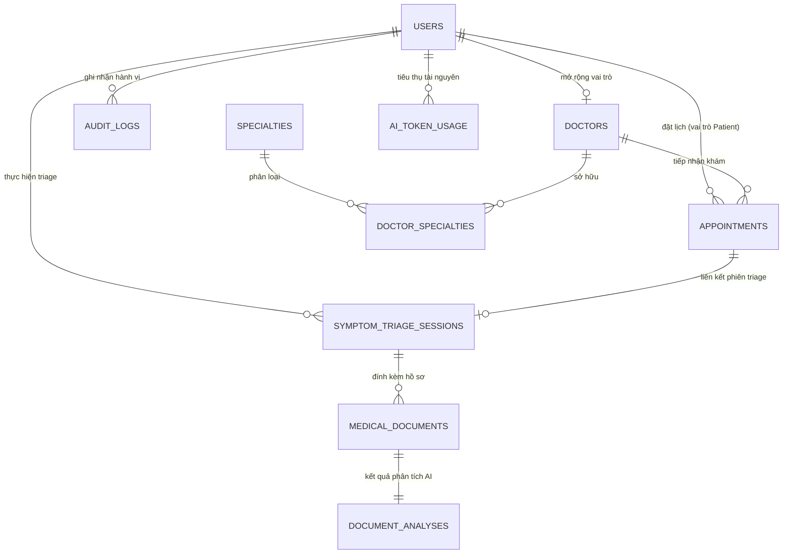

# Kiến Trúc Cơ Sở Dữ Liệu Chuyên Sâu - MediAssist-AI
## Enterprise Database Architecture Specification (PostgreSQL 16 + pgvector)

> **Mã tài liệu:** MEDIASSIST-DB-SPEC-2026  
> **Phiên bản:** 2.0 (Enterprise-Ready & Capstone Thesis Approved)  
> **DBMS:** PostgreSQL 16.x LTS với phần mở rộng vector `pgvector` (0.7+)  
> **Cache Tier:** 2-Layer Hybrid (L1 Caffeine in-memory + L2 Redis Cluster)  
> **Chuẩn tuân thủ:** HIPAA Security Rule, Bộ Y Tế Việt Nam (Thông tư 46/2018/TT-BYT về bệnh án điện tử)

---

## 1. Mô Hình Thực Thể Quan Hệ (Conceptual & Logical Data Model)

MediAssist-AI phục vụ hệ sinh thái khám chữa bệnh từ xa (Telehealth) kết hợp AI hỗ trợ phân luồng triệu chứng và giải nghĩa hồ sơ xét nghiệm. Cơ sở dữ liệu được thiết kế đạt chuẩn chuẩn hóa **3NF (Third Normal Form)** để đảm bảo tính toàn vẹn dữ liệu giao dịch y tế, đồng thời bổ sung **Vector Embeddings (1536 chiều)** phục vụ tìm kiếm ngữ nghĩa thông minh.



---

## 2. Chi Tiết Lược Đồ Bảng (Physical Database Schema DDL)

### 2.1. Cài Đặt Tiền Tố & Extension
```sql
-- Kích hoạt extension hỗ trợ sinh UUIDv4 và Vector Similarity Search
CREATE EXTENSION IF NOT EXISTS "uuid-ossp";
CREATE EXTENSION IF NOT EXISTS "vector";
CREATE EXTENSION IF NOT EXISTS "pg_trgm"; -- Hỗ trợ full-text search tiếng Việt
```

---

### 2.2. Nhóm Bảng Phân Quyền & Người Dùng (Identity & RBAC)

#### Bảng `users`
Lưu trữ định danh toàn bộ chủ thể truy cập (Admin, Bác sĩ, Bệnh nhân).

```sql
CREATE TABLE users (
    id UUID PRIMARY KEY DEFAULT uuid_generate_v4(),
    email VARCHAR(255) NOT NULL UNIQUE,
    password_hash VARCHAR(255),                   -- Nullable cho tài khoản đăng ký qua Google OAuth2
    full_name VARCHAR(150) NOT NULL,
    phone_number VARCHAR(20) UNIQUE,
    avatar_url TEXT,
    google_id VARCHAR(255) UNIQUE,               -- Định danh Google Account phục vụ Social Login (OAuth2)
    role VARCHAR(30) NOT NULL CHECK (role IN ('ADMIN', 'DOCTOR', 'PATIENT')),
    is_active BOOLEAN NOT NULL DEFAULT TRUE,
    is_email_verified BOOLEAN NOT NULL DEFAULT FALSE,
    scan_quota INT NOT NULL DEFAULT 1,            -- Số lượt phân tích tài liệu khả dụng
    subscription_tier VARCHAR(30) NOT NULL DEFAULT 'FREE', -- FREE, VIP_MONTHLY, VIP_YEARLY
    vip_valid_until TIMESTAMPTZ,                 -- Hạn hội viên MediPass VIP
    failed_login_attempts INT NOT NULL DEFAULT 0,
    locked_until TIMESTAMPTZ,
    last_login_at TIMESTAMPTZ,
    created_at TIMESTAMPTZ NOT NULL DEFAULT CURRENT_TIMESTAMP,
    updated_at TIMESTAMPTZ NOT NULL DEFAULT CURRENT_TIMESTAMP
);

CREATE INDEX idx_users_email ON users(email);
CREATE INDEX idx_users_role ON users(role);
CREATE INDEX idx_users_phone ON users(phone_number);
CREATE INDEX idx_users_locked_until ON users(locked_until);

#### Bảng `patient_profiles` (Hồ Sơ Y Tế & Bệnh Án Điện Tử - EMR Medical Passport)
Lưu trữ thông tin hành chính, số định danh y tế, thẻ BHYT, tiền sử dị ứng và nhóm máu theo chuẩn Bộ Y Tế.

```sql
CREATE TABLE patient_profiles (
    id UUID PRIMARY KEY DEFAULT gen_random_uuid(),
    user_id UUID NOT NULL UNIQUE REFERENCES users(id) ON DELETE CASCADE,
    patient_code VARCHAR(50) NOT NULL UNIQUE,     -- Mã định danh bệnh viện: BN-2026-XXXXX
    citizen_id VARCHAR(20) UNIQUE,                -- Căn cước công dân (12 số)
    health_insurance_number VARCHAR(30),          -- Mã thẻ BHYT chuẩn 15 ký tự (Ví dụ: DN4791234567890)
    date_of_birth DATE,                           -- Ngày sinh
    gender VARCHAR(10),                           -- MALE, FEMALE, OTHER
    blood_group VARCHAR(10),                      -- A+, B+, AB+, O+, A-, B-, AB-, O-
    address TEXT,                                 -- Địa chỉ thường trú
    allergies TEXT,                               -- Dị ứng thuốc & thức ăn (Ví dụ: Penicillin, NSAIDs)
    medical_history TEXT,                         -- Tiền sử bệnh lý nền (Tăng huyết áp, Đái tháo đường...)
    emergency_contact_name VARCHAR(150),          -- Người liên hệ khẩn cấp
    emergency_contact_phone VARCHAR(20),          -- Số điện thoại khẩn cấp
    emergency_contact_relationship VARCHAR(50),   -- Mối quan hệ (Bố/Mẹ/Vợ/Chồng...)
    created_at TIMESTAMPTZ NOT NULL DEFAULT CURRENT_TIMESTAMP,
    updated_at TIMESTAMPTZ NOT NULL DEFAULT CURRENT_TIMESTAMP
);

CREATE INDEX idx_patient_code ON patient_profiles(patient_code);
CREATE INDEX idx_patient_citizen_id ON patient_profiles(citizen_id);
CREATE INDEX idx_patient_user_id ON patient_profiles(user_id);
```
```

---

### 2.3. Nhóm Bảng Hồ Sơ Bác Sĩ & Chuyên Khoa (Clinical Providers)

#### Bảng `specialties`
Danh mục chuyên khoa y tế chuẩn hóa (Tim mạch, Da liễu, Nhi khoa, v.v.).

```sql
CREATE TABLE specialties (
    id UUID PRIMARY KEY DEFAULT uuid_generate_v4(),
    code VARCHAR(50) NOT NULL UNIQUE,
    name VARCHAR(150) NOT NULL,
    description TEXT,
    icon_url TEXT,
    is_active BOOLEAN NOT NULL DEFAULT TRUE,
    created_at TIMESTAMPTZ NOT NULL DEFAULT CURRENT_TIMESTAMP
);

CREATE INDEX idx_specialties_code ON specialties(code);
```

#### Bảng `doctors`
Hồ sơ chứng chỉ hành nghề, học vị và vector biểu diễn chuyên môn lâm sàng.

```sql
#### Bảng `doctor_profiles`
Hồ sơ chứng chỉ hành nghề, học vị và vector biểu diễn chuyên môn lâm sàng thực tế (`doctor_profiles`).

```sql
CREATE TABLE doctor_profiles (
    id UUID PRIMARY KEY DEFAULT gen_random_uuid(),
    user_id UUID NOT NULL UNIQUE REFERENCES users(id) ON DELETE CASCADE,
    bio TEXT,                                    -- Tiểu sử, kinh nghiệm và thế mạnh lâm sàng
    license_number VARCHAR(255) UNIQUE,          -- Số CCHN y tế (Ví dụ: 008921/BYT-CCHN)
    license_document_url VARCHAR(255),           -- Ảnh/PDF chứng chỉ hành nghề
    consultation_fee NUMERIC(10, 2) DEFAULT 0.00,-- Phí khám tư vấn (VND)
    years_of_experience INT DEFAULT 0,           -- Số năm kinh nghiệm
    academic_title VARCHAR(50),                  -- Chức danh học thuật: GS.TS, PGS.TS, TS.BS, BS.CKII, BS.CKI
    hospital_affiliation VARCHAR(150),           -- Bệnh viện công tác: BV Đại Học Y Dược, BV Chợ Rẫy
    department VARCHAR(150),                     -- Khoa chuyên môn trực thuộc: Khoa Tim Mạch Can Thiệp
    license_issued_by VARCHAR(150),              -- Đơn vị cấp CCHN: Cục Quản lý Khám chữa bệnh - Bộ Y Tế
    rating DOUBLE PRECISION DEFAULT 4.9,         -- Điểm đánh giá hài lòng người bệnh (1.0 - 5.0)
    total_consultations INT DEFAULT 1250,        -- Tổng số ca khám lâm sàng đã hoàn thành
    is_verified BOOLEAN NOT NULL DEFAULT FALSE,  -- Trạng thái phê duyệt của Admin
    verified_at TIMESTAMPTZ,
    bio_embedding vector(1536),                  -- Vector nhúng 1536 chiều từ Bio + Chuyên khoa
    created_at TIMESTAMPTZ NOT NULL DEFAULT CURRENT_TIMESTAMP,
    updated_at TIMESTAMPTZ NOT NULL DEFAULT CURRENT_TIMESTAMP
);

-- Index HNSW tăng tốc truy vấn vector tương đồng cosine cho Semantic Doctor Matching
CREATE INDEX idx_doctor_bio_hnsw ON doctor_profiles 
USING hnsw (bio_embedding vector_cosine_ops);

CREATE INDEX idx_doctor_verified ON doctor_profiles(is_verified);
```

#### Bảng trung gian `doctor_specialties`
```sql
CREATE TABLE doctor_specialties (
    doctor_profile_id UUID NOT NULL REFERENCES doctor_profiles(id) ON DELETE CASCADE,
    specialty_id UUID NOT NULL REFERENCES specialties(id) ON DELETE RESTRICT,
    PRIMARY KEY (doctor_profile_id, specialty_id)
);
```

---

### 2.4. Nhóm Bảng AI Symptom Triage & Phân Tích Bệnh Án (AI Workflow)

#### Bảng `triage_sessions` (Hiện thực hóa chuẩn hóa của `symptom_triage_sessions`)
Lưu trữ toàn bộ phiên hội thoại sàng lọc sơ bộ giữa bệnh nhân và trợ lý AI.

```sql
CREATE TABLE triage_sessions (
    id UUID PRIMARY KEY DEFAULT gen_random_uuid(),
    user_id UUID REFERENCES users(id) ON DELETE SET NULL, -- Nullable cho khách vãng lai
    patient_name VARCHAR(255),
    symptoms_text TEXT NOT NULL,                  -- Lời khai triệu chứng bệnh nhân
    is_emergency BOOLEAN NOT NULL DEFAULT FALSE,  -- Đánh dấu cờ đỏ cấp cứu
    urgency_level VARCHAR(20) NOT NULL           -- ROUTINE, URGENT, EMERGENCY
        CHECK (urgency_level IN ('ROUTINE', 'URGENT', 'EMERGENCY')),
    primary_specialty VARCHAR(100),               -- Slug chuyên khoa gợi ý (cardiology, neurology...)
    sbar_summary TEXT,                            -- Báo cáo lâm sàng chuẩn SBAR
    ai_advice TEXT,                               -- Lời khuyên ban đầu cho người bệnh
    conversation_history TEXT,                    -- Lịch sử trao đổi
    created_at TIMESTAMPTZ NOT NULL DEFAULT CURRENT_TIMESTAMP
);

CREATE INDEX idx_triage_user ON triage_sessions(user_id);
CREATE INDEX idx_triage_urgency ON triage_sessions(urgency_level);
CREATE INDEX idx_triage_created_at ON triage_sessions(created_at DESC);
```
```

#### Bảng `medical_documents` & `document_analyses`
Lưu trữ siêu dữ liệu tài liệu y tế (kết quả xét nghiệm, đơn thuốc, phim chụp) và kết quả phân tích chỉ số cận lâm sàng, đề xuất bác sĩ chuyên khoa (`MedicalDocument` & `DocumentAnalysis`).

```sql
CREATE TABLE medical_documents (
    id UUID PRIMARY KEY DEFAULT gen_random_uuid(),
    user_id UUID REFERENCES users(id) ON DELETE SET NULL, -- Khách vãng lai hoặc bệnh nhân định danh
    file_name VARCHAR(255) NOT NULL,
    file_size_bytes BIGINT NOT NULL,
    content_type VARCHAR(100) NOT NULL,
    storage_path VARCHAR(500),                   -- Đường dẫn lưu trữ nội bộ
    storage_url TEXT,                            -- Đường dẫn công khai / presigned Supabase Storage Cloud EMR
    file_hash VARCHAR(64),                       -- Mã băm SHA-256 chống trùng lặp và lãng phí token
    is_valid_medical BOOLEAN NOT NULL DEFAULT TRUE, -- Cờ xác thực tài liệu y khoa từ Gatekeeper Sieve
    status VARCHAR(50) NOT NULL DEFAULT 'PROCESSED', -- PENDING, PROCESSING, PROCESSED, FAILED
    created_at TIMESTAMPTZ NOT NULL DEFAULT CURRENT_TIMESTAMP
);

CREATE TABLE document_analyses (
    id UUID PRIMARY KEY DEFAULT gen_random_uuid(),
    document_id UUID NOT NULL REFERENCES medical_documents(id) ON DELETE CASCADE,
    clinical_summary TEXT NOT NULL,              -- Báo cáo tóm tắt lâm sàng dành cho bác sĩ
    plain_language_explanation TEXT NOT NULL,    -- Giải nghĩa thuật ngữ dễ hiểu cho người bệnh
    abnormal_indicators_json TEXT NOT NULL,      -- Mảng JSON các chỉ số sinh hóa (tên, giá trị, ngưỡng, trạng thái ELEVATED/LOW/NORMAL)
    metadata_json TEXT,                          -- Siêu dữ liệu hành chính/lâm sàng động (bệnh viện, khoa, bác sĩ chỉ định, ngày xét nghiệm, SID, thiết bị, BN)
    recommended_specialty_slug VARCHAR(100),     -- cardiology, gastroenterology, nephrology...
    recommended_specialty_name VARCHAR(255),     -- Tên hiển thị tiếng Việt kèm quốc tế
    suggested_questions_json TEXT,               -- Mảng JSON các câu hỏi AI gợi ý bệnh nhân trao đổi với BS
    created_at TIMESTAMPTZ NOT NULL DEFAULT CURRENT_TIMESTAMP
);

CREATE INDEX idx_med_doc_user ON medical_documents(user_id);
CREATE INDEX idx_med_doc_created ON medical_documents(created_at DESC);
CREATE INDEX idx_med_doc_hash ON medical_documents(user_id, file_hash);
CREATE INDEX idx_doc_analysis_doc ON document_analyses(document_id);
CREATE INDEX idx_doc_analysis_specialty ON document_analyses(recommended_specialty_slug);
```

---

### 2.5. Nhóm Bảng Lịch Hẹn Khám & Giao Dịch (Telehealth Appointments)

#### Bảng `appointments`
Quản lý vòng đời ca khám từ xa với cơ chế kiểm soát concurrency chặt chẽ.

```sql
CREATE TABLE appointments (
    id UUID PRIMARY KEY DEFAULT uuid_generate_v4(),
    appointment_code VARCHAR(30) NOT NULL UNIQUE, -- Mã tra cứu: AP-20260311-XXXX
    patient_id UUID NOT NULL REFERENCES users(id) ON DELETE RESTRICT,
    doctor_id UUID NOT NULL REFERENCES doctors(id) ON DELETE RESTRICT,
    triage_session_id UUID REFERENCES symptom_triage_sessions(id),
    scheduled_start TIMESTAMPTZ NOT NULL,
    scheduled_end TIMESTAMPTZ NOT NULL,
    status VARCHAR(30) NOT NULL DEFAULT 'SCHEDULED'
        CHECK (status IN ('SCHEDULED', 'IN_PROGRESS', 'COMPLETED', 'CANCELLED', 'NO_SHOW')),
    queue_number VARCHAR(50),                    -- Số thứ tự tiếp nhận bệnh viện (Ví dụ: STT 08)
    clinic_room VARCHAR(100),                    -- Phòng khám lâm sàng trực tiếp/trực tuyến (Ví dụ: Phòng Khám 204)
    chief_complaint TEXT,                        -- Lý do vào viện / Triệu chứng chính
    vital_signs_json TEXT,                       -- JSON chỉ số sinh hiệu (Huyết áp, Mạch, Thân nhiệt, Nhịp thở, SpO2, Chiều cao, Cân nặng, BMI)
    icd10_code VARCHAR(20),                      -- Mã chẩn đoán quốc tế ICD-10 (Ví dụ: I10, I20.9, K21.0, E78.0)
    icd10_name VARCHAR(255),                     -- Tên bệnh danh ICD-10 tiếng Việt
    prescription_json TEXT,                      -- JSON đơn thuốc điện tử (Tên thuốc, hàm lượng, cách dùng, liều dùng, số lượng, lưu ý)
    treatment_plan TEXT,                         -- Kế hoạch điều trị & Dặn dò y lệnh của Bác sĩ
    follow_up_date DATE,                         -- Ngày hẹn tái khám
    cancellation_reason TEXT,
    consultation_notes TEXT,                     -- Ghi chú chẩn đoán lâm sàng của Bác sĩ
    telehealth_room_id VARCHAR(100),             -- Room ID WebRTC/Jitsi
    fee_amount NUMERIC(12, 2) NOT NULL,
    payment_status VARCHAR(30) NOT NULL DEFAULT 'UNPAID'
        CHECK (payment_status IN ('UNPAID', 'PAID', 'REFUNDED')),
    version BIGINT NOT NULL DEFAULT 0,           -- Optimistic Locking chống đặt trùng slot
    created_at TIMESTAMPTZ NOT NULL DEFAULT CURRENT_TIMESTAMP,
    updated_at TIMESTAMPTZ NOT NULL DEFAULT CURRENT_TIMESTAMP,
    CONSTRAINT check_appointment_times CHECK (scheduled_end > scheduled_start)
);

-- Index ngăn chặn trùng lịch cùng một bác sĩ trong cùng khoảng thời gian
CREATE UNIQUE INDEX idx_unique_doctor_schedule 
ON appointments(doctor_id, scheduled_start) 
WHERE status NOT IN ('CANCELLED');

CREATE INDEX idx_appointments_patient ON appointments(patient_id);
CREATE INDEX idx_appointments_doctor ON appointments(doctor_id);
CREATE INDEX idx_appointments_status ON appointments(status);
```

#### Bảng `doctor_schedule_slots`
Lưu trữ cấu hình khung giờ làm việc và tiếp nhận bệnh nhân định kỳ của bác sĩ theo các thứ trong tuần.

```sql
CREATE TABLE doctor_schedule_slots (
    id UUID PRIMARY KEY DEFAULT uuid_generate_v4(),
    doctor_profile_id UUID NOT NULL REFERENCES doctor_profiles(id) ON DELETE CASCADE,
    day_of_week VARCHAR(20) NOT NULL, -- MONDAY, TUESDAY, WEDNESDAY, ...
    start_time TIME NOT NULL,
    end_time TIME NOT NULL,
    slot_duration_minutes INT NOT NULL DEFAULT 30,
    is_active BOOLEAN NOT NULL DEFAULT TRUE,
    created_at TIMESTAMPTZ NOT NULL DEFAULT CURRENT_TIMESTAMP
);

CREATE INDEX idx_doctor_schedule_lookup 
ON doctor_schedule_slots(doctor_profile_id, day_of_week, is_active);
```

---

### 2.6. Nhóm Bảng Giám Sát Chi Phí & Kiểm Toán (FinOps & Audit Security)

#### Bảng `ai_token_usage`
Theo dõi sát sao từng request gọi sang OpenAI/Gemini để kiểm soát chi phí thực tế và phát hiện lạm dụng.

```sql
CREATE TABLE ai_token_usage (
    id UUID PRIMARY KEY DEFAULT uuid_generate_v4(),
    user_id UUID REFERENCES users(id),
    feature VARCHAR(50) NOT NULL,                -- TRIAGE_CHAT, DOCUMENT_OCR, VECTOR_EMBED
    model_name VARCHAR(50) NOT NULL,             -- gpt-4o, gemini-1.5-pro, text-embedding-3-small
    prompt_tokens INT NOT NULL DEFAULT 0,
    completion_tokens INT NOT NULL DEFAULT 0,
    total_tokens INT NOT NULL DEFAULT 0,
    estimated_cost_usd NUMERIC(10, 6) NOT NULL DEFAULT 0.000000,
    latency_ms INT NOT NULL DEFAULT 0,
    created_at TIMESTAMPTZ NOT NULL DEFAULT CURRENT_TIMESTAMP
);

CREATE INDEX idx_ai_token_feature ON ai_token_usage(feature);
CREATE INDEX idx_ai_token_created ON ai_token_usage(created_at);
```

#### Bảng `audit_logs`
Ghi nhận toàn bộ thao tác nhạy cảm (Đăng nhập, xem bệnh án, duyệt bác sĩ) phục vụ pháp lý.

```sql
CREATE TABLE audit_logs (
    id UUID PRIMARY KEY DEFAULT uuid_generate_v4(),
    actor_id UUID REFERENCES users(id),
    action VARCHAR(100) NOT NULL,               -- USER_LOGIN, VIEW_MEDICAL_DOC, VET_DOCTOR_APPROVE
    entity_name VARCHAR(50) NOT NULL,           -- users, doctors, appointments
    entity_id UUID,
    client_ip VARCHAR(50),
    user_agent TEXT,
    old_state JSONB,
    new_state JSONB,
    created_at TIMESTAMPTZ NOT NULL DEFAULT CURRENT_TIMESTAMP
);

CREATE INDEX idx_audit_actor ON audit_logs(actor_id);
CREATE INDEX idx_audit_action ON audit_logs(action);
CREATE INDEX idx_audit_created ON audit_logs(created_at DESC);
```

---

## 3. Chiến Lược Vector Similarity Search (`pgvector`)

Khi bệnh nhân mô tả triệu chứng: *"Tôi bị đau tức ngực trái lan ra vai, kèm khó thở khi leo cầu thang"*:
1. LLM Service tạo vector nhúng 1536 chiều $V_{query}$ bằng `text-embedding-3-small`.
2. PostgreSQL thực thi câu lệnh truy vấn Vector Cosine Distance:
```sql
SELECT 
    d.id,
    u.full_name,
    d.title,
    d.workplace,
    d.consultation_fee,
    d.rating_avg,
    (1 - (d.bio_embedding <=> $1)) AS similarity_score
FROM doctors d
JOIN users u ON d.id = u.id
WHERE d.vetting_status = 'VERIFIED'
ORDER BY d.bio_embedding <=> $1 ASC
LIMIT 5;
```
*Ghi chú:* Toán tử `<=>` tính khoảng cách Cosine Distance ($1 - \text{Cosine Similarity}$). Thuật toán **HNSW Index** giúp độ trễ tìm kiếm duy trì ở mức $< 15\text{ms}$ ngay cả khi tập dữ liệu mở rộng đến $100.000$ hồ sơ bác sĩ.

---

## 4. Tối Ưu Hóa Hiệu Năng & Connection Pool (HikariCP)

| Tham Số Cấu Hình | Giá Trị Dev | Giá Trị Production | Giải Thích Kỹ Thuật |
| :--- | :--- | :--- | :--- |
| `maximum-pool-size` | 10 | 30 - 50 | Giới hạn số connection đồng thời dựa trên công thức $N_{cpu} \times 2 + N_{spindle}$. |
| `minimum-idle` | 5 | 10 | Đảm bảo sẵn sàng phục vụ lượt truy cập đột biến (Spike load). |
| `idle-timeout` | 30000 ms | 600000 ms | Đóng connection rảnh rỗi quá lâu để giải phóng RAM cho PostgreSQL. |
| `max-lifetime` | 1800000 ms | 1800000 ms | Định kỳ làm mới connection (30 phút) tránh stale TCP socket. |
| `connection-timeout` | 20000 ms | 30000 ms | Thời gian chờ tối đa khi pool quá tải trước khi ném ngoại lệ. |

---

## 5. Chính Sách Sao Lưu & Phục Hồi Dữ Liệu (Enterprise SLA)

* **RPO (Recovery Point Objective):** $\le 5$ phút thông qua **PostgreSQL WAL Archiving** (Write-Ahead Logging) lưu trữ trên S3 Cold Storage.
* **RTO (Recovery Time Objective):** $\le 30$ phút cho khôi phục tự động toàn bộ cụm Primary-Replica.
* **Mã hóa:** Toàn bộ dữ liệu at-rest (Data at Rest) được mã hóa AES-256 ở tầng Tablespace; đường truyền (Data in Transit) bắt buộc TLS 1.3.

---

## 6. Chiến Lược Quản Lý Phiên Bản Cơ Sở Dữ Liệu Với Flyway (Database Migration Lifecycle)

Để loại bỏ hoàn toàn mã nguồn giả lập (mock data), hardcoded entities và rủi ro không đồng nhất giữa các môi trường (Dev, Staging, Production), MediAssist-AI chuẩn hóa quy trình **Database Versioning** bằng **Flyway Community 10.x / 11.x**:

### 6.1. Cấu Hình Flyway Trong Spring Boot (`application.properties`)
```properties
spring.flyway.enabled=true
spring.flyway.baseline-on-migrate=true
spring.flyway.baseline-version=0
spring.flyway.locations=classpath:db/migration
spring.flyway.validate-on-migrate=true
spring.flyway.table=flyway_schema_history
```

### 6.2. Lịch Sử Các Bản Di Trú (Migration History)
| Rank | Version | Script | Loại | Mục Đích & Nội Dung Chi Tiết | Trạng Thái |
| :---: | :---: | :--- | :---: | :--- | :---: |
| **1** | `0` | `<< Flyway Baseline >>` | BASELINE | Điểm mốc cơ sở (Baseline) hệ thống khởi tạo. | **SUCCESS** |
| **2** | `1` | `V1__initial_schema.sql` | SQL | Khởi tạo đầy đủ 12 bảng thực thể cốt lõi, extensions (`uuid-ossp`, `vector`, `pg_trgm`), HNSW cosine index `idx_doctor_bio_hnsw` (vector 1536 chiều), các chỉ mục hiệu năng cao và RBAC constraints. | **SUCCESS** |
| **3** | `2` | `V2__seed_rich_hospital_data.sql` | SQL | Nạp tập dữ liệu thực tế chuẩn bệnh viện tuyến trung ương (12 chuyên khoa, 1 Admin, 12 bác sĩ chuyên khoa đầu ngành kèm CCHN và bệnh viện công tác, 630 slots lịch khám định kỳ, 5 hồ sơ bệnh án điện tử EMR, 8 ca khám lâm sàng thực thụ có ICD-10 & phác đồ thuốc, 3 bản ghi audit trail). | **SUCCESS** |
| **4** | `3` | `V3__account_lockout_and_security_hardening.sql` | SQL | Bổ sung cột `failed_login_attempts` (mặc định 0), `locked_until` (timestamp) và chỉ mục `idx_users_locked_until` trên bảng `users` phục vụ phòng thủ Brute-force và khóa tài khoản tự động 15 phút sau 5 lần sai mật khẩu liên tiếp. | **SUCCESS** |
| **5** | `4` | `V4__cloud_storage_and_quota_management.sql` | SQL | Bổ sung cột `storage_url` vào bảng `medical_documents`, các trường `scan_quota`, `subscription_tier`, `vip_valid_until` vào bảng `users` phục vụ quản lý hạn mức phân tích tài liệu và gói VIP. | **SUCCESS** |
| **6** | `5` | `V5__add_document_analysis_metadata.sql` | SQL | Bổ sung cột `metadata_json TEXT` vào bảng `document_analyses` phục vụ lưu trữ siêu dữ liệu lâm sàng/hành chính động (bệnh viện, khoa, bác sĩ, ngày XN, SID, bệnh nhân, thiết bị phân tích). | **SUCCESS** |
| **7** | `6` | `V6__fix_user_status_and_audit_logs.sql` | SQL | Đồng bộ ràng buộc enum `UserStatus` (hỗ trợ `PENDING_VERIFICATION`), bổ sung cột `version BIGINT` vào bảng `users` cho JPA `@Version` optimistic locking, chuẩn hóa bảng `audit_logs` (thêm `user_id`, `user_agent`, `metadata`, gỡ `NOT NULL` actor), và tạo chỉ mục `idx_appointment_schedule` trên `appointments(doctor_id, scheduled_start)`. | **SUCCESS** |
| **8** | `7` | `V7__slot_collision_guard_and_dedup_constraints.sql` | SQL | Chốt chặn xung đột đặt lịch đồng thời (Race Condition Shield): Partial Unique Index `idx_appointment_unique_active_slot` trên `appointments(doctor_id, scheduled_start) WHERE status != 'CANCELLED'`; và Unique Index chống gian lận/trùng lặp file song song `idx_med_doc_user_hash_unique` trên `medical_documents(user_id, file_hash) WHERE file_hash IS NOT NULL`. | **SUCCESS** |

### 6.3. Chi Tiết Tập Dữ Liệu Bệnh Viện Mẫu (Enterprise Hospital Seed Data)
1. **12 Chuyên Khoa:** Tim mạch, Thần kinh, Tiêu hóa - Gan mật, Da liễu, Nhi khoa, Nội tổng quát, Hô hấp & Phổi, Cơ Xương Khớp, Thận & Tiết niệu, Sản Phụ Khoa, Nội tiết & Đái tháo đường, Tai Mũi Họng.
2. **12 Bác Sĩ Đầu Ngành:**
   - 9 Bác sĩ đã xác thực (`ACTIVE`, `is_verified = TRUE`): GS.TS. BS. Nguyễn Văn An (BV ĐH Y Dược TP.HCM), PGS.TS. BS. Trần Thị Mai Hương (BV Bạch Mai), BS. CKII. Phạm Quốc Tuấn (BV Chợ Rẫy), TS. BS. Đỗ Bích Thảo (BV Da Liễu TW), ThS. BS. Vũ Đức Toàn (BV Việt Đức), TS. BS. Hoàng Minh Đức (BV Bình Dân), BS. CKI. Nguyễn Thanh Tâm (BV Nhi Đồng 1), PGS.TS. BS. Trịnh Hải Yến (BV Từ Dũ), BS. CKI. Bùi Quang Huy (BV Nhân Dân 115).
   - 3 Bác sĩ hàng đợi duyệt (`PENDING_VERIFICATION`, `is_verified = FALSE`): BS. CKII. Lê Hoàng Long (BV Chợ Rẫy), ThS. BS. Nguyễn Tuấn Khang (BV Tai Mũi Họng TP.HCM), BS. Đỗ Phương Lan (BV Nội Tiết TW).
3. **630 Slots Lịch Khám Định Kỳ:** 9 bác sĩ $\times$ 5 ngày (Thứ 2 - Thứ 6) $\times$ 14 ca (Ca sáng: 08:00 - 11:30, Ca chiều: 13:30 - 17:00, 30 phút/slot).
4. **5 Hồ Sơ EMR Medical Passport:** Đầy đủ Mã BN, CCCD 12 số, Thẻ BHYT 15 ký tự, Nhóm máu (ABO/Rh), Cảnh báo dị ứng nghiêm trọng (Beta-lactam, Aspirin/NSAID, Paracetamol), Tiền sử bệnh án gia đình và Người liên hệ khẩn cấp.
5. **8 Ca Khám Lâm Sàng Thực Thụ:**
   - 4 Ca hoàn tất (`COMPLETED`): Chỉ số sinh tồn (Huyết áp, Mạch, Nhiệt độ, SpO2, BMI), Chẩn đoán chuẩn quốc tế ICD-10 (I20.9 Đau thắt ngực, J45.9 Hen suyễn, K21.0 Trào ngược dạ dày thực quản, N20.0 Sỏi thận), Toa thuốc điện tử chi tiết (Hoạt chất, Liều dùng, Số lượng, Đơn vị tính), Lời dặn theo dõi và Ngày hẹn tái khám.
   - 4 Ca sắp tới (`SCHEDULED`): STT hàng đợi tiếp nhận, phòng khám chuyên khoa thực tế, lý do vào viện.

---

## 7. Kiến Trúc Dual-Tier Supabase Cloud Database & Storage

Để đáp ứng cả hai mô hình triển khai: **On-Premise / Local Development** (PostgreSQL 16 Docker tại `localhost:5433`) và **Cloud Enterprise Production** (Supabase Managed PostgreSQL & Supabase Cloud Storage), hệ thống tích hợp cơ chế Dual-Tier linh hoạt:

### 7.1. Cấu Hình Supabase Database Pooler (`application-supabase.properties`)
Supabase cung cấp PostgreSQL 16 tích hợp sẵn `pgvector`. Do mạng IPv4/IPv6 chuyển tiếp, hệ thống sử dụng **Supabase Connection Pooler** (cổng `6543`, chế độ Session Pooling):
* **JDBC URL:** `jdbc:postgresql://aws-0-ap-southeast-1.pooler.supabase.com:6543/postgres?sslmode=require`
* **Driver:** `org.postgresql.Driver`
* **Username Format:** `postgres.wakgzrzchmqdqyrgxlaq` (Project ref định danh rõ tenant).
* **HikariCP Pool Sizing:** Tối ưu `maximum-pool-size: 10`, `minimum-idle: 3` nhằm tương thích giới hạn connection của Supabase Free/Pro tier mà không gây nghẽn socket.

### 7.2. Supabase Cloud Storage Bucket (`medical-documents`)
Tài liệu y tế (đơn thuốc, hình ảnh triệu chứng, phiếu xét nghiệm PDF, ảnh đại diện bác sĩ) được upload đa tầng:
1. **Cloud Tier:** Supabase Storage Bucket `medical-documents`.
   - **Endpoint:** `https://wakgzrzchmqdqyrgxlaq.supabase.co/storage/v1/object/medical-documents/`
   - **Public Access URL:** `https://wakgzrzchmqdqyrgxlaq.supabase.co/storage/v1/object/public/medical-documents/{filename}`
   - **Chính sách phân quyền RLS / Bucket:** Public Read cho bệnh nhân và bác sĩ xem ảnh đơn thuốc/xét nghiệm; Authenticated Write cho backend service upload.
2. **Local Fallback Tier:** Khi `supabase.enabled=false` hoặc khi bucket chưa khởi tạo / mạng cloud timeout, `SupabaseStorageService` tự động chuyển tiếp an toàn sang lưu trữ cục bộ tại `backend/uploads/medical_documents/` kèm log hướng dẫn quản trị viên khởi tạo bucket mà không làm gián đoạn trải nghiệm người dùng hay làm sập giao diện.

### 7.3. Phân Trang Limit / Offset Tránh Quá Tải Bộ Nhớ (Zero Layout Shift Pagination)
Hệ thống chuẩn hóa DTO `PageResponse<T>` và tích hợp phân trang limit/offset ở tất cả các danh sách:
* `page`: Chỉ số trang hiện tại (0-indexed ở backend API, 1-indexed ở frontend UI).
* `size`: Kích thước trang tùy chọn (5, 10, 20, 50 bản ghi/trang).
* `totalElements`: Tổng số bản ghi thực tế trong cơ sở dữ liệu.
* `totalPages`: Tổng số trang được tính toán: $\lceil \text{totalElements} / \text{size} \rceil$.
* Giúp loại bỏ hoàn toàn tình trạng render hàng nghìn DOM nodes cùng lúc, tránh nghẽn RAM trình duyệt và loại bỏ hiện tượng đơ giật giao diện.

