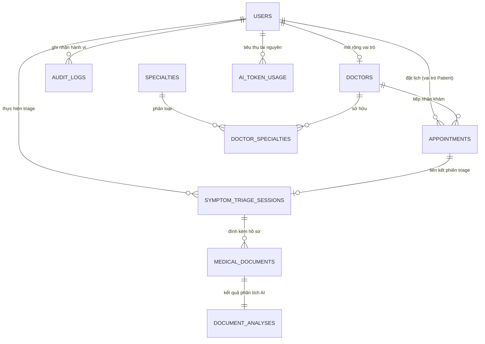

# Kiến Trúc Cơ Sở Dữ Liệu Chuyên Sâu - MediAssist-AI
## Enterprise Database Architecture Specification (PostgreSQL 16 + pgvector)

> **Mã tài liệu:** MEDIASSIST-DB-SPEC-2026  
> **Phiên bản:** 2.0 (Enterprise-Ready & Capstone Thesis Approved)  
> **DBMS:** PostgreSQL 16.x LTS với phần mở rộng vector `pgvector` (0.7+)  
> **Cache Tier:** 2-Layer Hybrid (L1 Caffeine in-memory + L2 Redis Cluster)  
> **Chuẩn tuân thủ:** HIPAA Security Rule, Bộ Y Tế Việt Nam (Thông tư 46/2018/TT-BYT về bệnh án điện tử)

---

## 1. Mô Hình Thực Thể Quan Hệ (Conceptual & Logical Data Model)

MediAssist-AI phục vụ hệ sinh thái khám chữa bệnh từ xa (Telehealth) kết hợp AI hỗ trợ phân luồng triệu chứng và giải nghĩa hồ sơ xét nghiệm. Cơ sở dữ liệu được thiết kế đạt chuẩn chuẩn hóa **3NF (Third Normal Form)** để đảm bảo tính toàn vẹn dữ liệu giao dịch y tế, đồng thời bổ sung **Vector Embeddings (1536 chiều)** phục vụ tìm kiếm ngữ nghĩa thông minh.


```mermaid
erDiagram
    USERS ||--o| DOCTORS : "mở rộng vai trò"
    USERS ||--o{ APPOINTMENTS : "đặt lịch (vai trò Patient)"
    USERS ||--o{ SYMPTOM_TRIAGE_SESSIONS : "thực hiện triage"
    USERS ||--o{ AUDIT_LOGS : "ghi nhận hành vi"
    
    SPECIALTIES ||--o{ DOCTOR_SPECIALTIES : "phân loại"
    DOCTORS ||--o{ DOCTOR_SPECIALTIES : "sở hữu"
    DOCTORS ||--o{ APPOINTMENTS : "tiếp nhận khám"
    
    SYMPTOM_TRIAGE_SESSIONS ||--o{ MEDICAL_DOCUMENTS : "đính kèm hồ sơ"
    MEDICAL_DOCUMENTS ||--|| DOCUMENT_ANALYSES : "kết quả phân tích AI"
    
    APPOINTMENTS ||--o| SYMPTOM_TRIAGE_SESSIONS : "liên kết phiên triage"
    USERS ||--o{ AI_TOKEN_USAGE : "tiêu thụ tài nguyên"
```

---

## 2. Chi Tiết Lược Đồ Bảng (Physical Database Schema DDL)

### 2.1. Cài Đặt Tiền Tố & Extension
```sql
-- Kích hoạt extension hỗ trợ sinh UUIDv4 và Vector Similarity Search
CREATE EXTENSION IF NOT EXISTS "uuid-ossp";
CREATE EXTENSION IF NOT EXISTS "vector";
CREATE EXTENSION IF NOT EXISTS "pg_trgm"; -- Hỗ trợ full-text search tiếng Việt
```

---

### 2.2. Nhóm Bảng Phân Quyền & Người Dùng (Identity & RBAC)

#### Bảng `users`
Lưu trữ định danh toàn bộ chủ thể truy cập (Admin, Bác sĩ, Bệnh nhân).

```sql
CREATE TABLE users (
    id UUID PRIMARY KEY DEFAULT uuid_generate_v4(),
    email VARCHAR(255) NOT NULL UNIQUE,
    password_hash VARCHAR(255),                   -- Nullable cho tài khoản đăng ký qua Google OAuth2
    full_name VARCHAR(150) NOT NULL,
    phone_number VARCHAR(20) UNIQUE,
    avatar_url TEXT,
    google_id VARCHAR(255) UNIQUE,               -- Định danh Google Account phục vụ Social Login (OAuth2)
    role VARCHAR(30) NOT NULL CHECK (role IN ('ADMIN', 'DOCTOR', 'PATIENT')),
    is_active BOOLEAN NOT NULL DEFAULT TRUE,
    email_verified BOOLEAN NOT NULL DEFAULT FALSE, -- V1 tên is_email_verified (chưa map); V20 đổi tên + backfill TRUE
    email_verified_at TIMESTAMPTZ,                -- V20: thời điểm xác thực email lần đầu
    scan_quota INT NOT NULL DEFAULT 1,            -- Số lượt phân tích tài liệu khả dụng
    subscription_tier VARCHAR(30) NOT NULL DEFAULT 'FREE', -- FREE, VIP_MONTHLY, VIP_YEARLY
    vip_valid_until TIMESTAMPTZ,                 -- Hạn hội viên MediPass VIP
    failed_login_attempts INT NOT NULL DEFAULT 0,
    locked_until TIMESTAMPTZ,
    last_login_at TIMESTAMPTZ,
    created_at TIMESTAMPTZ NOT NULL DEFAULT CURRENT_TIMESTAMP,
    updated_at TIMESTAMPTZ NOT NULL DEFAULT CURRENT_TIMESTAMP
);

CREATE INDEX idx_users_email ON users(email);
CREATE INDEX idx_users_role ON users(role);
CREATE INDEX idx_users_phone ON users(phone_number);
CREATE INDEX idx_users_locked_until ON users(locked_until);

#### Bảng `patient_profiles` (Hồ Sơ Y Tế & Bệnh Án Điện Tử - EMR Medical Passport)
Lưu trữ thông tin hành chính, số định danh y tế, thẻ BHYT, tiền sử dị ứng và nhóm máu theo chuẩn Bộ Y Tế.

```sql
CREATE TABLE patient_profiles (
    id UUID PRIMARY KEY DEFAULT gen_random_uuid(),
    user_id UUID NOT NULL UNIQUE REFERENCES users(id) ON DELETE CASCADE,
    patient_code VARCHAR(50) NOT NULL UNIQUE,     -- Mã định danh bệnh viện: BN-2026-XXXXX
    citizen_id VARCHAR(20) UNIQUE,                -- Căn cước công dân (12 số)
    health_insurance_number VARCHAR(30),          -- Mã thẻ BHYT chuẩn 15 ký tự (Ví dụ: DN4791234567890)
    date_of_birth DATE,                           -- Ngày sinh
    gender VARCHAR(10),                           -- MALE, FEMALE, OTHER
    blood_group VARCHAR(10),                      -- A+, B+, AB+, O+, A-, B-, AB-, O-
    address TEXT,                                 -- Địa chỉ thường trú
    allergies TEXT,                               -- Dị ứng thuốc & thức ăn (Ví dụ: Penicillin, NSAIDs)
    medical_history TEXT,                         -- Tiền sử bệnh lý nền (Tăng huyết áp, Đái tháo đường...)
    emergency_contact_name VARCHAR(150),          -- Người liên hệ khẩn cấp
    emergency_contact_phone VARCHAR(20),          -- Số điện thoại khẩn cấp
    emergency_contact_relationship VARCHAR(50),   -- Mối quan hệ (Bố/Mẹ/Vợ/Chồng...)
    created_at TIMESTAMPTZ NOT NULL DEFAULT CURRENT_TIMESTAMP,
    updated_at TIMESTAMPTZ NOT NULL DEFAULT CURRENT_TIMESTAMP
);

CREATE INDEX idx_patient_code ON patient_profiles(patient_code);
CREATE INDEX idx_patient_citizen_id ON patient_profiles(citizen_id);
CREATE INDEX idx_patient_user_id ON patient_profiles(user_id);
```
```

---

### 2.3. Nhóm Bảng Hồ Sơ Bác Sĩ & Chuyên Khoa (Clinical Providers)

#### Bảng `specialties`
Danh mục chuyên khoa y tế chuẩn hóa (Tim mạch, Da liễu, Nhi khoa, v.v.).

```sql
CREATE TABLE specialties (
    id UUID PRIMARY KEY DEFAULT uuid_generate_v4(),
    code VARCHAR(50) NOT NULL UNIQUE,
    name VARCHAR(150) NOT NULL,
    description TEXT,
    icon_url TEXT,
    is_active BOOLEAN NOT NULL DEFAULT TRUE,
    created_at TIMESTAMPTZ NOT NULL DEFAULT CURRENT_TIMESTAMP
);

CREATE INDEX idx_specialties_code ON specialties(code);
```

#### Bảng `doctors`
Hồ sơ chứng chỉ hành nghề, học vị và vector biểu diễn chuyên môn lâm sàng.

```sql
#### Bảng `doctor_profiles`
Hồ sơ chứng chỉ hành nghề, học vị và vector biểu diễn chuyên môn lâm sàng thực tế (`doctor_profiles`).

```sql
CREATE TABLE doctor_profiles (
    id UUID PRIMARY KEY DEFAULT gen_random_uuid(),
    user_id UUID NOT NULL UNIQUE REFERENCES users(id) ON DELETE CASCADE,
    bio TEXT,                                    -- Tiểu sử, kinh nghiệm và thế mạnh lâm sàng
    license_number VARCHAR(255) UNIQUE,          -- Số CCHN y tế (Ví dụ: 008921/BYT-CCHN)
    license_document_url VARCHAR(255),           -- Ảnh/PDF chứng chỉ hành nghề
    consultation_fee NUMERIC(10, 2) DEFAULT 0.00,-- Phí khám tư vấn (VND)
    years_of_experience INT DEFAULT 0,           -- Số năm kinh nghiệm
    academic_title VARCHAR(50),                  -- Chức danh học thuật: GS.TS, PGS.TS, TS.BS, BS.CKII, BS.CKI
    hospital_affiliation VARCHAR(150),           -- Bệnh viện công tác: BV Đại Học Y Dược, BV Chợ Rẫy
    department VARCHAR(150),                     -- Khoa chuyên môn trực thuộc: Khoa Tim Mạch Can Thiệp
    license_issued_by VARCHAR(150),              -- Đơn vị cấp CCHN: Cục Quản lý Khám chữa bệnh - Bộ Y Tế
    rating DOUBLE PRECISION DEFAULT 4.9,         -- Điểm đánh giá hài lòng người bệnh (1.0 - 5.0)
    review_count INT NOT NULL DEFAULT 0,         -- [V17] Tổng số lượt đánh giá thực tế của người bệnh
    total_consultations INT DEFAULT 1250,        -- Tổng số ca khám lâm sàng đã hoàn thành
    is_verified BOOLEAN NOT NULL DEFAULT FALSE,  -- Trạng thái phê duyệt của Admin
    verified_at TIMESTAMPTZ,
    bio_embedding vector(1536),                  -- Vector nhúng 1536 chiều từ Bio + Chuyên khoa
    created_at TIMESTAMPTZ NOT NULL DEFAULT CURRENT_TIMESTAMP,
    updated_at TIMESTAMPTZ NOT NULL DEFAULT CURRENT_TIMESTAMP
);

-- Index HNSW tăng tốc truy vấn vector tương đồng cosine cho Semantic Doctor Matching
CREATE INDEX idx_doctor_bio_hnsw ON doctor_profiles 
USING hnsw (bio_embedding vector_cosine_ops);

CREATE INDEX idx_doctor_verified ON doctor_profiles(is_verified);

-- [V10 Migration] Tối ưu hóa truy vấn pgvector với Partial Indexes:
CREATE INDEX idx_doctor_verified_has_embedding ON doctor_profiles(is_verified) WHERE bio_embedding IS NOT NULL;
CREATE INDEX idx_doctor_bio_hnsw_verified ON doctor_profiles USING hnsw (bio_embedding vector_cosine_ops) WHERE is_verified = TRUE AND bio_embedding IS NOT NULL;
```

#### Bảng trung gian `doctor_specialties`
```sql
CREATE TABLE doctor_specialties (
    doctor_profile_id UUID NOT NULL REFERENCES doctor_profiles(id) ON DELETE CASCADE,
    specialty_id UUID NOT NULL REFERENCES specialties(id) ON DELETE RESTRICT,
    PRIMARY KEY (doctor_profile_id, specialty_id)
);
```

---

### 2.4. Nhóm Bảng AI Symptom Triage & Phân Tích Bệnh Án (AI Workflow)

#### Bảng `triage_sessions` (Hiện thực hóa chuẩn hóa của `symptom_triage_sessions`)
Lưu trữ toàn bộ phiên hội thoại sàng lọc sơ bộ giữa bệnh nhân và trợ lý AI.

```sql
CREATE TABLE triage_sessions (
    id UUID PRIMARY KEY DEFAULT gen_random_uuid(),
    user_id UUID REFERENCES users(id) ON DELETE SET NULL, -- Nullable cho khách vãng lai
    patient_name VARCHAR(255),
    symptoms_text TEXT NOT NULL,                  -- Lời khai triệu chứng bệnh nhân
    is_emergency BOOLEAN NOT NULL DEFAULT FALSE,  -- Đánh dấu cờ đỏ cấp cứu
    urgency_level VARCHAR(20) NOT NULL           -- ROUTINE, URGENT, EMERGENCY
        CHECK (urgency_level IN ('ROUTINE', 'URGENT', 'EMERGENCY')),
    primary_specialty VARCHAR(100),               -- Slug chuyên khoa gợi ý (cardiology, neurology...)
    sbar_summary TEXT,                            -- Báo cáo lâm sàng chuẩn SBAR
    ai_advice TEXT,                               -- Lời khuyên ban đầu cho người bệnh
    conversation_history TEXT,                    -- Lịch sử trao đổi
    created_at TIMESTAMPTZ NOT NULL DEFAULT CURRENT_TIMESTAMP
);

CREATE INDEX idx_triage_user ON triage_sessions(user_id);
CREATE INDEX idx_triage_urgency ON triage_sessions(urgency_level);
CREATE INDEX idx_triage_created_at ON triage_sessions(created_at DESC);
```
```

#### Bảng `medical_documents` & `document_analyses`
Lưu trữ siêu dữ liệu tài liệu y tế (kết quả xét nghiệm, đơn thuốc, phim chụp) và kết quả phân tích chỉ số cận lâm sàng, đề xuất bác sĩ chuyên khoa (`MedicalDocument` & `DocumentAnalysis`).

```sql
CREATE TABLE medical_documents (
    id UUID PRIMARY KEY DEFAULT gen_random_uuid(),
    user_id UUID REFERENCES users(id) ON DELETE SET NULL, -- Khách vãng lai hoặc bệnh nhân định danh
    file_name VARCHAR(255) NOT NULL,
    file_size_bytes BIGINT NOT NULL,
    content_type VARCHAR(100) NOT NULL,
    storage_path TEXT,                           -- [V18] Object key trong bucket Supabase PRIVATE (patients/{userId}/{random}_{tên})
                                                 --       hoặc đường dẫn local '/uploads/...' (fallback dev). KHÔNG BAO GIỜ trả ra API.
    file_hash VARCHAR(64),                       -- Mã băm SHA-256 chống trùng lặp và lãng phí token
    is_valid_medical BOOLEAN NOT NULL DEFAULT TRUE, -- Cờ xác thực tài liệu y khoa từ Gatekeeper Sieve
    status VARCHAR(50) NOT NULL DEFAULT 'PROCESSED', -- PENDING, PROCESSING, PROCESSED, FAILED
    created_at TIMESTAMPTZ NOT NULL DEFAULT CURRENT_TIMESTAMP
);

CREATE TABLE document_analyses (
    id UUID PRIMARY KEY DEFAULT gen_random_uuid(),
    document_id UUID NOT NULL REFERENCES medical_documents(id) ON DELETE CASCADE,
    clinical_summary TEXT NOT NULL,              -- Báo cáo tóm tắt lâm sàng dành cho bác sĩ
    plain_language_explanation TEXT NOT NULL,    -- Giải nghĩa thuật ngữ dễ hiểu cho người bệnh
    abnormal_indicators_json TEXT NOT NULL,      -- Mảng JSON các chỉ số sinh hóa (tên, giá trị, ngưỡng, trạng thái ELEVATED/LOW/NORMAL)
    metadata_json TEXT,                          -- Siêu dữ liệu hành chính/lâm sàng động (bệnh viện, khoa, bác sĩ chỉ định, ngày xét nghiệm, SID, thiết bị, BN)
    recommended_specialty_slug VARCHAR(100),     -- cardiology, gastroenterology, nephrology...
    recommended_specialty_name VARCHAR(255),     -- Tên hiển thị tiếng Việt kèm quốc tế
    suggested_questions_json TEXT,               -- Mảng JSON các câu hỏi AI gợi ý bệnh nhân trao đổi với BS
    created_at TIMESTAMPTZ NOT NULL DEFAULT CURRENT_TIMESTAMP
);

CREATE INDEX idx_med_doc_user ON medical_documents(user_id);
CREATE INDEX idx_med_doc_created ON medical_documents(created_at DESC);
CREATE INDEX idx_med_doc_hash ON medical_documents(user_id, file_hash);
CREATE INDEX idx_doc_analysis_doc ON document_analyses(document_id);
CREATE INDEX idx_doc_analysis_specialty ON document_analyses(recommended_specialty_slug);
```

---

### 2.5. Nhóm Bảng Lịch Hẹn Khám & Giao Dịch (Telehealth Appointments)

#### Bảng `appointments`
Quản lý vòng đời ca khám từ xa với cơ chế kiểm soát concurrency chặt chẽ.

```sql
CREATE TABLE appointments (
    id UUID PRIMARY KEY DEFAULT uuid_generate_v4(),
    appointment_code VARCHAR(30) NOT NULL UNIQUE, -- Mã tra cứu: AP-20260311-XXXX
    patient_id UUID NOT NULL REFERENCES users(id) ON DELETE RESTRICT,
    doctor_id UUID NOT NULL REFERENCES doctors(id) ON DELETE RESTRICT,
    triage_session_id UUID REFERENCES symptom_triage_sessions(id),
    scheduled_start TIMESTAMPTZ NOT NULL,
    scheduled_end TIMESTAMPTZ NOT NULL,
    status VARCHAR(30) NOT NULL DEFAULT 'SCHEDULED'
        CHECK (status IN ('SCHEDULED', 'IN_PROGRESS', 'COMPLETED', 'CANCELLED', 'NO_SHOW')),
    queue_number VARCHAR(50),                    -- Số thứ tự tiếp nhận bệnh viện (Ví dụ: STT 08)
    clinic_room VARCHAR(100),                    -- Phòng khám lâm sàng trực tiếp/trực tuyến (Ví dụ: Phòng Khám 204)
    chief_complaint TEXT,                        -- Lý do vào viện / Triệu chứng chính
    vital_signs_json TEXT,                       -- JSON chỉ số sinh hiệu (Huyết áp, Mạch, Thân nhiệt, Nhịp thở, SpO2, Chiều cao, Cân nặng, BMI)
    icd10_code VARCHAR(20),                      -- Mã chẩn đoán quốc tế ICD-10 (Ví dụ: I10, I20.9, K21.0, E78.0)
    icd10_name VARCHAR(255),                     -- Tên bệnh danh ICD-10 tiếng Việt
    prescription_json TEXT,                      -- JSON đơn thuốc điện tử (Tên thuốc, hàm lượng, cách dùng, liều dùng, số lượng, lưu ý)
    treatment_plan TEXT,                         -- Kế hoạch điều trị & Dặn dò y lệnh của Bác sĩ
    follow_up_date DATE,                         -- Ngày hẹn tái khám
    cancellation_reason TEXT,
    consultation_notes TEXT,                     -- Ghi chú chẩn đoán lâm sàng của Bác sĩ
    telehealth_room_id VARCHAR(100),             -- Room ID WebRTC/Jitsi
    medical_document_id UUID REFERENCES medical_documents(id) ON DELETE SET NULL, -- [V14] Hồ sơ y tế / kết quả xét nghiệm đính kèm khi bệnh nhân đặt lịch
    fee_amount NUMERIC(12, 2) NOT NULL,
    payment_status VARCHAR(30) NOT NULL DEFAULT 'UNPAID'
        CHECK (payment_status IN ('UNPAID', 'PAID', 'REFUNDED')),
    version BIGINT NOT NULL DEFAULT 0,           -- Optimistic Locking chống đặt trùng slot
    created_at TIMESTAMPTZ NOT NULL DEFAULT CURRENT_TIMESTAMP,
    updated_at TIMESTAMPTZ NOT NULL DEFAULT CURRENT_TIMESTAMP,
    CONSTRAINT check_appointment_times CHECK (scheduled_end > scheduled_start)
);

-- Index ngăn chặn trùng lịch cùng một bác sĩ trong cùng khoảng thời gian
CREATE UNIQUE INDEX idx_unique_doctor_schedule 
ON appointments(doctor_id, scheduled_start) 
WHERE status NOT IN ('CANCELLED');

CREATE INDEX idx_appointments_patient ON appointments(patient_id);
CREATE INDEX idx_appointments_doctor ON appointments(doctor_id);
CREATE INDEX idx_appointments_status ON appointments(status);
CREATE INDEX idx_appointments_medical_document_id ON appointments(medical_document_id);
```

#### Bảng `doctor_schedule_slots`
Lưu trữ cấu hình khung giờ làm việc và tiếp nhận bệnh nhân định kỳ của bác sĩ theo các thứ trong tuần.

```sql
CREATE TABLE doctor_schedule_slots (
    id UUID PRIMARY KEY DEFAULT uuid_generate_v4(),
    doctor_profile_id UUID NOT NULL REFERENCES doctor_profiles(id) ON DELETE CASCADE,
    day_of_week VARCHAR(20) NOT NULL, -- MONDAY, TUESDAY, WEDNESDAY, ...
    start_time TIME NOT NULL,
    end_time TIME NOT NULL,
    slot_duration_minutes INT NOT NULL DEFAULT 30,
    is_active BOOLEAN NOT NULL DEFAULT TRUE,
    created_at TIMESTAMPTZ NOT NULL DEFAULT CURRENT_TIMESTAMP
);

CREATE INDEX idx_doctor_schedule_lookup 
ON doctor_schedule_slots(doctor_profile_id, day_of_week, is_active);
```

#### Bảng `doctor_reviews` [V17]
Lưu trữ đánh giá chất lượng lâm sàng (1-5 sao, nhận xét, tags) của người bệnh sau khi hoàn thành buổi khám (`COMPLETED`). Khép kín vòng phản hồi thực tế và cung cấp trọng số thực tế cho thuật toán WHRF ($O(M \log K)$ Min-Heap).

```sql
CREATE TABLE doctor_reviews (
    id UUID PRIMARY KEY DEFAULT gen_random_uuid(),
    appointment_id UUID NOT NULL UNIQUE REFERENCES appointments(id) ON DELETE CASCADE,
    doctor_id UUID NOT NULL REFERENCES users(id) ON DELETE CASCADE,
    patient_id UUID NOT NULL REFERENCES users(id) ON DELETE CASCADE,
    rating INT NOT NULL CHECK (rating >= 1 AND rating <= 5),
    comment TEXT,
    tags TEXT,                                    -- Mảng tag phân cách bằng phẩy (Ví dụ: "Tận tình,Giải thích rõ,Đúng giờ")
    created_at TIMESTAMPTZ NOT NULL DEFAULT CURRENT_TIMESTAMP,
    updated_at TIMESTAMPTZ NOT NULL DEFAULT CURRENT_TIMESTAMP
);

-- Ràng buộc 1 đánh giá duy nhất cho mỗi lịch hẹn đã hoàn thành
CREATE UNIQUE INDEX idx_doctor_reviews_appointment ON doctor_reviews(appointment_id);
-- Tăng tốc truy vấn danh sách đánh giá của từng bác sĩ
CREATE INDEX idx_doctor_reviews_doctor ON doctor_reviews(doctor_id, created_at DESC);
-- Truy vấn lịch sử đánh giá của người bệnh
CREATE INDEX idx_doctor_reviews_patient ON doctor_reviews(patient_id);
```

---

### 2.6. Nhóm Bảng Giám Sát Chi Phí & Kiểm Toán (FinOps & Audit Security)

#### Bảng `ai_token_usage`
Theo dõi sát sao từng request gọi sang OpenAI/Gemini để kiểm soát chi phí thực tế và phát hiện lạm dụng.

```sql
CREATE TABLE ai_token_usage (
    id UUID PRIMARY KEY DEFAULT uuid_generate_v4(),
    user_id UUID REFERENCES users(id),
    feature VARCHAR(50) NOT NULL,                -- TRIAGE_CHAT, DOCUMENT_OCR, VECTOR_EMBED
    model_name VARCHAR(50) NOT NULL,             -- gpt-4o, gemini-1.5-pro, text-embedding-3-small
    prompt_tokens INT NOT NULL DEFAULT 0,
    completion_tokens INT NOT NULL DEFAULT 0,
    total_tokens INT NOT NULL DEFAULT 0,
    estimated_cost_usd NUMERIC(10, 6) NOT NULL DEFAULT 0.000000,
    latency_ms INT NOT NULL DEFAULT 0,
    created_at TIMESTAMPTZ NOT NULL DEFAULT CURRENT_TIMESTAMP
);

CREATE INDEX idx_ai_token_feature ON ai_token_usage(feature);
CREATE INDEX idx_ai_token_created ON ai_token_usage(created_at);
```

#### Bảng `audit_logs`
Ghi nhận toàn bộ thao tác nhạy cảm (Đăng nhập, xem bệnh án, duyệt bác sĩ) phục vụ pháp lý.

```sql
CREATE TABLE audit_logs (
    id UUID PRIMARY KEY DEFAULT uuid_generate_v4(),
    actor_id UUID REFERENCES users(id),
    action VARCHAR(100) NOT NULL,               -- USER_LOGIN, VIEW_MEDICAL_DOC, VET_DOCTOR_APPROVE
    entity_name VARCHAR(50) NOT NULL,           -- users, doctors, appointments
    entity_id UUID,
    client_ip VARCHAR(50),
    user_agent TEXT,
    old_state JSONB,
    new_state JSONB,
    created_at TIMESTAMPTZ NOT NULL DEFAULT CURRENT_TIMESTAMP
);

CREATE INDEX idx_audit_actor ON audit_logs(actor_id);
CREATE INDEX idx_audit_action ON audit_logs(action);
CREATE INDEX idx_audit_created ON audit_logs(created_at DESC);
```

> **Action email & xác thực tài khoản (WORK_LOG #083, UC-24/UC-29):** `PASSWORD_RESET_REQUESTED` (chỉ khi email tồn tại; metadata ghi có gửi mail hay không), `PASSWORD_RESET_COMPLETED`, `EMAIL_VERIFIED`, `ACCOUNT_GOOGLE_LINKED_PASSWORD_CLEARED` (liên kết Google vào tài khoản chưa xác thực → xóa mật khẩu). Kèm IP, User-Agent; không bao giờ lưu token hay liên kết.
>
> **Action `DOCUMENT_SIGNED_URL_ISSUED` (UC-28, V18):** Được ghi mỗi khi backend cấp liên kết xem / tải tệp y tế gốc (`GET /documents/{id}/signed-url` hoặc redirect 302 của `GET /documents/{id}/file`) cho **MỌI role**, kể cả bệnh nhân tự xem. Chỉ ghi **sau khi** đã ký được URL (Supabase lỗi 404/503 thì không ghi). Các cột: `user_id` (người xem), `resource` = `medical_documents/{id}`, `ip_address`, `user_agent`, `metadata` = `Role: PATIENT, PatientId: {uuid}, Download: false, TtlSeconds: 900, Storage: SUPABASE|LOCAL`. Không bao giờ lưu signed URL/token. Với DOCTOR/ADMIN, một lần xem tệp sinh 2 dòng: `VIEW_PATIENT_RECORD` (mở hồ sơ) + `DOCUMENT_SIGNED_URL_ISSUED` (cấp link tệp).
>
> **Action `VIEW_PATIENT_RECORD` (UC-27):** Được ghi mỗi khi `DOCTOR`/`ADMIN` được `PatientAccessGuard` cấp quyền mở hồ sơ bệnh nhân. Các cột sử dụng: `user_id` (người xem), `resource` (ví dụ `medical_documents/{id}/file`, `triage_sessions/patient/{patientId}`), `ip_address`, `user_agent`, `metadata` (`Role: DOCTOR, PatientId: {uuid}`). Không thay đổi schema.
>
> Kiểm tra quan hệ điều trị dùng truy vấn dẫn xuất `AppointmentRepository.existsByDoctorIdAndPatientIdAndStatusIn(doctorId, patientId, [SCHEDULED, IN_PROGRESS, COMPLETED])` trên bảng `appointments` (tận dụng chỉ mục có tiền tố `doctor_id`), không cần migration mới.

---

## 3. Chiến Lược Vector Similarity Search (`pgvector`)

Khi bệnh nhân mô tả triệu chứng: *"Tôi bị đau tức ngực trái lan ra vai, kèm khó thở khi leo cầu thang"*:
1. LLM Service tạo vector nhúng 1536 chiều $V_{query}$ bằng `text-embedding-3-small`.
2. PostgreSQL thực thi câu lệnh truy vấn Vector Cosine Distance:
```sql
SELECT 
    d.id,
    u.full_name,
    d.title,
    d.workplace,
    d.consultation_fee,
    d.rating_avg,
    (1 - (d.bio_embedding <=> $1)) AS similarity_score
FROM doctors d
JOIN users u ON d.id = u.id
WHERE d.vetting_status = 'VERIFIED'
ORDER BY d.bio_embedding <=> $1 ASC
LIMIT 5;
```
*Ghi chú:* Toán tử `<=>` tính khoảng cách Cosine Distance ($1 - \text{Cosine Similarity}$). Thuật toán **HNSW Index** giúp độ trễ tìm kiếm duy trì ở mức $< 15\text{ms}$ ngay cả khi tập dữ liệu mở rộng đến $100.000$ hồ sơ bác sĩ.

---

## 4. Tối Ưu Hóa Hiệu Năng & Connection Pool (HikariCP)

| Tham Số Cấu Hình | Giá Trị Dev | Giá Trị Production | Giải Thích Kỹ Thuật |
| :--- | :--- | :--- | :--- |
| `maximum-pool-size` | 10 | 30 - 50 | Giới hạn số connection đồng thời dựa trên công thức $N_{cpu} \times 2 + N_{spindle}$. |
| `minimum-idle` | 5 | 10 | Đảm bảo sẵn sàng phục vụ lượt truy cập đột biến (Spike load). |
| `idle-timeout` | 30000 ms | 600000 ms | Đóng connection rảnh rỗi quá lâu để giải phóng RAM cho PostgreSQL. |
| `max-lifetime` | 1800000 ms | 1800000 ms | Định kỳ làm mới connection (30 phút) tránh stale TCP socket. |
| `connection-timeout` | 20000 ms | 30000 ms | Thời gian chờ tối đa khi pool quá tải trước khi ném ngoại lệ. |

---

## 5. Chính Sách Sao Lưu & Phục Hồi Dữ Liệu (Enterprise SLA)

* **RPO (Recovery Point Objective):** $\le 5$ phút thông qua **PostgreSQL WAL Archiving** (Write-Ahead Logging) lưu trữ trên S3 Cold Storage.
* **RTO (Recovery Time Objective):** $\le 30$ phút cho khôi phục tự động toàn bộ cụm Primary-Replica.
* **Mã hóa:** Toàn bộ dữ liệu at-rest (Data at Rest) được mã hóa AES-256 ở tầng Tablespace; đường truyền (Data in Transit) bắt buộc TLS 1.3.

---

## 6. Chiến Lược Quản Lý Phiên Bản Cơ Sở Dữ Liệu Với Flyway (Database Migration Lifecycle)

Để loại bỏ hoàn toàn mã nguồn giả lập (mock data), hardcoded entities và rủi ro không đồng nhất giữa các môi trường (Dev, Staging, Production), MediAssist-AI chuẩn hóa quy trình **Database Versioning** bằng **Flyway Community 10.x / 11.x**:

### 6.1. Cấu Hình Flyway Trong Spring Boot (`application.properties`)
```properties
spring.flyway.enabled=true
spring.flyway.baseline-on-migrate=true
spring.flyway.baseline-version=0
spring.flyway.locations=classpath:db/migration
spring.flyway.validate-on-migrate=true
spring.flyway.table=flyway_schema_history
```

### 6.2. Lịch Sử Các Bản Di Trú (Migration History)
| Rank | Version | Script | Loại | Mục Đích & Nội Dung Chi Tiết | Trạng Thái |
| :---: | :---: | :--- | :---: | :--- | :---: |
| **1** | `0` | `<< Flyway Baseline >>` | BASELINE | Điểm mốc cơ sở (Baseline) hệ thống khởi tạo. | **SUCCESS** |
| **2** | `1` | `V1__initial_schema.sql` | SQL | Khởi tạo đầy đủ 12 bảng thực thể cốt lõi, extensions (`uuid-ossp`, `vector`, `pg_trgm`), HNSW cosine index `idx_doctor_bio_hnsw` (vector 1536 chiều), các chỉ mục hiệu năng cao và RBAC constraints. | **SUCCESS** |
| **3** | `2` | `V2__seed_rich_hospital_data.sql` | SQL | Nạp tập dữ liệu thực tế chuẩn bệnh viện tuyến trung ương (12 chuyên khoa, 1 Admin, 12 bác sĩ chuyên khoa đầu ngành kèm CCHN và bệnh viện công tác, 630 slots lịch khám định kỳ, 5 hồ sơ bệnh án điện tử EMR, 8 ca khám lâm sàng thực thụ có ICD-10 & phác đồ thuốc, 3 bản ghi audit trail). | **SUCCESS** |
| **4** | `3` | `V3__account_lockout_and_security_hardening.sql` | SQL | Bổ sung cột `failed_login_attempts` (mặc định 0), `locked_until` (timestamp) và chỉ mục `idx_users_locked_until` trên bảng `users` phục vụ phòng thủ Brute-force và khóa tài khoản tự động 15 phút sau 5 lần sai mật khẩu liên tiếp. | **SUCCESS** |
| **5** | `4` | `V4__cloud_storage_and_quota_management.sql` | SQL | Bổ sung cột `storage_url` (đã đổi tên thành `storage_path` ở V18) vào bảng `medical_documents`, các trường `scan_quota`, `subscription_tier`, `vip_valid_until` vào bảng `users` phục vụ quản lý hạn mức phân tích tài liệu và gói VIP. | **SUCCESS** |
| **6** | `5` | `V5__add_document_analysis_metadata.sql` | SQL | Bổ sung cột `metadata_json TEXT` vào bảng `document_analyses` phục vụ lưu trữ siêu dữ liệu lâm sàng/hành chính động (bệnh viện, khoa, bác sĩ, ngày XN, SID, bệnh nhân, thiết bị phân tích). | **SUCCESS** |
| **7** | `6` | `V6__fix_user_status_and_audit_logs.sql` | SQL | Đồng bộ ràng buộc enum `UserStatus` (hỗ trợ `PENDING_VERIFICATION`), bổ sung cột `version BIGINT` vào bảng `users` cho JPA `@Version` optimistic locking, chuẩn hóa bảng `audit_logs` (thêm `user_id`, `user_agent`, `metadata`, gỡ `NOT NULL` actor), và tạo chỉ mục `idx_appointment_schedule` trên `appointments(doctor_id, scheduled_start)`. | **SUCCESS** |
| **8** | `7` | `V7__slot_collision_guard_and_dedup_constraints.sql` | SQL | Chốt chặn xung đột đặt lịch đồng thời (Race Condition Shield): Partial Unique Index `idx_appointment_unique_active_slot` trên `appointments(doctor_id, scheduled_start) WHERE status != 'CANCELLED'`; và Unique Index chống gian lận/trùng lặp file song song `idx_med_doc_user_hash_unique` trên `medical_documents(user_id, file_hash) WHERE file_hash IS NOT NULL`. | **SUCCESS** |
| **9** | `8` | `V8__allow_null_password_hash_for_oauth.sql` | SQL | Cho phép `password_hash` nhận giá trị `NULL` trên bảng `users` nhằm hỗ trợ tài khoản đăng nhập bên thứ ba (Google OAuth2 Social Sign-In). | **SUCCESS** |
| **10** | `9` | `V9__verify_all_specialties_and_seed_pending_doctors.sql` | SQL | Kích hoạt và xác thực toàn bộ 12 bác sĩ chuyên khoa (bao gồm Thần kinh, Tai Mũi Họng, Nội tiết & Đái tháo đường - TS.BS Đỗ Phương Lan) với lịch khám định kỳ T2-T6, nạp vector 1536 chiều cho toàn bộ 12 chuyên khoa vào pgvector; đồng thời khởi tạo 2 bác sĩ chờ duyệt chuyên biệt (`dr.nam.pending`, `dr.thao.pending`) phục vụ quy trình Admin Vetting. | **SUCCESS** |
| **11** | `10` | `V10__optimize_doctor_hnsw_index.sql` | SQL | Tối ưu hóa truy vấn pgvector: Bổ sung B-tree index `idx_doctor_verified_has_embedding` trên `doctor_profiles(is_verified) WHERE bio_embedding IS NOT NULL` và Partial HNSW vector index `idx_doctor_bio_hnsw_verified` giúp triệt tiêu độ trễ lọc sau (post-filter) khi tìm kiếm bác sĩ đã xác minh. | **SUCCESS** |
| **12** | `11` | `V11__add_composite_performance_indexes.sql` | SQL | Triệt tiêu điểm nghẽn hiệu năng sắp xếp & khóa ngoại (N+1 Query & Table Scan Elimination): Bổ sung composite indexes `idx_appointments_patient_schedule` trên `appointments(patient_id, scheduled_start DESC)`, `idx_appointments_doctor_schedule` trên `appointments(doctor_id, scheduled_start DESC)`, `idx_med_doc_user_created` trên `medical_documents(user_id, created_at DESC)`, `idx_triage_user_created` trên `triage_sessions(user_id, created_at DESC)`, và index khóa ngoại `idx_doctor_specialties_specialty_id` trên `doctor_specialties(specialty_id)`. | **SUCCESS** |
| **13** | `12` | `V12__supervision_and_realtime_performance_indexes.sql` | SQL | Tối ưu hóa truy vấn giám sát & realtime: Bổ sung chỉ mục `idx_appointments_scheduled_start_desc`, `idx_triage_sessions_created_desc`, partial index `idx_triage_emergency_partial`, partial index `idx_doc_analysis_abnormal_partial` và `idx_doc_analyses_created_desc`. | **SUCCESS** |
| **14** | `13` | `V13__create_payment_transactions.sql` | SQL | Thiết lập bảng sổ cái `payment_transactions` hỗ trợ cổng thanh toán đa kênh (Stripe Sandbox, VietQR, VNPAY, MoMo, Mock), bảo đảm kiểm toán tài chính, chống trùng lặp và khóa lạc quan `@Version`. | **SUCCESS** |
| **15** | `14` | `V14__add_medical_document_to_appointments.sql` | SQL | Bổ sung khóa ngoại `medical_document_id UUID REFERENCES medical_documents(id) ON DELETE SET NULL` và chỉ mục `idx_appointments_medical_document_id` vào bảng `appointments`, liên kết trực tiếp ca khám với hồ sơ xét nghiệm bệnh nhân đã tải lên & phân tích AI. | **SUCCESS** |

### 6.3. Chi Tiết Tập Dữ Liệu Bệnh Viện Mẫu (Enterprise Hospital Seed Data)
1. **12 Chuyên Khoa Toàn Diện:** Tim mạch, Thần kinh, Tiêu hóa - Gan mật, Da liễu, Nhi khoa, Nội tổng quát, Hô hấp & Phổi, Cơ Xương Khớp, Thận & Tiết niệu, Sản Phụ Khoa, Nội tiết & Đái tháo đường, Tai Mũi Họng.
2. **14 Bác Sĩ Đầu Ngành (12 Verified + 2 Pending Vetting):**
   - 12 Bác sĩ chính thức đã xác thực (`ACTIVE`, `is_verified = TRUE`): Đầy đủ 12 chuyên khoa bao gồm GS.TS. BS. Nguyễn Văn An (Tim mạch), PGS.TS. BS. Trần Thị Mai Hương (Hô hấp), BS. CKII. Phạm Quốc Tuấn (Tiêu hóa), TS. BS. Đỗ Bích Thảo (Da liễu), ThS. BS. Vũ Đức Toàn (Cơ Xương Khớp), TS. BS. Hoàng Minh Đức (Thận - Tiết niệu), BS. CKI. Nguyễn Thanh Tâm (Nhi khoa), PGS.TS. BS. Trịnh Hải Yến (Sản Phụ Khoa), BS. CKI. Bùi Quang Huy (Nội tổng quát), BS. CKII. Lê Hoàng Long (Thần kinh), ThS. BS. Nguyễn Tuấn Khang (Tai Mũi Họng), TS. BS. Đỗ Phương Lan (Nội tiết & Đái tháo đường - BV Nội Tiết TW).
   - 2 Bác sĩ hàng đợi duyệt (`PENDING_VERIFICATION`, `is_verified = FALSE`): ThS. BS. Vũ Hoài Nam (Cơ Xương Khớp - BV Việt Đức), BS. CKI. Lê Thị Phương Thảo (Nhi khoa - BV Nhi TW) phục vụ kịch bản demo duyệt hồ sơ Admin.
3. **840 Slots Lịch Khám Định Kỳ:** 12 bác sĩ chính thức $\times$ 5 ngày (Thứ 2 - Thứ 6) $\times$ 14 ca (Ca sáng: 08:00 - 11:30, Ca chiều: 13:30 - 17:00, 30 phút/slot).
4. **5 Hồ Sơ EMR Medical Passport:** Đầy đủ Mã BN, CCCD 12 số, Thẻ BHYT 15 ký tự, Nhóm máu (ABO/Rh), Cảnh báo dị ứng nghiêm trọng (Beta-lactam, Aspirin/NSAID, Paracetamol), Tiền sử bệnh án gia đình và Người liên hệ khẩn cấp.
5. **8 Ca Khám Lâm Sàng Thực Thụ:**
   - 4 Ca hoàn tất (`COMPLETED`): Chỉ số sinh tồn (Huyết áp, Mạch, Nhiệt độ, SpO2, BMI), Chẩn đoán chuẩn quốc tế ICD-10 (I20.9 Đau thắt ngực, J45.9 Hen suyễn, K21.0 Trào ngược dạ dày thực quản, N20.0 Sỏi thận), Toa thuốc điện tử chi tiết (Hoạt chất, Liều dùng, Số lượng, Đơn vị tính), Lời dặn theo dõi và Ngày hẹn tái khám.
   - 4 Ca sắp tới (`SCHEDULED`): STT hàng đợi tiếp nhận, phòng khám chuyên khoa thực tế, lý do vào viện.

---

## 7. Kiến Trúc Dual-Tier Supabase Cloud Database & Storage

Để đáp ứng cả hai mô hình triển khai: **On-Premise / Local Development** (PostgreSQL 16 Docker tại `localhost:5433`) và **Cloud Enterprise Production** (Supabase Managed PostgreSQL & Supabase Cloud Storage), hệ thống tích hợp cơ chế Dual-Tier linh hoạt:

### 7.1. Cấu Hình Supabase Database Pooler (`application-supabase.properties`)
Supabase cung cấp PostgreSQL 16 tích hợp sẵn `pgvector`. Do mạng IPv4/IPv6 chuyển tiếp, hệ thống sử dụng **Supabase Connection Pooler** (cổng `6543`, chế độ Session Pooling):
* **JDBC URL:** `jdbc:postgresql://aws-0-ap-southeast-1.pooler.supabase.com:6543/postgres?sslmode=require`
* **Driver:** `org.postgresql.Driver`
* **Username Format:** `postgres.wakgzrzchmqdqyrgxlaq` (Project ref định danh rõ tenant).
* **HikariCP Pool Sizing:** Tối ưu `maximum-pool-size: 10`, `minimum-idle: 3` nhằm tương thích giới hạn connection của Supabase Free/Pro tier mà không gây nghẽn socket.

### 7.2. Supabase Cloud Storage Bucket (`medical-documents`)
Tài liệu y tế (đơn thuốc, hình ảnh triệu chứng, phiếu xét nghiệm PDF, ảnh đại diện bác sĩ) được upload đa tầng:
1. **Cloud Tier:** Supabase Storage Bucket `medical-documents`.
   - **Endpoint:** `https://wakgzrzchmqdqyrgxlaq.supabase.co/storage/v1/object/medical-documents/`
   - **Bucket PRIVATE (từ V18 / UC-28):** KHÔNG có Public Access URL. CSDL chỉ lưu **object key** (`patients/{userId}/{random}_{tên}`) trong cột `medical_documents.storage_path`.
   - **Xem tệp:** Backend kiểm tra `PatientAccessGuard` → gọi `POST /storage/v1/object/sign/{bucket}/{key}` (body `{"expiresIn": 900}`, header `Authorization: Bearer` + `apikey` = service_role key) → trả **signed URL hết hạn sau 15 phút** (`app.storage.signed-url-ttl-seconds=900`) và ghi audit `DOCUMENT_SIGNED_URL_ISSUED`.
   - **Service key:** `SUPABASE_KEY` (service_role) chỉ đặt trong `backend/.env` (đã `.gitignore`); các file `application*.properties` dùng `${SUPABASE_KEY:}` — rỗng thì tự động dùng Local Fallback Tier.
   - **Kiểm tra khi khởi động:** `SupabaseStorageService.verifyBucketIsPrivate()` gọi `GET /storage/v1/bucket/{bucket}`; nếu `"public": true` thì log WARN `[SECURITY]`.
2. **Local Fallback Tier:** Khi `supabase.enabled=false` hoặc khi bucket chưa khởi tạo / mạng cloud timeout, `SupabaseStorageService` tự động chuyển tiếp an toàn sang lưu trữ cục bộ tại `backend/uploads/medical_documents/` kèm log hướng dẫn quản trị viên khởi tạo bucket **PRIVATE** mà không làm gián đoạn trải nghiệm người dùng hay làm sập giao diện.

### 7.3. Phân Trang Limit / Offset Tránh Quá Tải Bộ Nhớ (Zero Layout Shift Pagination)
Hệ thống chuẩn hóa DTO `PageResponse<T>` và tích hợp phân trang limit/offset ở tất cả các danh sách:
* `page`: Chỉ số trang hiện tại (0-indexed ở backend API, 1-indexed ở frontend UI).
* `size`: Kích thước trang tùy chọn (5, 10, 20, 50 bản ghi/trang).
* `totalElements`: Tổng số bản ghi thực tế trong cơ sở dữ liệu.
* `totalPages`: Tổng số trang được tính toán: $\lceil \text{totalElements} / \text{size} \rceil$.
* Giúp loại bỏ hoàn toàn tình trạng render hàng nghìn DOM nodes cùng lúc, tránh nghẽn RAM trình duyệt và loại bỏ hiện tượng đơ giật giao diện.

---

## 8. Tối Ưu Chỉ Mục Hiệu Năng Cao Cho Giám Sát & Realtime (Flyway V12)

Nhằm triệt tiêu triệt để độ trễ truy vấn (Query Lag) và hiện tượng chậm tải khi số lượng giao dịch tăng cao, bản di chuyển `V12__supervision_and_realtime_performance_indexes.sql` bổ sung hệ thống chỉ mục chuyên biệt:

| Tên Chỉ Mục | Bảng Áp Dụng | Định Dạng Cột / Điều Kiện | Mục Đích Tối Ưu |
| :--- | :--- | :--- | :--- |
| `idx_appointments_scheduled_start_desc` | `appointments` | `(scheduled_start DESC)` | Tối ưu hóa truy vấn lịch khám toàn viện không điều kiện lọc theo user, loại bỏ thao tác Disk Sort. |
| `idx_triage_sessions_created_desc` | `triage_sessions` | `(created_at DESC)` | Tối ưu hóa sắp xếp thời gian toàn viện cho danh sách phân luồng triệu chứng AI. |
| `idx_triage_emergency_partial` | `triage_sessions` | `(is_emergency) WHERE is_emergency = true` | **Partial Index** siêu nhẹ ($< 50\text{KB}$) giúp API thống kê `/admin/stats` đếm số ca cấp cứu với độ phức tạp $O(1)$. |
| `idx_doc_analysis_abnormal_partial` | `document_analyses` | `(id) WHERE abnormal_indicators_json IS NOT NULL AND ...` | **Partial Index** loại bỏ hoàn toàn Full Table Scan khi đếm các hồ sơ cận lâm sàng có chỉ số bệnh lý bất thường. |
| `idx_doc_analyses_created_desc` | `document_analyses` | `(created_at DESC)` | Tăng tốc truy vấn lịch sử phân tích tài liệu cận lâm sàng bệnh nhân và bác sĩ. |

---

## 9. Sổ Cái Giao Dịch & Cổng Thanh Toán Đa Kênh (Flyway V13)

Để phục vụ quản lý doanh thu minh bạch, kiểm toán tài chính y tế và tích hợp các cổng thanh toán (Stripe Sandbox, VietQR, VNPAY, MoMo), bản di trú `V13__create_payment_transactions.sql` thiết lập bảng sổ cái `payment_transactions`:

### 9.1. Lược Đồ Bảng `payment_transactions`
```sql
CREATE TABLE IF NOT EXISTS payment_transactions (
    id UUID PRIMARY KEY DEFAULT gen_random_uuid(),
    transaction_code VARCHAR(64) NOT NULL UNIQUE,       -- Định dạng: TX-YYYYMMDD-XXXXXX
    user_id UUID NOT NULL REFERENCES users(id) ON DELETE CASCADE,
    order_type VARCHAR(40) NOT NULL,                    -- QUOTA_PURCHASE | APPOINTMENT_FEE
    reference_id VARCHAR(100),                          -- Mã gói (BASIC_5, VIP_MONTHLY) hoặc appointment_id
    amount DECIMAL(12, 2) NOT NULL,                     -- Số tiền giao dịch (VNĐ)
    currency VARCHAR(10) NOT NULL DEFAULT 'VND',
    payment_method VARCHAR(40) NOT NULL,                -- STRIPE | VIETQR | VNPAY | MOMO | MOCK
    payment_gateway VARCHAR(40) NOT NULL,               -- STRIPE | LOCAL_MOCK
    status VARCHAR(30) NOT NULL DEFAULT 'PENDING'       -- PENDING | COMPLETED | FAILED | CANCELLED | REFUNDED
        CHECK (status IN ('PENDING', 'COMPLETED', 'FAILED', 'CANCELLED', 'REFUNDED')),
    gateway_reference VARCHAR(255),                     -- Stripe Session ID (cs_test_...) hoặc PaymentIntent ID
    metadata_json TEXT,                                 -- Thông tin chi tiết phản hồi từ gateway (thẻ, webhook)
    created_at TIMESTAMP(6) WITHOUT TIME ZONE NOT NULL DEFAULT CURRENT_TIMESTAMP,
    updated_at TIMESTAMP(6) WITHOUT TIME ZONE NOT NULL DEFAULT CURRENT_TIMESTAMP,
    version BIGINT NOT NULL DEFAULT 0                   -- Optimistic locking chống ghi đè đồng thời
);

-- Chỉ mục tối ưu hóa tra cứu sổ cái & kiểm toán tài chính
CREATE INDEX IF NOT EXISTS idx_payment_tx_user_id ON payment_transactions(user_id);
CREATE INDEX IF NOT EXISTS idx_payment_tx_code ON payment_transactions(transaction_code);
CREATE INDEX IF NOT EXISTS idx_payment_tx_gateway_ref ON payment_transactions(gateway_reference);
CREATE INDEX IF NOT EXISTS idx_payment_tx_status ON payment_transactions(status);
CREATE INDEX IF NOT EXISTS idx_payment_tx_created_at ON payment_transactions(created_at DESC);
```

### 9.2. Nguyên Tắc An Toàn Tài Chính & Idempotency (Bất Khả Xâm Phạm)
1. **Chống Ghi Đè Kép (Strict Idempotency Guard):**
   - Khi nhận yêu cầu xác thực qua Webhook hoặc Redirect Return URL, hệ thống kiểm tra `status == 'COMPLETED'`.
   - Nếu giao dịch đã hoàn tất trước đó, hệ thống lập tức trả về biên lai thành công mà tuyệt đối không cộng đúp hạn ngạch quét (`scan_quota`) hoặc thời hạn VIP (`vip_valid_until`).
2. **Khóa Lạc Quan (`@Version` Optimistic Locking):**
   - Cột `version` ngăn chặn xung đột dữ liệu (race conditions) khi Webhook từ Stripe và luồng Return URL của trình duyệt gửi về đồng thời.
3. **Audit Trail Bắt Buộc:**
   - Mọi giao dịch hoàn tất thành công đều tự động kích hoạt tạo bản ghi trong bảng `audit_logs` với `action = 'PAYMENT_COMPLETED'`.

---

## 10. Liên Kết Hồ Sơ Cận Lâm Sàng Với Lịch Khám (Flyway V14)

Để giải quyết nhu cầu thực tế của Bác sĩ khi tiếp nhận ca khám: **Xem trực tiếp hồ sơ bệnh án gốc (PDF/ảnh) và kết quả bóc tách chỉ số AI OCR** do bệnh nhân tải lên từ phân hệ *Tóm Tắt Hồ Sơ*, bản di chuyển `V14__add_medical_document_to_appointments.sql` thiết lập mối quan hệ trực tiếp:

### 10.1. Lược Đồ & Ràng Buộc Khóa Ngoại
```sql
ALTER TABLE appointments 
ADD COLUMN IF NOT EXISTS medical_document_id UUID REFERENCES medical_documents(id) ON DELETE SET NULL;

CREATE INDEX IF NOT EXISTS idx_appointments_medical_document_id ON appointments(medical_document_id);
```

### 10.2. Đặc Tính Kỹ Thuật & An Toàn Dữ Liệu
1. **Liên Kết Tự Động Khi Đặt Lịch:** Khi bệnh nhân hoàn tất quy trình quét hồ sơ cận lâm sàng tại `DocumentSummarizerPage.tsx` và chọn bác sĩ đề xuất, `medicalDocumentId` được truyền tự động vào payload `POST /api/v1/appointments`.
2. **Ràng Buộc `ON DELETE SET NULL`:** Nếu bệnh nhân xóa tệp tài liệu gốc trong kho cá nhân, lịch hẹn khám và dữ liệu lâm sàng của bác sĩ vẫn được bảo toàn nguyên vẹn mà không vi phạm tính toàn vẹn tham chiếu.
3. **Bảo Mật Truy Cập Đa Tầng (RBAC Access Control):** Endpoint trích xuất file (`GET /api/v1/documents/{id}/file`) và dữ liệu bóc tách (`GET /api/v1/documents/{id}/analysis`) chỉ cấp quyền cho chính Bệnh nhân sở hữu, Bác sĩ được chỉ định khám hoặc Quản trị viên hệ thống (Admin).

---

## 11. Liên Kết Phiên Phân Luồng AI Triage & Tự Động Hoàn Tiền (Flyway V15)

Nhằm hiện thực hóa chu trình khám lâm sàng khép kín (End-to-End Clinical Synergy), bản di trú `V15__add_triage_session_and_refund_to_appointments.sql` bổ sung liên kết giữa ca khám `appointments` và phiên sàng lọc triệu chứng AI `symptom_triage_sessions`:

### 11.1. Lược Đồ Bảng
```sql
ALTER TABLE appointments 
ADD COLUMN IF NOT EXISTS triage_session_id UUID REFERENCES symptom_triage_sessions(id) ON DELETE SET NULL;

CREATE INDEX IF NOT EXISTS idx_appointments_triage_session_id ON appointments(triage_session_id);
```

### 11.2. Ứng Dụng Lâm Sàng & Cơ Chế Hoàn Tiền (Refund State Guard)
1. **Đồng Bộ Dữ Liệu SBAR Sang Bàn Khám Bác Sĩ:**
   - Khi bệnh nhân đặt lịch từ phân hệ Triage, `triageSessionId` được lưu vào `appointments`.
   - Bác sĩ khi mở ca khám (`activeEncounterAppointment`) có thể lập tức xem mức độ khẩn cấp (`triageUrgencyLevel`) và tóm tắt theo chuẩn SBAR (`triageSbarSummary`), nạp thẳng vào phiếu khám lâm sàng.
2. **Tự Động Kích Hoạt Hoàn Tiền (Auto-Refund on Cancellation):**
   - Khi ca khám có `payment_status = 'PAID'` bị hủy bởi bệnh nhân hoặc bác sĩ (`status = 'CANCELLED'`), hệ thống tự động gọi `paymentService.refundPayment(appointmentId)` và cập nhật `payment_status = 'REFUNDED'`.

---

## 12. Xác Thực Quên Mật Khẩu & Hệ Thống Thông Báo Nội Bộ (Flyway V16)

Bản di trú `V16__create_password_reset_and_notifications.sql` thiết lập 2 bảng trọng yếu phục vụ tính năng bảo mật tài khoản và trải nghiệm tương tác thời gian thực:

### 12.1. Lược Đồ Bảng `password_reset_tokens`
```sql
CREATE TABLE IF NOT EXISTS password_reset_tokens (
    id UUID PRIMARY KEY DEFAULT gen_random_uuid(),
    user_id UUID NOT NULL REFERENCES users(id) ON DELETE CASCADE,
    token VARCHAR(255) NOT NULL UNIQUE,
    expiry_date TIMESTAMP(6) WITHOUT TIME ZONE NOT NULL,
    is_used BOOLEAN NOT NULL DEFAULT FALSE,
    created_at TIMESTAMP(6) WITHOUT TIME ZONE NOT NULL DEFAULT CURRENT_TIMESTAMP
);

CREATE INDEX IF NOT EXISTS idx_password_reset_token ON password_reset_tokens(token);
CREATE INDEX IF NOT EXISTS idx_password_reset_user_id ON password_reset_tokens(user_id);
```

- **Cơ chế an toàn (lịch sử V16):** Token UUID ngẫu nhiên lưu dạng plaintext. **Đã được thay thế ở Flyway V19** (mục 14): cột `token` đổi thành `token_hash` (SHA-256), hiệu lực 30 phút, một lần dùng.

### 12.2. Lược Đồ Bảng `notifications`
```sql
CREATE TABLE IF NOT EXISTS notifications (
    id UUID PRIMARY KEY DEFAULT gen_random_uuid(),
    user_id UUID NOT NULL REFERENCES users(id) ON DELETE CASCADE,
    title VARCHAR(255) NOT NULL,
    message TEXT NOT NULL,
    type VARCHAR(50) NOT NULL DEFAULT 'SYSTEM',
    reference_id VARCHAR(100),
    is_read BOOLEAN NOT NULL DEFAULT FALSE,
    created_at TIMESTAMP(6) WITHOUT TIME ZONE NOT NULL DEFAULT CURRENT_TIMESTAMP
);

CREATE INDEX IF NOT EXISTS idx_notifications_user_id ON notifications(user_id);
CREATE INDEX IF NOT EXISTS idx_notifications_is_read ON notifications(is_read);
CREATE INDEX IF NOT EXISTS idx_notifications_created_at ON notifications(created_at DESC);
```

- **Phân loại thông báo (`type`):**
  - `APPOINTMENT`: Nhắc lịch hẹn, thông báo ca khám mới hoặc xác nhận dời lịch.
  - `DOCTOR_VERIFIED` / `DOCTOR_REJECTED`: Thông báo kết quả kiểm duyệt chứng chỉ hành nghề từ Quản trị viên.
  - `SYSTEM`: Cảnh báo bảo mật và nâng cấp hệ thống.

---

## 13. Lưu Trữ Tài Liệu Y Tế Riêng Tư - Bucket PRIVATE & Signed URL 15 Phút (Flyway V18)

Bản di trú `V18__private_document_storage_path.sql` khép lại lỗ hổng "ai có link public là tải được phiếu xét nghiệm" (WORK_LOG #081 mục 5):

| Bước | Câu lệnh | Ghi chú |
| :--- | :--- | :--- |
| 1 | `ALTER TABLE medical_documents RENAME COLUMN storage_url TO storage_path` | Bọc trong khối `DO $$` kiểm tra `information_schema`: nếu Hibernate `ddl-auto=update` đã tạo sẵn `storage_path` thì gộp dữ liệu (`COALESCE`) rồi `DROP storage_url`; chạy lại không lỗi (idempotent). |
| 2 | `regexp_replace(storage_path, '^https?://[^/]+/storage/v1/object/(public/\|sign/\|authenticated/)?[^/]+/([^?#]*).*$', '\2')` | Chuyển URL cũ (có hoặc không có `public/`, kể cả query `?token=`) về object key. Giá trị local `/uploads/...` giữ nguyên. |
| 3 | `UPDATE ... SET storage_path = NULL WHERE storage_path = '/uploads/medical_documents/default_emr.pdf'` | Xóa đường dẫn giả mà fallback local cũ trả về khi ghi file lỗi → tài liệu có `hasFile=false`. |
| 4 | `UPDATE ... SET storage_path = NULL WHERE btrim(storage_path) = ''` | Chuẩn hóa chuỗi rỗng. |

**Quy ước giá trị `storage_path`:** bắt đầu bằng `/uploads/` → tệp local (stream qua `GET /documents/{id}/file` có kiểm tra quyền); còn lại → object key trên bucket Supabase PRIVATE (chỉ xem qua signed URL). `NULL` → không có tệp (API trả `hasFile: false`, endpoint xem tệp trả `404 FILE_NOT_AVAILABLE`).

**Kiểm chứng:** chạy V18 trên PostgreSQL 16 (embedded) với 3 kịch bản — chỉ có `storage_url`; có cả `storage_url` lẫn `storage_path`; chạy V18 hai lần — đều cho kết quả `patients/u1/ab12_a.pdf | patients/u2/cd34_b.pdf | patients/u3/c.pdf | /uploads/medical_documents/u4/ef_d.pdf | NULL | NULL | NULL` và không còn cột `storage_url`.

**Audit:** action mới `DOCUMENT_SIGNED_URL_ISSUED` trên bảng `audit_logs` (không đổi schema) — xem mục Bảng `audit_logs`.

---

## 14. Hệ Thống Email: Token Băm SHA-256 & Xác Thực Email (Flyway V19, V20)

### 14.1. Flyway V19: `password_reset_tokens.token` → `token_hash`
Bản di trú `V19__password_reset_token_hash.sql` (WORK_LOG #083):

| Bước | Câu lệnh | Ghi chú |
| :--- | :--- | :--- |
| 1 | `DELETE FROM password_reset_tokens` | Token cũ đang là plaintext và chưa từng được gửi đi; người dùng chỉ cần yêu cầu liên kết mới. |
| 2 | Khối `DO $$`: gỡ mọi ràng buộc `UNIQUE` trên bảng (tên do PostgreSQL/Hibernate tự sinh) | Tránh ràng buộc cũ còn bám vào cột sau khi đổi tên. |
| 3 | `ALTER TABLE ... RENAME COLUMN token TO token_hash` | Idempotent: nếu đã có `token_hash` thì `DROP COLUMN token`; nếu thiếu cả hai thì `ADD COLUMN`. |
| 4 | `DROP INDEX IF EXISTS idx_prt_token` → `CREATE UNIQUE INDEX idx_prt_token_hash ON password_reset_tokens(token_hash)` | Tra cứu token bằng hash (O(log n)), duy nhất. |

Lược đồ sau V19:
```sql
password_reset_tokens (
    id          UUID PRIMARY KEY DEFAULT gen_random_uuid(),
    user_id     UUID NOT NULL REFERENCES users(id) ON DELETE CASCADE,
    token_hash  VARCHAR(64) NOT NULL,          -- SHA-256 hex của token gốc; UNIQUE qua idx_prt_token_hash
    expires_at  TIMESTAMPTZ NOT NULL,          -- now + 30 phút
    used        BOOLEAN NOT NULL DEFAULT FALSE,
    created_at  TIMESTAMPTZ NOT NULL DEFAULT CURRENT_TIMESTAMP
);
```
- **Token gốc** = 32 byte `SecureRandom`, Base64 URL-safe không padding (43 ký tự), **chỉ** nằm trong email. DB chỉ lưu `SHA-256(token)`, nên kẻ đọc được DB (backup, SQL injection, pgweb) không dựng lại được liên kết.
- Tạo token mới → xóa mọi token cũ của user. Đặt lại thành công → `used = true` cho token vừa dùng và xóa các token còn lại.
- Kiểu `VARCHAR(64)` (không dùng `CHAR(64)`) để khớp `ddl-auto=validate` của Hibernate ở profile prod.

**Audit (bảng `audit_logs`, không đổi schema):** `PASSWORD_RESET_REQUESTED` (chỉ khi email tồn tại; metadata ghi rõ có gửi mail hay không), `PASSWORD_RESET_COMPLETED`. Kèm IP và User-Agent.

### 14.2. Flyway V20: Xác thực email (`users.email_verified`, bảng `email_verification_tokens`)
Bản di trú `V20__email_verification.sql`:

| Bước | Câu lệnh | Ghi chú |
| :--- | :--- | :--- |
| 1 | `ALTER TABLE users RENAME COLUMN is_email_verified TO email_verified` | V1 đã có cột `is_email_verified` nhưng entity chưa từng map (mọi dòng FALSE, vô nghĩa). Đổi tên thay vì thêm cột thứ hai cùng ý nghĩa. Không có cột cũ thì `ADD COLUMN`; có cả hai thì `DROP` cột cũ. |
| 2 | `UPDATE users SET email_verified = TRUE` | **Backfill một lần** (chỉ chạy khi cột `email_verified` vừa xuất hiện): mọi tài khoản tồn tại trước V20 (seed/demo, Google, bác sĩ) không bị chặn đặt lịch/thanh toán. |
| 3 | `ALTER COLUMN email_verified SET DEFAULT FALSE, SET NOT NULL` | Tài khoản đăng ký mới mặc định chưa xác thực (fail-closed, entity cũng mặc định `false`). |
| 4 | `ADD COLUMN IF NOT EXISTS email_verified_at TIMESTAMPTZ` + backfill `created_at` | Thời điểm xác thực lần đầu. |
| 5 | `CREATE TABLE IF NOT EXISTS email_verification_tokens` + `idx_evt_token_hash` (UNIQUE), `idx_evt_user_id` | Cấu trúc giống `password_reset_tokens`. |

```sql
email_verification_tokens (
    id          UUID PRIMARY KEY DEFAULT gen_random_uuid(),
    user_id     UUID NOT NULL REFERENCES users(id) ON DELETE CASCADE,
    token_hash  VARCHAR(64) NOT NULL,     -- SHA-256 hex; UNIQUE qua idx_evt_token_hash
    expires_at  TIMESTAMPTZ NOT NULL,     -- now + 24 giờ
    used_at     TIMESTAMPTZ,              -- NULL = chưa dùng
    created_at  TIMESTAMPTZ NOT NULL DEFAULT CURRENT_TIMESTAMP
);
```
- Gửi lại email → xóa token cũ của user; xác thực thành công → ghi `used_at` và xóa token khác.
- Các luồng đặt `email_verified = true`: liên kết xác thực, đặt lại mật khẩu thành công, tài khoản Google mới, liên kết Google (kèm xóa mật khẩu nếu chưa xác thực), bác sĩ do admin tạo, `DataInitializer`.

### 14.3. Kiểm chứng V19 + V20
Chạy trên **PostgreSQL 16.4 embedded (scratch, không đụng DB dev)** với bảng tối giản mô phỏng đúng cột liên quan của V1/V16, 3 kịch bản: (A) schema gốc (có `is_email_verified`, `token` UNIQUE + `idx_prt_token`); (B) chạy V19 + V20 **hai lần**; (C) không có `is_email_verified`, có thêm UNIQUE do Hibernate sinh với tên ngẫu nhiên. Cả 3 cho cùng kết quả: `password_reset_tokens` còn 0 dòng, cột `token_hash VARCHAR NOT NULL`, chỉ còn khóa chính + khóa ngoại + `idx_prt_token_hash` UNIQUE + `idx_prt_user_id`; `users.email_verified BOOLEAN NOT NULL DEFAULT false`; user cũ `email_verified = t` và có `email_verified_at`; user chèn sau migration `email_verified = f`; chèn trùng `token_hash` bị từ chối. **Kiểm chứng trên DB dev thật (Docker, 02/10/2026):** Flyway áp dụng V17→V20 thành công trong 0,3 giây; 22/22 user cũ có `email_verified = true`, cột `is_email_verified` đã được đổi tên, `storage_path` không còn giá trị `https://`. Chi tiết: WORK_LOG #083.
