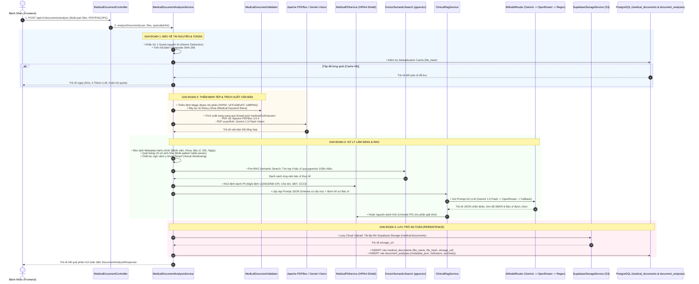

# Đặc Tả Kỹ Thuật: Pipeline Quét Cận Lâm Sàng & Lưu Trữ Database
## MediAssist-AI Multimodal Lab OCR, Clinical RAG & Database Architecture

> **Dự án:** MediAssist-AI Telehealth & Clinical AI Platform  
> **Chức năng:** Phân Tích Hồ Sơ Cận Lâm Sàng / Tóm Tắt Phiếu Xét Nghiệm (Document Summarizer & Lab OCR)  
> **Mã Use Case:** `UC-CLIN-03`  
> **Tài liệu liên quan:** [`docs/USE_CASES.md`](file:///Users/thanvinh/Desktop/KLTN/docs/USE_CASES.md#L190), [`docs/DATABASE_DESIGN.md`](file:///Users/thanvinh/Desktop/KLTN/docs/DATABASE_DESIGN.md#L208)

---

## 1. Sơ Đồ Luồng Hoạt Động Từ A Đến Z (End-to-End Pipeline)



---

## 2. Chi Tiết Lưu Xuống Cơ Sở Dữ Liệu (Database Persistence)

Kiến trúc áp dụng nguyên lý **Tách rời Tệp nhị phân và Dữ liệu quan hệ (Decoupled Binary Storage)**. Toàn bộ thông tin được chia thành **2 bảng quan hệ 1-1** trong PostgreSQL:

### 2.1. Bảng 1: `medical_documents` (Quản lý tệp & Mã băm chống trùng)
Được định nghĩa tại [`backend/src/main/java/com/mediassist/model/entity/MedicalDocument.java`](file:///Users/thanvinh/Desktop/KLTN/backend/src/main/java/com/mediassist/model/entity/MedicalDocument.java) và DDL tại [`V1__initial_schema.sql`](file:///Users/thanvinh/Desktop/KLTN/backend/src/main/resources/db/migration/V1__initial_schema.sql) kết hợp [`V4__cloud_storage_and_quota_management.sql`](file:///Users/thanvinh/Desktop/KLTN/backend/src/main/resources/db/migration/V4__cloud_storage_and_quota_management.sql):

| Tên Cột | Kiểu Dữ Liệu | Ràng Buộc | Ý Nghĩa Lưu Trữ |
| :--- | :--- | :--- | :--- |
| `id` | `UUID` | `PRIMARY KEY` | Khóa chính duy nhất của tài liệu. |
| `user_id` | `UUID` | `FOREIGN KEY` | Khóa ngoại liên kết tới người bệnh sở hữu (`users.id`). |
| `file_name` | `VARCHAR(255)` | `NOT NULL` | Tên gốc của tệp (hoặc tên gom cụm nếu là đa tệp). |
| `file_size_bytes` | `BIGINT` | `NOT NULL` | Dung lượng tệp tính theo Byte. |
| `content_type` | `VARCHAR(255)` | `NOT NULL` | MIME type (`application/pdf`, `image/jpeg`,...). |
| `status` | `VARCHAR(30)` | `NOT NULL` | Trạng thái: `PROCESSED`, `FAILED`, `PENDING`. |
| `file_hash` | `VARCHAR(64)` | Index | **Mã băm SHA-256:** Chuỗi 64 ký tự hex. Nếu tệp gửi lên trùng mã băm của bệnh nhân, hệ thống trả cache ngay mà không tốn token AI. |
| `storage_url` | `TEXT` | Nullable | **Đường dẫn Cloud Storage:** URL an toàn trên Supabase S3. Tệp nhị phân thực tế lưu trên S3, không lưu trong DB để chống phình dữ liệu. |
| `is_valid_medical` | `BOOLEAN` | `DEFAULT TRUE` | Đánh dấu tài liệu hợp lệ qua bước sàng lọc y tế. |
| `created_at` | `TIMESTAMP` | `NOT NULL` | Thời điểm tải lên hệ thống. |

---

### 2.2. Bảng 2: `document_analyses` (Lưu Metadata Y Tế, Bảng Chỉ Số & Tóm Tắt)
Được định nghĩa tại [`backend/src/main/java/com/mediassist/model/entity/DocumentAnalysis.java`](file:///Users/thanvinh/Desktop/KLTN/backend/src/main/java/com/mediassist/model/entity/DocumentAnalysis.java) và DDL tại [`V5__add_document_analysis_metadata.sql`](file:///Users/thanvinh/Desktop/KLTN/backend/src/main/resources/db/migration/V5__add_document_analysis_metadata.sql):

| Tên Cột | Kiểu Dữ Liệu | Ràng Buộc | Ý Nghĩa Lưu Trữ |
| :--- | :--- | :--- | :--- |
| `id` | `UUID` | `PRIMARY KEY` | Khóa chính phân tích. |
| `document_id` | `UUID` | `UNIQUE FK` | Liên kết 1-1 với `medical_documents.id` (`ON DELETE CASCADE`). |
| `metadata_json` | `TEXT` | JSON String | **Bóc tách hành chính cơ sở y tế:**<br>• `hospitalName`: Tên bệnh viện (Chợ Rẫy, ĐH Y Dược, Medlatec...)<br>• `departmentName`: Khoa xét nghiệm<br>• `orderingDoctor`: Bác sĩ chỉ định / duyệt kết quả<br>• `testDate`: Ngày giờ in phiếu xét nghiệm<br>• `sidCode`: Mã xét nghiệm SID / Mã BN<br>• `patientName`, `patientAge`, `patientGender`<br>• `deviceModel`: Thiết bị tự động (Cobas, Sysmex...) |
| `abnormal_indicators_json` | `TEXT` | JSON String | **Bảng toàn bộ chỉ số xét nghiệm trích xuất:**<br>Mỗi chỉ số là 1 JSON Object: `name` (Glucose, AST...), `value` (8.5), `unit` (mmol/L), `referenceRange` (3.9 - 6.4), `status` (`ELEVATED` / `LOW` / `NORMAL`), `clinicalSignificance` (Ý nghĩa sinh học). |
| `clinical_summary` | `TEXT` | `NOT NULL` | Tóm tắt bệnh cảnh y khoa toàn diện dành cho Bác sĩ điều trị. |
| `plain_language_explanation` | `TEXT` | `NOT NULL` | Lời giải thích bình dân, ân cần, dễ hiểu cho người bệnh. |
| `recommended_specialty_slug` | `VARCHAR` | Nullable | Mã chuyên khoa chuẩn bệnh viện (ví dụ: `cardiology`, `endocrinology`). |
| `recommended_specialty_name` | `VARCHAR` | `NOT NULL` | Tên chuyên khoa hiển thị tiếng Việt. |
| `suggested_questions_json` | `TEXT` | JSON String | Mảng 3 câu hỏi sâu sắc gợi ý người bệnh hỏi bác sĩ trong ca khám. |
| `created_at` | `TIMESTAMP` | `NOT NULL` | Thời điểm phân tích xong. |

---

## 3. Các Cơ Chế Kỹ Thuật Đột Phá Đã Triển Khai

### 3.1. Rào Chắn Token & Tiết Kiệm Chi Phí (Zero-Token Deduplication)
* Mỗi khi người bệnh tải tệp lên, hệ thống tính mã băm SHA-256 từ mảng byte trong bộ nhớ tạm (`calculateSha256(bytes)`).
* Gọi truy vấn:
  ```sql
  SELECT * FROM medical_documents WHERE user_id = ? AND file_hash = ? ORDER BY created_at DESC LIMIT 1;
  ```
* Nếu tìm thấy: Hệ thống đọc ngay kết quả từ bảng `document_analyses` trả về cho người bệnh.
  * **Độ trễ:** $< 5\text{ms}$.
  * **Token AI tiêu tốn:** `0 Token`.
  * **Lượt quét:** Không bị trừ Quota.

### 3.2. Lazy Cloud Upload & Rào Chắn Thu Hồi File Mồ Côi (Zero Orphan Files)
* Tệp PDF/Ảnh **KHÔNG** được upload lên Supabase Storage ngay khi nhận được.
* **Nguyên tắc Lazy:** Toàn bộ quá trình đọc, OCR, suy luận AI đều diễn ra trên RAM (mảng byte). Chỉ khi bước phân tích AI thành công 100%, tệp mới được đẩy lên Cloud.
* Nếu lưu Database thất bại: Hệ thống kích hoạt **Compensating Rollback Hook** xóa ngay tệp trên Cloud Storage, bảo đảm không bao giờ để lại file rác/file mồ côi chiếm dụng dung lượng.

### 3.3. Bộ Định Tuyến AI 3 Lớp Chống Sập (AiModelRouter)
1. **Tier 1 (Google Gemini 1.5 Flash):** Ưu tiên hàng đầu, hỗ trợ đọc cả văn bản và Multimodal Vision OCR cho ảnh chụp/scan, tốc độ 1 - 2s.
2. **Tier 2 (OpenRouter Pool):** Tự động xoay chuyển sang GPT-4o-mini hoặc Claude-3.5-Haiku nếu Tier 1 chạm hạn mức hoặc bảo trì.
3. **Tier 3 (Deterministic Fallback Engine):** Bộ máy Regex nội bộ tự động phân tích 10 chỉ số xét nghiệm phổ biến khi mất mạng hoàn toàn. Đảm bảo buổi thuyết trình/bảo vệ luận văn **không bao giờ bị crash**.

### 3.4. Khử Định Danh PII Y Tế (HIPAA & Nghị Định 13/2023/NĐ-CP)
* Trước khi đưa văn bản sang LLM ngoài đám mây, `MedicalPiiService` tự động che giấu:
  * Tên người bệnh $\rightarrow$ `[BỆNH_NHÂN_1]`
  * Số CCCD/BHYT/Mã BN $\rightarrow$ `[SỐ_ĐỊNH_DANH_1]`
  * Số điện thoại $\rightarrow$ `[SĐT_1]`
  * Địa chỉ $\rightarrow$ `[ĐỊA_CHỈ_1]`
* Sau khi LLM trả về lời giải thích, hệ thống tự động hoàn nguyên danh tính (`unmaskPii`) để hiển thị tự nhiên cho người bệnh.

### 3.5. Ghép Bác Sĩ Bằng Vector (pgvector + WHRF Re-Ranking)
* Các chỉ số bất thường và chuyên khoa do AI suy luận được đưa vào mô hình nhúng 1536 chiều.
* Truy vấn Cosine Distance trên PostgreSQL qua chỉ mục Partial HNSW (`idx_doctor_bio_hnsw_verified`).
* Thuật toán **WHRF** xếp hạng bác sĩ tối ưu:
  $$\text{Score} = 0.7 \times \text{CosineSimilarity} + 0.2 \times \text{RatingScore} + 0.1 \times \text{ExperienceScore}$$

---

## 4. Danh Mục Mã Nguồn Trực Tiếp Cần Đọc

Khi anh cần tra cứu chi tiết từng dòng code:

| Thành Phần | Đường Dẫn Tệp Tin | Dòng Code Quan Trọng |
| :--- | :--- | :--- |
| **1. Service Điều Phối Chính** | [`MedicalDocumentAnalysisService.java`](file:///Users/thanvinh/Desktop/KLTN/backend/src/main/java/com/mediassist/service/MedicalDocumentAnalysisService.java) | • Băm SHA-256 & Dedup: dòng 248 - 280<br>• Trích xuất song song: dòng 310 - 348<br>• Gọi RAG: dòng 363 - 368<br>• Lưu `medical_documents`: dòng 545 - 555<br>• Lưu `document_analyses`: dòng 610 - 632 |
| **2. Trích Xuất PDF Box** | [`PdfExtractionService.java`](file:///Users/thanvinh/Desktop/KLTN/backend/src/main/java/com/mediassist/service/PdfExtractionService.java) | • `extractTextFromPdf`: trích xuất văn bản & nén trang |
| **3. Rào Chắn Kiểm Định** | [`MedicalDocumentValidator.java`](file:///Users/thanvinh/Desktop/KLTN/backend/src/main/java/com/mediassist/service/MedicalDocumentValidator.java) | • Kiểm tra Magic Bytes & Rây lọc từ khóa y khoa |
| **4. Lắp Ráp Prompt RAG** | [`ClinicalRagService.java`](file:///Users/thanvinh/Desktop/KLTN/backend/src/main/java/com/mediassist/service/ClinicalRagService.java) | • `performDocumentRagAnalysis`: System Prompt, JSON Schema |
| **5. Khử Định Danh PII** | [`MedicalPiiService.java`](file:///Users/thanvinh/Desktop/KLTN/backend/src/main/java/com/mediassist/service/MedicalPiiService.java) | • `maskPii` và `reidentify` theo Nghị định 13 |
| **6. Tìm Kiếm Bác Sĩ pgvector** | [`DoctorSemanticSearchService.java`](file:///Users/thanvinh/Desktop/KLTN/backend/src/main/java/com/mediassist/service/DoctorSemanticSearchService.java) | • Thuật toán WHRF & Min-Heap Bounded PriorityQueue |
| **7. Lưu Trữ Supabase** | [`SupabaseStorageService.java`](file:///Users/thanvinh/Desktop/KLTN/backend/src/main/java/com/mediassist/service/SupabaseStorageService.java) | • `uploadDocument`, `deleteDocument` |
| **8. Thực Thể Database** | [`MedicalDocument.java`](file:///Users/thanvinh/Desktop/KLTN/backend/src/main/java/com/mediassist/model/entity/MedicalDocument.java)<br>[`DocumentAnalysis.java`](file:///Users/thanvinh/Desktop/KLTN/backend/src/main/java/com/mediassist/model/entity/DocumentAnalysis.java) | • Các trường mapping bảng CSDL |
| **9. Giao Diện Người Dùng** | [`DocumentSummarizerPage.tsx`](file:///Users/thanvinh/Desktop/KLTN/frontend/src/pages/patient/DocumentSummarizerPage.tsx) | • Kéo thả đa tệp, hiển thị bảng chỉ số, xem PDF mẫu Meddies |
