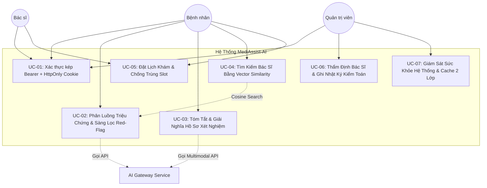

# Đặc Tả Use Case Chuẩn Doanh Nghiệp (Enterprise Use Cases Specification)
## MediAssist-AI Telehealth & Clinical AI Platform

> **Tiêu chuẩn tài liệu:** RUP (Rational Unified Process) & IEEE 830 Standard  
> **Dự án:** MediAssist-AI Telehealth Platform  
> **Trạng thái:** Hoàn chỉnh & Đã phê duyệt (Capstone Baseline)  
> **Các tác nhân chính (Actors):**
> 1. **Patient (Bệnh nhân / Người dùng cuối):** Tìm kiếm bác sĩ, trò chuyện triage triệu chứng, tải lên hồ sơ xét nghiệm.
> 2. **Doctor (Bác sĩ chuyên khoa):** Quản lý hồ sơ CCHN, xem tóm tắt lâm sàng AI, tiếp nhận lịch hẹn.
> 3. **Admin (Quản trị viên hệ thống):** Thẩm định bác sĩ, kiểm soát người dùng, cấu hình danh mục chuyên khoa.
> 4. **AI Gateway (Tác nhân bên ngoài):** OpenAI GPT-4o / Gemini 1.5 Pro & Embedding API.

---

## 1. Sơ Đồ Tổng Quan Use Case (Use Case Diagram)



---

## 2. Chi Tiết Các Use Case Lâm Sàng & Nghiệp Vụ

---

### UC-01: Xác Thực Kép Chuẩn Doanh Nghiệp (Dual-Transport Authentication)

* **Mã Use Case:** `UC-SEC-01`
* **Tác nhân chính:** Patient, Doctor, Admin.
* **Mục tiêu:** Cung cấp cơ chế đăng nhập bảo mật cao, kết hợp linh hoạt giữa Web Browser (`HttpOnly` Cookie chống XSS) và Mobile/Third-party Client (`Bearer` Authorization header).
* **Tiền điều kiện:** Người dùng đã có tài khoản trên hệ thống và trạng thái `is_active = true`.
* **Hậu điều kiện thành công:**
  - Token JWT được sinh ra với TTL 15 phút (Access Token) và 7 ngày (Refresh Token).
  - Trình duyệt lưu cookie an toàn `Set-Cookie: access_token=...; HttpOnly; SameSite=Strict; Secure`.
  - Frontend hydration từ localStorage giữ trạng thái đăng nhập tức thì không giật lag.

#### Luồng sự kiện chính (Happy Path):
1. Người dùng truy cập trang `/login` và nhập Email + Mật khẩu.
2. Trình duyệt gửi `POST /api/v1/auth/login` với body `{ email, password }`.
3. Backend `AuthService` kiểm tra số lần đăng nhập sai (`failed_login_attempts < 5`).
4. `DaoAuthenticationProvider` kiểm tra mã băm mật khẩu với `BCryptPasswordEncoder(12)`.
5. Hệ thống sinh JWT chứa `sub`, `role`, `fullName`.
6. Phản hồi trả về:
   - Header `Set-Cookie` chứa token `HttpOnly`.
   - Body JSON `{ success: true, data: { token, user: { id, fullName, email, role } } }`.
7. Frontend lưu trữ thông tin vào Zustand Auth Store và chuyển hướng người dùng theo role:
   - `ADMIN` $\rightarrow$ `/admin`
   - `DOCTOR` $\rightarrow$ `/doctor`
   - `PATIENT` $\rightarrow$ `/patient`

#### Luồng phụ & Ngoại lệ (Alternative / Exception Flows):
* **3a. Tài khoản bị tạm khóa do nhập sai quá 5 lần:** Hệ thống trả về `HTTP 423 Locked`, ghi log kiểm toán bảo mật và khóa tài khoản trong 30 phút.
* **4a. Sai thông tin đăng nhập:** Hệ thống tăng biến đếm `failed_login_attempts`, trả về `HTTP 401 Unauthorized` với thông báo chung *"Email hoặc mật khẩu không chính xác"* (tránh user enumeration attack).

---

### UC-02: Phân Luồng Triệu Chứng Bằng AI & Rào Chắn Cấp Cứu (AI Symptom Triage)

* **Mã Use Case:** `UC-CLIN-02`
* **Tác nhân chính:** Patient, Trợ lý AI (OpenAI/Gemini).
* **Mục tiêu:** Thu thập lời khai triệu chứng của bệnh nhân, nhận diện dấu hiệu nguy hiểm (Red-flag), phân loại mức độ khẩn cấp (Emergency, Urgent, Routine), và gợi ý chuyên khoa phù hợp.
* **Tiền điều kiện:** Bệnh nhân đã xác nhận đồng ý với *Tuyên bố từ chối trách nhiệm y tế (Medical Disclaimer)*.

#### Luồng sự kiện chính (Happy Path):
1. Bệnh nhân nhập mô tả triệu chứng: *"Tôi bị đau tức ngực trái lan ra cánh tay trái khi vận động nhẹ, thỉnh thoảng khó thở"*.
2. **Hard Rule Red-flag Check:** Hệ thống regex quét các từ khóa nguy cơ tim mạch cấp tính.
3. Nếu KHÔNG rơi vào cấp cứu tức thời:
   - Hệ thống chuyển prompt kèm lịch sử hội thoại đến AI Service.
   - AI đóng vai trò **Medical Scribe** tạo phản hồi lịch sự, đặt 1-2 câu hỏi làm rõ (Thời gian xuất hiện, mức độ đau từ 1-10).
   - Bệnh nhân trả lời thêm thông tin.
4. AI Service tổng hợp và kết luận:
   - Mức độ nguy cơ: `URGENT`.
   - Chuyên khoa gợi ý: `CARDIO` (Tim Mạch).
   - Tóm tắt lâm sàng (SBAR Summary): Lưu vào bảng `symptom_triage_sessions`.
5. Giao diện hiển thị nút *"Xem danh sách bác sĩ Tim Mạch phù hợp"* liên kết sang UC-04.

#### Luồng cấp cứu (Red-Flag Emergency Flow):
* **2a. Phát hiện dấu hiệu đột quỵ/nhồi máu cơ tim tối cấp:**
  - Hệ thống ngắt hội thoại LLM ngay lập tức.
  - Màn hình chuyển sang trạng thái cảnh báo đỏ nguy cấp:
    > **CẢNH BÁO Y TẾ KHẨN CẤP:** Triệu chứng của bạn có thể là dấu hiệu của hội chứng mạch vành cấp hoặc đột quỵ não. **KHÔNG** tiếp tục chờ đợi tư vấn trực tuyến. Hãy gọi ngay **115** hoặc nhờ người thân đưa đến khoa Cấp cứu bệnh viện gần nhất!
  - Cung cấp nút bấm gọi nhanh 115 và bản đồ các bệnh viện cấp cứu gần vị trí hiện tại.

---

### UC-03: Tóm Tắt & Giải Nghĩa Phiếu Xét Nghiệm Bằng AI Đa Phương Thức (Multimodal Document Summarization)

* **Mã Use Case:** `UC-CLIN-03`
* **Tác nhân chính:** Patient, Multimodal LLM Vision API.
* **Mục tiêu:** Chuyển đổi kết quả xét nghiệm máu/nước tiểu/chẩn đoán hình ảnh phức tạp thành bảng chỉ số đối chiếu dễ hiểu cho người bệnh.

#### Luồng sự kiện chính (Happy Path):
1. Bệnh nhân tải lên ảnh chụp phiếu xét nghiệm máu (`.jpg`, `.png`, hoặc `.pdf`, dung lượng $\le 15\text{MB}$).
2. Hệ thống kiểm tra mime-type và mã độc tệp tin.
3. Lưu trữ tệp tin vào Object Storage mã hóa và lưu siêu dữ liệu vào bảng `medical_documents`.
4. Gọi mô hình Vision (GPT-4o Vision hoặc Gemini 1.5 Pro) với Prompt chuyên biệt:
   - Trích xuất bảng chỉ số: Tên xét nghiệm, Giá trị đo được, Đơn vị, Khoảng tham chiếu bình thường.
   - Đánh dấu trạng thái: Bình thường / Tăng nhẹ / Giảm nhẹ / Bất thường nghiêm trọng.
   - Viết phần giải thích ngôn ngữ đại chúng (Plain-language translation).
   - Liệt kê 3 câu hỏi gợi ý để bệnh nhân hỏi lại bác sĩ trong buổi khám.
5. Lưu kết quả vào bảng `document_analyses`.
6. Giao diện hiển thị kết quả phân tích trực quan kèm nhãn *"Dữ liệu mang tính chất tham khảo, không thay thế chẩn đoán của bác sĩ"*.

---

### UC-04: Tìm Kiếm Bác Sĩ Bằng Vector Similarity Search (Semantic Doctor Discovery)

* **Mã Use Case:** `UC-CLIN-04`
* **Tác nhân chính:** Patient, PostgreSQL với extension `pgvector`.
* **Mục tiêu:** Khớp triệu chứng người bệnh với bác sĩ chuyên khoa sâu có kinh nghiệm điều trị thực tế cao nhất thông qua khoảng cách vector cosine.

#### Luồng sự kiện chính (Happy Path):
1. Người dùng nhập câu tìm kiếm: *"Bác sĩ chuyên tầm soát hẹp mạch vành và rối loạn nhịp tim"*.
2. Hệ thống tạo vector embedding 1536 chiều bằng `text-embedding-3-small`.
3. Thực thi truy vấn HNSW Vector Search trên bảng `doctors` có lọc điều kiện `vetting_status = 'VERIFIED'`.
4. Trả về danh sách bác sĩ xếp hạng theo độ tương đồng giảm dần (`similarity_score > 0.75`).
5. Giao diện hiển thị thẻ Bác sĩ gồm: Ảnh đại diện, Học vị, Nơi công tác, Điểm đánh giá, Giá khám và Nút *"Đặt Khám Ngay"*.

---

### UC-05: Đặt Lịch Khám Từ Xa & Ngăn Chặn Race Condition (Telehealth Appointment Booking)

* **Mã Use Case:** `UC-OPS-05`
* **Tác nhân chính:** Patient, Doctor, Hệ thống thanh toán/đặt chỗ.
* **Mục tiêu:** Đảm bảo một khung giờ (Slot) của bác sĩ chỉ có duy nhất 1 bệnh nhân đặt thành công, ngay cả khi hàng chục người cùng bấm nút tại cùng một mili-giây.

#### Luồng sự kiện chính (Happy Path):
1. Bệnh nhân chọn Bác sĩ, ngày khám và khung giờ còn trống (Ví dụ: `09:00 - 09:30 ngày 15/03/2026`).
2. Bệnh nhân bấm *"Xác nhận đặt lịch"*.
3. Backend mở giao dịch `@Transactional(isolation = Isolation.REPEATABLE_READ)`:
   - Kiểm tra xem slot đã có cuộc hẹn nào ở trạng thái `SCHEDULED` chưa qua câu lệnh:
     ```sql
     SELECT id FROM appointments 
     WHERE doctor_id = :doctorId AND scheduled_start = :startTime AND status = 'SCHEDULED' 
     FOR UPDATE;
     ```
   - Tạo bản ghi mới vào bảng `appointments` với `version = 0`.
   - Unique Partial Index `idx_unique_doctor_schedule` bảo vệ tầng DB.
4. Gửi email xác nhận lịch hẹn kèm đường dẫn phòng khám trực tuyến.
5. Cuộc hẹn xuất hiện trên bảng điều khiển của cả Bác sĩ và Bệnh nhân.

#### Luồng xung đột (Conflict Exception Flow):
* **3a. Người khác đã đặt slot trước đó 50ms:** Giao dịch bắt được lỗi `DataIntegrityViolationException` hoặc `ObjectOptimisticLockingFailureException`. Hệ thống rollback giao dịch, trả về thông báo thân thiện: *"Khung giờ này vừa có bệnh nhân khác nhanh tay đặt trước. Vui lòng chọn khung giờ khác liền kề."*

---

### UC-06: Thẩm Định Bác Sĩ & Ghi Nhật Ký Kiểm Toán (Doctor Vetting & Audit Trail)

* **Mã Use Case:** `UC-ADM-06`
* **Tác nhân chính:** Admin.
* **Mục tiêu:** Xác minh tính chính danh, bằng cấp và số Chứng chỉ hành nghề (CCHN) của bác sĩ trước khi cho phép hồ sơ hiển thị công khai trên ứng dụng.

#### Luồng sự kiện chính (Happy Path):
1. Admin truy cập đường dẫn `/admin/doctors` (Trang Duyệt Bác Sĩ).
2. Hệ thống tải danh sách các bác sĩ đang ở trạng thái `vetting_status = 'PENDING'`.
3. Admin kiểm tra số hiệu CCHN, cơ quan cấp phép và ảnh chụp bằng cấp đối chiếu với Cổng tra cứu thông tin của Bộ Y Tế.
4. Admin bấm *"Phê duyệt (Approve)"*:
   - Backend cập nhật `vetting_status = 'VERIFIED'`, `vetted_by = admin_id`, `vetted_at = NOW()`.
   - Xóa cache danh sách bác sĩ trên L1/L2 Cache để cập nhật bác sĩ mới ngay lập tức.
   - Ghi nhật ký vào bảng `audit_logs`:
     `action: VET_DOCTOR_APPROVE, actor: admin_id, entity: doctor_id`.
5. Bác sĩ nhận được thông báo tài khoản đã được kích hoạt thành công.
