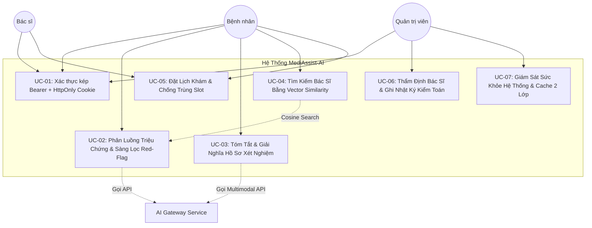

# Đặc Tả Use Case Chuẩn Doanh Nghiệp (Enterprise Use Cases Specification)
## MediAssist-AI Telehealth & Clinical AI Platform

> **Tiêu chuẩn tài liệu:** RUP (Rational Unified Process) & IEEE 830 Standard  
> **Dự án:** MediAssist-AI Telehealth Platform  
> **Trạng thái:** Hoàn chỉnh & Đã phê duyệt (Capstone Baseline)  
> **Các tác nhân chính (Actors):**
> 1. **Patient (Bệnh nhân / Người dùng cuối):** Tìm kiếm bác sĩ, trò chuyện triage triệu chứng, tải lên hồ sơ xét nghiệm.
> 2. **Doctor (Bác sĩ chuyên khoa):** Quản lý hồ sơ CCHN, xem tóm tắt lâm sàng AI, tiếp nhận lịch hẹn.
> 3. **Admin (Quản trị viên hệ thống):** Thẩm định bác sĩ, kiểm soát người dùng, cấu hình danh mục chuyên khoa.
> 4. **AI Gateway (Tác nhân bên ngoài):** OpenAI GPT-4o / Gemini 1.5 Pro & Embedding API.

---

## 1. Sơ Đồ Tổng Quan Use Case (Use Case Diagram)



---

## 2. Chi Tiết Các Use Case Lâm Sàng & Nghiệp Vụ

---

### UC-00: Khám Phá Trang Chủ Y Tế Số & Mô Phỏng Phân Luồng Lâm Sàng Tức Thì (Modern Telehealth Landing Page & Live Triage Simulator)

* **Mã Use Case:** `UC-UX-00`
* **Tác nhân chính:** Khách vãng lai (Guest Visitor), Người bệnh (Patient), Bác sĩ (Doctor), Hội đồng Đánh giá.
* **Mục tiêu:** Cung cấp trang đích giới thiệu hệ sinh thái MediAssist-AI hiện đại, tinh gọn, chuẩn mực y khoa (cảm hứng từ Mayo Clinic, One Medical, Zocdoc), tích hợp thanh mô phỏng phân luồng lâm sàng trực tiếp (Live Triage Simulator) phản hồi < 5ms, 4 bước khám chữa bệnh chuẩn hóa, bảng giá minh bạch và các chứng chỉ an toàn y tế.
* **Tiền điều kiện:** Người dùng truy cập URL gốc `/` hoặc `/landing`.
* **Hậu điều kiện thành công:**
  - Tải trang cực nhanh (< 100ms) với Zero-lag, loại bỏ hoàn toàn tải nặng WebGL.
  - Người dùng tương tác trực tiếp với **Live Triage Simulator**:
    1. Chọn kịch bản mẫu (Đau thắt ngực khẩn cấp, Sốt cao truyền nhiễm, Men gan tăng, Hồi hộp tim đập nhanh, Đau thượng vị).
    2. Nhận ngay kết quả tóm tắt chuẩn **SBAR** (Situation - Background - Assessment - Recommendation) với nhãn mức độ ưu tiên lâm sàng.
    3. Tự động kích hoạt còi báo động đỏ và liên kết gọi cấp cứu 115 khi gặp triệu chứng Red-Flag nguy kịch.
  - Khám phá 4 bước số hóa hành trình y tế chuẩn hóa (Triage Red-Flag -> Multimodal OCR -> Ghép Bác sĩ pgvector 1536 chiều -> Bàn khám EMR & WHO ICD-10).
  - Trình diễn sâu 4 tab công nghệ lâm sàng tương tác (Triage SBAR, Lab OCR Scanner, Doctor Match Card, EMR & Toa thuốc điện tử).
  - Bảng giá dịch vụ minh bạch (Gói lẻ 29k, Gói tiết kiệm 99k, Gói VIP 149k/tháng) kèm bảo lãnh hoàn tiền 100% Escrow.
  - Chuyển hướng mượt mà sang `/login` hoặc vào thẳng Dashboard nếu đã đăng nhập.

##### Luồng sự kiện chính (Happy Path):
1. Người dùng mở trang web tại địa chỉ `http://localhost:5173/`.
2. Hệ thống hiển thị thanh cảnh báo miễn trừ trách nhiệm y tế (Medical Disclaimer Banner) chuẩn Bộ Y Tế.
3. Thanh điều hướng trên cùng (Sticky Frosted Navbar) hiển thị logo MediAssist-AI, trạng thái hệ thống và các liên kết nhanh.
4. Tại Hero Section, người dùng bấm vào các chip triệu chứng hoặc nhập văn bản triệu chứng bất kỳ:
   - Nếu có từ khóa Red-Flag (đau thắt ngực, đột quỵ): Thẻ kết quả chuyển sang màu đỏ rực, cảnh báo cấp cứu và hiển thị nút *"Gọi Ngay Cấp Cứu 115"*.
   - Nếu là triệu chứng ngoại trú thông thường: Thẻ kết quả hiển thị tóm tắt SBAR và nút *"Đặt Khám Bác Sĩ Chuyên Khoa Ngay"*.
5. Người dùng cuộn xem hệ thống đối tác bệnh viện tuyến đầu (Chợ Rẫy, Bạch Mai, ĐH Y Dược TP.HCM, Viện Tim Tâm Đức, Nhi Đồng 1).
6. Người dùng khám phá 4 tab công nghệ lâm sàng, bảng giá dịch vụ và các câu hỏi thường gặp (FAQ Accordion).
7. Khi bấm nút *"Khám Miễn Phí"* hoặc *"Đăng Nhập"*, hệ thống chuyển mượt mà sang giao diện `LoginPage.tsx` với độ tương phản cao và nút *"Về Trang Chủ"* tiện lợi.

---

### UC-01: Xác Thực Kép Chuẩn Doanh Nghiệp (Dual-Transport Authentication)

* **Mã Use Case:** `UC-SEC-01`
* **Tác nhân chính:** Patient, Doctor, Admin.
* **Mục tiêu:** Cung cấp cơ chế đăng nhập bảo mật cao, kết hợp linh hoạt giữa Web Browser (`HttpOnly` Cookie chống XSS) và Mobile/Third-party Client (`Bearer` Authorization header).
* **Tiền điều kiện:** Người dùng đã có tài khoản trên hệ thống và trạng thái `is_active = true`.
* **Hậu điều kiện thành công:**
  - Token JWT được sinh ra với TTL 15 phút (Access Token) và 7 ngày (Refresh Token).
  - Trình duyệt lưu cookie an toàn `Set-Cookie: access_token=...; HttpOnly; SameSite=Strict; Secure`.
  - Frontend hydration từ localStorage giữ trạng thái đăng nhập tức thì không giật lag.

##### Luồng sự kiện chính (Happy Path):
1. **Trường hợp Người dùng mới (Bệnh nhân tự đăng ký):**
   - Bệnh nhân chọn tab *"Đăng Ký Bệnh Nhân Mới"* trên `/login`.
   - Điền: Họ tên, Email, Mật khẩu, Số điện thoại, Giới tính, Ngày sinh, Địa chỉ.
   - Trình duyệt gửi `POST /api/v1/auth/register`.
   - Backend `AuthService.register()` kiểm tra tính duy nhất của email, băm mật khẩu bằng BCrypt, tự động sinh mã hồ sơ bệnh án điện tử EMR `patient_code` dạng `BN-2026-XXXXX`, trả về `HTTP 201 Created` kèm token và set `HttpOnly` cookie.
2. **Trường hợp Đăng nhập:**
   - Người dùng nhập Email + Mật khẩu.
   - Rate Limiter phân tán trên Redis kiểm tra tần suất IP (`< 5 requests / phút`).
   - Trình duyệt gửi `POST /api/v1/auth/login`.
   - `AuthService` kiểm tra khóa tài khoản (`locked_until`). Nếu tài khoản đang bị khóa, trả về ngay `HTTP 423 Locked`.
   - `PasswordEncoder` kiểm tra mật khẩu. Nếu khớp, đặt lại `failed_login_attempts = 0`, cấp token JWT và `HttpOnly` cookie.
   - Frontend lưu trữ thông tin vào Zustand Auth Store và chuyển hướng người dùng theo role:
     - `ADMIN` $\rightarrow$ `/admin`
     - `DOCTOR` $\rightarrow$ `/doctor`
     - `PATIENT` $\rightarrow$ `/patient`

#### Luồng phụ & Ngoại lệ (Alternative / Exception Flows):
* **2a. Quá tải tần suất đăng nhập từ 1 IP (Anti-DDoS / Rate Limit):** Khi 1 IP gửi quá 5 request login trong 1 phút, hệ thống từ chối với `HTTP 429 Too Many Requests`.
* **2b. Sai mật khẩu liên tiếp (Anti-Brute Force Account Lockout):** Mỗi lần sai, `failed_login_attempts` tăng 1. Sau đúng 5 lần sai, tài khoản tự động bị khóa trong 15 phút, trả về `HTTP 423 Locked` kèm cảnh báo thời gian còn lại.
* **2c. Đăng ký email đã tồn tại:** Trả về `HTTP 409 Conflict` với thông báo thân thiện bằng tiếng Việt.

---

### UC-02: Phân Luồng Triệu Chứng Bằng AI & Rào Chắn Cấp Cứu (AI Symptom Triage)

* **Mã Use Case:** `UC-CLIN-02`
* **Tác nhân chính:** Patient, Trợ lý AI (OpenAI/Gemini/Deterministic Scribe).
* **Mục tiêu:** Thu thập lời khai triệu chứng của bệnh nhân, nhận diện dấu hiệu nguy hiểm (Red-flag), phân loại mức độ khẩn cấp (`ROUTINE`, `URGENT`, `EMERGENCY`), tạo bản tóm tắt SBAR và tự động kết nối đề xuất Bác sĩ chuyên khoa qua `pgvector`.
* **Tiền điều kiện:** Người dùng **ĐÃ ĐĂNG NHẬP** (Zero-Trust Login-First, mọi truy cập ẩn danh nhận ngay `HTTP 401 Unauthorized`), và xác nhận đồng ý với *Tuyên bố từ chối trách nhiệm y tế (Medical Disclaimer)*. Tuân thủ hạn mức Rate Limit (tối đa 10 lượt triage/phút).
* **REST Endpoints:**
  - `POST /api/v1/triage/assess`: Nhận diện triệu chứng, kiểm tra Red-Flag và trả về đánh giá SBAR kèm danh sách Bác sĩ đề xuất.
  - `GET /api/v1/triage/history`: Lấy danh sách lịch sử phân luồng của người dùng hiện tại.

#### Luồng sự kiện chính (Happy Path):
1. Bệnh nhân nhập mô tả triệu chứng: *"Tôi hay bị hồi hộp, đánh trống ngực và choáng váng khi vận động mạnh"*.
2. **Hard Rule Red-flag Check:** `RedFlagService` quét chuỗi triệu chứng bằng các mẫu regex tối cấp (Acute Coronary Syndrome, Stroke FAST, Anaphylaxis, Severe Hemorrhage).
3. Triệu chứng KHÔNG thuộc cấp cứu tức thời:
   - Hệ thống kích hoạt **Mô hình Trí tuệ Nhân tạo thực thụ (LLM via OpenRouter Gateway)** để suy luận lâm sàng (AI-First Clinical Reasoning):
     - Suy luận chuyên khoa mục tiêu phù hợp nhất trong 12 chuyên khoa bệnh viện (loại bỏ hoàn toàn các chuỗi if-else từ khóa cứng).
     - Đánh giá mức độ khẩn cấp lâm sàng (`ROUTINE`, `URGENT`, `EMERGENCY`).
     - Tạo bản tóm tắt lâm sàng theo chuẩn y khoa **SBAR** (Situation - Background - Assessment - Recommendation).
     - Cung cấp lời khuyên y tế chi tiết, an toàn (AI Advice) và gợi ý 2-3 câu hỏi làm rõ triệu chứng (Clarifying Questions).
   - Tự động gọi `DoctorSemanticSearchService` sử dụng khoảng cách Cosine trên PostgreSQL `pgvector` để tìm top Bác sĩ chuyên khoa tương thích cao nhất (`similarity_score > 0.90`) dựa trên embedding kết hợp giữa triệu chứng và chuyên khoa do AI suy luận.
   - Khi ngoại tuyến hoặc chưa nạp API key: Hệ thống chuyển sang **Transparent Offline Fallback**, an toàn định tuyến về Khám Nội Tổng Quát (`general-internal-medicine`), tuyệt đối không tự bịa đặt mức độ nguy kịch hay chẩn đoán mò.
4. Lưu thông tin phiên vào bảng `triage_sessions`.
5. Giao diện hiển thị thẻ kết quả Triage, nhãn mức độ ưu tiên, lời khuyên của AI, câu hỏi làm rõ và danh thiếp Bác sĩ đề xuất qua pgvector kèm nút *"Đặt Khám Ngay"*.

#### Luồng cấp cứu (Red-Flag Emergency Flow):
* **2a. Phát hiện dấu hiệu đột quỵ / nhồi máu cơ tim / sốc phản vệ:**
  - Hệ thống ngắt quy trình gọi LLM ngay lập tức (0ms LLM latency, 0 token cost).
  - Trả về `isEmergency = true`, mức độ `EMERGENCY`.
  - Màn hình chuyển sang trạng thái cảnh báo đỏ nguy cấp với nút bấm gọi nhanh 115 và hướng dẫn xử trí tại chỗ.

---

### UC-03: Tóm Tắt & Giải Nghĩa Phiếu Xét Nghiệm Bằng AI Đa Phương Thức (Multimodal Document Summarization & Token Protection)

* **Mã Use Case:** `UC-CLIN-03`
* **Tác nhân chính:** Patient, Apache PDFBox Parser, MedicalDocumentValidator, Supabase Storage, pgvector Semantic Matching Engine.
* **Mục tiêu:** Chuyển đổi kết quả xét nghiệm máu/sinh hóa/nước tiểu từ tài liệu PDF phức tạp thành bảng chỉ số đối chiếu dễ hiểu cho người bệnh, cảnh báo bất thường, đề xuất bác sĩ chuyên khoa phù hợp tức thì; đồng thời bảo vệ 100% token AI và lưu trữ an toàn trên Cloud EMR.
* **Tiền điều kiện:** 
  - Người dùng **ĐÃ ĐĂNG NHẬP** (Zero-Trust Login-First, từ chối khách vãng lai với `HTTP 401 Unauthorized`).
  - Người dùng có hạn ngạch quét (`scanQuota > 0`) hoặc là hội viên `MediPass VIP` (nếu hết lượt, chuyển sang ngoại lệ `HTTP 402 Payment Required`).
  - Tuân thủ Rate Limiter (tối đa 5 lượt tải lên/phút) và giới hạn kích thước tệp tối đa 15MB.
* **REST Endpoints:**
  - `POST /api/v1/documents/analyze`: Tiếp nhận tệp PDF xét nghiệm qua `multipart/form-data` (tham số `file`), kiểm tra SHA-256 deduplication, sàng lọc gatekeeper, bóc tách chỉ số sinh hóa, upload Supabase Storage, trừ hạn ngạch và tìm kiếm bác sĩ qua pgvector. (Yêu cầu đăng nhập).
  - `POST /api/v1/documents/analyze-preview`: Quét thử nghiệm tài liệu xét nghiệm trực tiếp từ Landing Page không cần đăng nhập. Sàng lọc Gatekeeper nghiêm ngặt chống ảnh rác/ảnh mờ/ảnh ngoài ngành y, bóc tách chỉ số thật 100% từ PDF/Vision (không suy đoán, không dùng mock), truy vấn danh mục bác sĩ pgvector tương thích nhưng không lưu Cloud EMR và không trừ quota.
  - `GET /api/v1/documents/quota`: Kiểm tra số lượt quét khả dụng, hạn hội viên VIP và trạng thái gói cước của người bệnh.
  - `GET /api/v1/documents/my`: Truy vấn lịch sử các tài liệu y tế đã phân tích của người bệnh đăng nhập (yêu cầu Bearer Token).

#### Luồng sự kiện chính (Happy Path):
1. **Chọn Tệp & Kích Hoạt Tức Thì (Instant Upload UX):** Bệnh nhân kéo thả hoặc chọn tệp kết quả xét nghiệm (`.pdf`, `.txt`, `.jpg`, `.png`, dung lượng $\le 15\text{MB}$) hoặc chọn dữ liệu mẫu chuẩn (Mỡ máu / Men gan / Điện não). Hệ thống **tự động kích hoạt ngay tiến trình phân tích AI** mà không cần qua nút bấm trung gian.
2. **Kiểm tra Deduplication (SHA-256 Checksum):** Hệ thống tính toán hash SHA-256 của tệp. Nếu tài liệu đã từng được phân tích trong hồ sơ EMR của bệnh nhân này:
   - Trả về ngay kết quả đã lưu trong DB (`cachedResult = true`).
   - Tiêu tốn **0 token AI**, độ trễ $< 5\text{ms}$ và **TUYỆT ĐỐI KHÔNG trừ lượt quét**.
3. **Kiểm tra Hạn Ngạch (Quota Guard):** Nếu tài liệu mới, kiểm tra `user.hasScanQuota()`. Nếu hết lượt và chưa là VIP, trả về `HTTP 402 Payment Required` kèm modal báo giá gói quét và thanh toán tức thì qua VietQR.
4. **Cơ chế Lọc Rác Tiền Thẩm Định (Gatekeeper Sieve Validation):**
   - Kiểm tra magic bytes nhị phân (chấp nhận PDF, JPEG, PNG và luồng văn bản y khoa hợp lệ).
   - Kiểm tra độ dài văn bản trích xuất (tối thiểu 15 ký tự; nếu ngắn hơn -> lỗi mờ ảnh `UNREADABLE_DOCUMENT`).
   - Sàng lọc từ điển chỉ số lâm sàng (40+ thuật ngữ xét nghiệm sinh hóa/huyết học).
   - *Nếu phát hiện ảnh rác (hóa đơn siêu thị, meme, chó mèo, ảnh mờ):* Ném lỗi `HTTP 400 NON_MEDICAL_DOCUMENT` hoặc `UNREADABLE_DOCUMENT` và **KHÔNG trừ hạn ngạch** của bệnh nhân.
5. **Quy Trình Lazy Upload & Triệt Tiêu File Mồ Côi (Zero Orphan Files):**
   - **Xử lý hoàn toàn trong RAM:** Trích xuất chỉ số sinh hóa và thực thi suy luận AI RAG trực tiếp trên mảng byte trong bộ nhớ tạm.
   - **Lazy Upload Pattern:** Chỉ khi và chỉ khi toàn bộ pipeline phân tích AI hoàn tất 100% thành công, tệp nhị phân mới được tải lên Supabase Storage (`storageService.uploadDocument()`). Nếu AI lỗi hoặc file hỏng, luồng hủy ngay tại chỗ, **0 byte rác lọt lên Cloud**.
   - **Compensating Rollback Hook:** Nếu quá trình ghi Database EMR gặp sự cố sau khi đã tải lên Cloud, hệ thống tự động gọi `storageService.deleteDocument()` để xóa file trên Supabase ngay lập tức, triệt tiêu 100% nguy cơ file mồ côi (Zero Orphan Files).
   - **Upload Circuit Breaker:** Người dùng gửi liên tiếp 3 file không hợp lệ sẽ bị áp dụng án phạt Cooldown 10 phút.
6. **Kiến Trúc AI-First Toàn Diện & Xử Lý Hồ Sơ Đa Trang (AI-First Clinical Reasoning & Multi-Page Windowing):**
   - **Xóa Bỏ 100% Ma Trận Hardcode & Bịa Bệnh (Zero Fake Diagnoses & Zero Keyword Maps):** Hệ thống không sử dụng các bảng tra cứu tĩnh hay chuỗi if-else chấm điểm từ khóa cố định. Toàn bộ suy luận y khoa được điều phối theo luồng AI-First:
     - *Pha 1 - Universal Tabular Line Parser:* Quét động mọi dòng cận lâm sàng dạng bảng `[Tên xét nghiệm]: [Kết quả] [Đơn vị] ([Khoảng tham chiếu])`, bóc tách dữ liệu số/định tính thô mà không áp đặt định kiến bệnh tật.
     - *Pha 2 - Smart Clinical Windowing:* Chắt lọc ngữ cảnh y khoa tập trung cho hồ sơ bệnh án đa trang ($\le 5.500$ ký tự), loại bỏ nhiễu hành chính/viện phí.
     - *Pha 3 - AI Clinical Reasoning (OpenRouter Gateway):* Mô hình LLM đọc toàn bộ ngữ cảnh lâm sàng, tự suy luận bệnh cảnh, tổng hợp `clinicalSummary`, dịch nghĩa `plainLanguageExplanation`, xác định chuyên khoa phù hợp nhất từ 12 chuyên khoa bệnh viện, và sinh 3 câu hỏi sâu sắc cho người bệnh.
     - *Pha 4 - pgvector Cosine Similarity Doctor Matching:* Sử dụng chuyên khoa và các chỉ số bất thường do AI xác nhận làm câu truy vấn ngữ nghĩa, tính toán độ tương đồng cosine toán học (`1 - (bio_embedding <=> query_vector)`) trên PostgreSQL pgvector. Bác sĩ đứng đầu danh sách được đề xuất minh bạch kèm tỷ lệ phần trăm tương thích (Tuyệt đối không chọn ngẫu nhiên).
     - *Chế Độ Ngoại Tuyến Minh Bạch (Transparent Offline Mode):* Khi thiếu `OPENROUTER_API_KEY` hoặc ngoại tuyến, hệ thống hiển thị rõ ràng nhãn cảnh báo Ngoại Tuyến (Offline Fallback), chuyển tuyến Nội Tổng Quát an toàn và không tự tiện suy đoán chẩn đoán bệnh.
    - **Dự phòng Scanned PDF (Vision OCR) & Bể Model Thị Giác Đa Tầng (Multi-Model Vision Pool):**
      - Nếu PDF là bản scan thuần ảnh không có text layer ($< 30$ ký tự), hệ thống tự động render ảnh từng trang với độ phân giải cao **200 DPI** qua `PDFRenderer`.
      - Xây dựng bể xoay vòng tự động 3 model Vision mạnh nhất trên OpenRouter: `inclusionai/ling-3.0-flash-vl:free` $\rightarrow$ `nex-agi/nex-n2.5-pro:free` $\rightarrow$ `nvidia/nemotron-3-nano-omni-30b-a3b-reasoning:free`. Tự động fallback nếu chạm rate-limit `HTTP 429`.
    - **Rào Chắn An Toàn Y Tế & Triệt Tiêu Đề Xuất Ảo (Medical Safety Gating & Zero Fake Recommendation):**
      - *Trường hợp phiếu trắng / ảnh mờ / không có số liệu:* Nếu tài liệu là phiếu chỉ định trắng chưa điền kết quả (cột kết quả để trống) hoặc ảnh chụp mờ không bóc tách được số liệu cận lâm sàng (`indicators.isEmpty()`):
        + **Tuyệt đối không đoán mò chuyên khoa:** Để `recommendedSpecialtySlug = null`, `recommendedSpecialtyName = "Chưa xác định (Cần bổ sung kết quả)"`.
        + **Tuyệt đối không đề xuất bác sĩ:** Khóa toàn bộ danh sách `matchedDoctors = []`, `recommendedDoctorId = null`, không gán cờ `aiRecommended`.
        + **Giao diện cảnh báo an toàn y tế:** Hiển thị Banner màu hổ phách giải thích rõ ràng nguyên nhân, công bố nguyên tắc an toàn không phán đoán khi thiếu dữ liệu, và hướng dẫn người bệnh chụp lại ảnh rõ nét hoặc tải phiếu có kết quả đầy đủ.
7. **Khấu trừ Hạn Ngạch:** Trừ 1 lượt quét đối với tài khoản FREE (`scanQuota = scanQuota - 1`). Giữ nguyên không giới hạn đối với hội viên MediPass VIP.
8. **Phản hồi Giao Diện Tức Thì & Phân Định Trạng Thái AI:**
   - Hiển thị **Banner Thông Báo Thành Công Nổi Bật** phân định rõ: Huy hiệu Xanh Ngọc (*"AI Phân Tích Hoàn Tất"*) khi có LLM, hoặc Huy hiệu Vàng Hổ Phách (*"Chế Độ Ngoại Tuyến"*) khi chạy fallback an toàn.
   - Thẻ hiển thị động cơ phân tích minh bạch tên mô hình AI đã xử lý (`modelUsed`).
   - Màn hình tự động cuộn mượt mà (`scrollIntoView`) đến phần kết quả `#analysis-results`.
   - Danh sách Bác sĩ chuyên khoa sâu được sắp xếp chuẩn xác theo điểm số tương đồng cosine từ PostgreSQL pgvector kèm nút *"Đặt Khám Ngay"*. (Nếu tài liệu không có kết quả, hiển thị Empty State hướng dẫn người bệnh).

---

### UC-11: Quản Lý Hạn Ngạch Quét & Mô Hình Doanh Thu Win-Win (Commercial Scan Quota & Token Protection)

* **Mã Use Case:** `UC-FIN-11`
* **Tác nhân chính:** Patient, Doctor, System Platform Owner.
* **Mục tiêu:** Bảo vệ tài nguyên AI chống spam tốn chi phí token, triển khai mô hình kinh tế Win-Win đôi bên cùng có lợi (Bệnh nhân tiết kiệm - Bác sĩ gia tăng thu nhập - Nền tảng bền vững).
* **REST Endpoints:**
  - `GET /api/v1/documents/quota`: Lấy thông tin hạn ngạch quét còn lại và trạng thái gói cước VIP.
* **Chính sách Thương Mại Doanh Nghiệp:**
  1. **Bệnh nhân:**
     - Tặng **1 lượt quét miễn phí** cho tài khoản mới trải nghiệm chất lượng.
     - **Gói lẻ:** 29.000đ / 1 lượt phân tích chuyên sâu.
     - **Gói Tiết kiệm:** 99.000đ / 5 lượt (giảm 32%, hạn dùng 12 tháng).
     - **MediPass VIP:** 149.000đ / tháng (Quét không giới hạn + Tư vấn ưu tiên).
     - **Chính sách Deduplication Vĩnh Viễn:** Tải lại tài liệu đã phân tích hoàn toàn miễn phí trọn đời (0đ, 0 token).
  2. **Bác sĩ Chuyên Khoa:**
     - Nhận **85% phí khám** (250.000đ - 450.000đ/ca) qua cơ chế ký quỹ Escrow minh bạch.
     - Tiếp nhận tóm tắt lâm sàng SBAR chuẩn bị sẵn, tiết kiệm 50% thời gian hội chẩn.
  3. **Platform Owner:**
     - Nhận 15% hoa hồng đặt khám và doanh thu gói quét.
     - Bảo vệ 100% token LLM trước nạn bot/spam ảnh rác nhờ Gatekeeper Sieve Validation.

### UC-04: Tìm Kiếm Bác Sĩ Bằng Vector Similarity Search (Semantic Doctor Discovery)

* **Mã Use Case:** `UC-CLIN-04`
* **Tác nhân chính:** Patient, PostgreSQL với extension `pgvector`.
* **Mục tiêu:** Khớp triệu chứng người bệnh với bác sĩ chuyên khoa sâu có kinh nghiệm điều trị thực tế cao nhất thông qua khoảng cách vector cosine trên chỉ mục HNSW (`vector_cosine_ops`).
* **REST Endpoints:**
  - `GET /api/v1/triage/search/semantic?query={text}&limit={n}`: Tra cứu danh sách bác sĩ tương thích ngữ nghĩa từ câu truy vấn tự nhiên.

#### Luồng sự kiện chính (Happy Path):
1. Người dùng nhập câu tìm kiếm: *"Bác sĩ chuyên tầm soát hẹp mạch vành và rối loạn nhịp tim"*.
2. Hệ thống tạo vector embedding 1536 chiều bằng `EmbeddingService`.
3. Thực thi truy vấn HNSW Vector Search trên bảng `doctor_profiles` với điều kiện `is_verified = true`:
   ```sql
   SELECT dp.*, 1 - (dp.bio_embedding <=> CAST(:vector AS vector)) AS similarity_score
   FROM doctor_profiles dp ...
   ORDER BY dp.bio_embedding <=> CAST(:vector AS vector) ASC
   LIMIT 5;
   ```
4. Trả về danh sách bác sĩ xếp hạng theo độ tương đồng giảm dần (`similarity_score`).
5. Giao diện hiển thị thẻ Bác sĩ gồm: Ảnh đại diện, Học vị, Nơi công tác, Điểm tương đồng (`%`), Giá khám và Nút *"Đặt Khám Ngay"*.

---

### UC-05: Đặt Lịch Khám Từ Xa & Ngăn Chặn Race Condition (Telehealth Appointment Booking)

* **Mã Use Case:** `UC-OPS-05`
* **Tác nhân chính:** Patient, Doctor, Hệ thống thanh toán/đặt chỗ.
* **Mục tiêu:** Đảm bảo một khung giờ (Slot) của bác sĩ chỉ có duy nhất 1 bệnh nhân đặt thành công, ngăn chặn race condition bằng Optimistic Locking (`@Version`), isolation level `REPEATABLE_READ`, và Partial Unique Index.
* **REST Endpoints:**
  - `GET /api/v1/doctors/{id}/slots?date=YYYY-MM-DD`: Tra cứu slot 30 phút khả dụng trong ngày.
  - `POST /api/v1/appointments`: Đặt lịch khám mới (`{ doctorId, scheduledStart, notes }`). Trả về HTTP 201 kèm `appointmentCode`.
  - `GET /api/v1/appointments/my`: Lấy danh sách lịch hẹn của người dùng hiện tại (lọc theo role Patient/Doctor).
  - `PATCH /api/v1/appointments/{id}/status`: Cập nhật trạng thái (`SCHEDULED` -> `COMPLETED` / `CANCELLED`).

#### Luồng sự kiện chính (Happy Path):
1. Bệnh nhân vào trang danh bạ, chọn Bác sĩ, chọn ngày khám và khung giờ còn trống (Ví dụ: `09:00 - 09:30 ngày 12/09/2026`).
2. Bệnh nhân nhập triệu chứng và bấm *"Xác nhận đặt khám"*.
3. Trình duyệt gửi `POST /api/v1/appointments` kèm Bearer token.
4. Backend mở giao dịch `@Transactional(isolation = Isolation.REPEATABLE_READ)`:
   - Kiểm tra xem slot đã có cuộc hẹn nào ở trạng thái không bị hủy chưa qua câu lệnh:
     ```sql
     SELECT COUNT(a) > 0 FROM Appointment a 
     WHERE a.doctor.id = :doctorId AND a.scheduledStart = :scheduledStart 
       AND a.status NOT IN (AppointmentStatus.CANCELLED)
     ```
   - Sinh mã định danh giao dịch chuẩn: `AP-YYYYMMDD-XXXXXX`.
   - Tạo bản ghi mới vào bảng `appointments` với `version = 0`.
   - Ghi nhật ký kiểm toán vào `audit_logs` với action `APPOINTMENT_BOOKED`.
5. Backend trả về HTTP 201 Created cùng `AppointmentDto`.
6. Cuộc hẹn xuất hiện trên bảng điều khiển của cả Bác sĩ (`DoctorDashboard`) và Bệnh nhân (`PatientDashboard`).

#### Luồng xung đột (Conflict Exception Flow):
* **3a. Người khác đã đặt slot trước đó:** `existsConflict` phát hiện trùng giờ $\rightarrow$ Ném ngoại lệ `AppException(HttpStatus.CONFLICT, "SLOT_CONFLICT", ...)`. Backend trả về HTTP 409: *"Khung giờ này đã có bệnh nhân khác nhanh tay đặt trước. Vui lòng chọn khung giờ khác."*

---

### UC-06: Thẩm Định Bác Sĩ & Ghi Nhật Ký Kiểm Toán (Doctor Vetting & Audit Trail)

* **Mã Use Case:** `UC-ADM-06`
* **Tác nhân chính:** Admin, Doctor.
* **Mục tiêu:** Xác minh tính chính danh, bằng cấp và số Chứng chỉ hành nghề (CCHN) của bác sĩ trước khi cho phép hồ sơ hiển thị công khai trên ứng dụng.
* **REST Endpoints:**
  - `GET /api/v1/admin/doctors/pending`: Lấy danh sách hồ sơ bác sĩ chưa xác thực (`isVerified = false`).
  - `POST /api/v1/admin/doctors/{id}/vet`: Phê duyệt hoặc từ chối hồ sơ (`{ approve: boolean, rejectionReason: string }`).
  - `PUT /api/v1/doctors/me/profile`: Bác sĩ tự cập nhật thông tin CCHN, tiểu sử, số năm kinh nghiệm, và giá khám.

#### Luồng sự kiện chính (Happy Path):
1. Admin truy cập đường dẫn `/admin/doctors` (Trang Duyệt Bác Sĩ).
2. Hệ thống gọi `GET /api/v1/admin/doctors/pending` tải danh sách các bác sĩ đang chờ xác minh.
3. Admin kiểm tra số hiệu CCHN, cơ quan cấp phép, số năm kinh nghiệm và chuyên khoa.
4. Admin bấm *"Phê duyệt (Approve)"*:
   - Backend gọi `adminVettingService.vetDoctor(id, true, null, adminId)`.
   - Cập nhật `isVerified = true`, `verifiedAt = NOW()`.
   - Đồng bộ xóa cache: `cacheService.evict("doctors:verified")` trên cả L1 Caffeine và L2 Redis để danh bạ bác sĩ công khai cập nhật ngay lập tức.
   - Ghi nhật ký kiểm toán vào bảng `audit_logs`:
     `action: VET_DOCTOR_APPROVED, actor: admin_id, resource: doctor_profiles/{id}`.
5. Hồ sơ bác sĩ lập tức hiển thị công khai trên `DoctorSearchPage` cho tất cả bệnh nhân tra cứu và đặt lịch.

---

### UC-07: Quản Lý Hộ Chiếu Y Tế & Cổng Thông Tin Bệnh Nhân Đa Năng (Patient EMR Medical Passport & Portal)

* **Mã Use Case:** `UC-PAT-07`
* **Tác nhân chính:** Patient, Doctor, Admin.
* **Mục tiêu:** Quản lý toàn bộ thông tin hành chính y tế chuẩn bệnh viện (Mã BN bệnh viện `BN-YYYY-XXXXX`, 12 số CCCD, thẻ BHYT 15 ký tự, nhóm máu, tiền sử dị ứng thuốc và người liên hệ khẩn cấp). Cung cấp giao diện 3 tab tổng hợp: (1) Lịch khám & EMR ngoại trú, (2) Lịch sử phân luồng AI (Triage Sessions & SBAR), (3) Danh mục tài liệu xét nghiệm đã số hóa.
* **REST Endpoints:**
  - `GET /api/v1/patient/profile`: Bệnh nhân tra cứu hồ sơ y tế cá nhân.
  - `PUT /api/v1/patient/profile`: Cập nhật thông tin CCCD, BHYT, nhóm máu, dị ứng, bệnh sử nền.
  - `GET /api/v1/patient/profile/by-user/{userId}`: Bác sĩ điều trị tra cứu hồ sơ bệnh nhân trước ca khám.
  - `GET /api/v1/triage/history`: Bệnh nhân tra cứu toàn bộ lịch sử phân luồng AI và khuyến nghị SBAR.
  - `GET /api/v1/documents/my`: Bệnh nhân tra cứu danh mục phiếu xét nghiệm đã lưu trữ và xác thực.

#### Luồng sự kiện chính (Happy Path):
1. Bệnh nhân đăng nhập vào hệ thống và truy cập `PatientDashboard`.
2. Hệ thống hiển thị Thẻ Y Tế Chuẩn Bệnh Viện:
   - Mã định danh bệnh viện: `BN-2026-08492`.
   - Thẻ CCCD 12 số, Thẻ BHYT 15 số có hạn mức thanh toán bảo hiểm y tế.
   - Nhóm máu (O+, A+, B+, AB+...).
   - Banner Cảnh Báo Đỏ Dị Ứng (Ví dụ: `DỊ ỨNG PENICILLIN (Kháng sinh Beta-lactam) - NGUY CƠ SỐC PHẢN VỆ`).
3. Giao diện 3 tab tổng hợp giúp bệnh nhân quản lý sức khỏe toàn diện:
   - **Tab 1: Lịch Khám & EMR Ngoại Trú:** Xem các lịch hẹn đã đặt, số thứ tự STT khám, phòng khám chỉ định, xem chi tiết EMR bệnh án và toa thuốc điện tử kèm nút In Toa Thuốc. Hủy lịch khám qua modal xác nhận lý do hủy rõ ràng.
   - **Tab 2: Lịch Sử Phân Luồng AI:** Xem danh sách các ca sàng lọc triệu chứng, phân tầng mức độ khẩn cấp (Cấp cứu / Khẩn cấp / Tiêu chuẩn / Tự chăm sóc), xem tóm tắt lâm sàng SBAR và khuyến nghị AI, cùng nút đặt khám bác sĩ chuyên khoa tương ứng.
   - **Tab 3: Hồ Sơ Xét Nghiệm Đã Quét:** Xem danh mục tệp PDF/ảnh kết quả xét nghiệm đã bóc tách, dung lượng tệp, trạng thái xác thực y tế và nút mở lại phân tích.
4. Bác sĩ khi khám bệnh cho bệnh nhân này có thể xem toàn bộ lịch sử bệnh án và các cảnh báo dị ứng thuốc.

---

### UC-08: Thực Hiện Khám Lâm Sàng, Ghi Nhận Sinh Hiệu, Chẩn Đoán ICD-10 & Kê Toa Thuốc Điện Tử (Clinical Encounter & e-Prescription)

* **Mã Use Case:** `UC-DOC-08`
* **Tác nhân chính:** Doctor, Patient.
* **Mục tiêu:** Bác sĩ điều trị tiếp nhận ca khám, nhập bảng chỉ số sinh hiệu (Huyết áp, Mạch, Thân nhiệt, Nhịp thở, SpO2, BMI), chẩn đoán theo mã bệnh danh quốc tế ICD-10 của WHO, kê đơn thuốc điện tử nhiều loại kèm liều dùng / hướng dẫn sử dụng, và dặn dò tái khám.
* **REST Endpoints:**
  - `POST /api/v1/appointments/{id}/complete-clinical`: Bác sĩ hoàn tất ca khám lâm sàng với payload `ClinicalEncounterRequest`.

#### Luồng sự kiện chính (Happy Path):
1. Bác sĩ truy cập Bảng điều khiển lâm sàng `DoctorDashboard`.
2. Tại danh sách lịch hẹn hôm nay, bác sĩ thấy số thứ tự khám `STT 08`, phòng khám `Phòng Khám 204`, và lý do vào viện của bệnh nhân.
3. Bác sĩ bấm *"Khám Lâm Sàng & Kê Đơn (EMR)"* để mở Bàn Làm Việc Bác Sĩ (Clinical Workstation):
   - Nhập bảng sinh hiệu: Huyết áp (135/85 mmHg), Nhịp tim (78 bpm), Thân nhiệt (36.8°C), Nhịp thở (18 bpm), SpO2 (98%), Chiều cao (170cm), Cân nặng (68kg) $\rightarrow$ Hệ thống tự động tính BMI: $23.53\text{ kg/m}^2$ (Thể trạng bình thường).
   - Chọn hoặc nhập mã bệnh danh quốc tế ICD-10 (Ví dụ: `I20.9 - Bệnh tim thiếu máu cục bộ nghẽn mạch vành`).
   - Lập Toa thuốc điện tử đa dòng: Tên thuốc, dạng bào chế, hàm lượng, số lượng, cách dùng (sáng/trưa/chiều/tối, trước/sau ăn), và lưu ý y lệnh.
   - Nhập Kế hoạch điều trị & Chọn ngày hẹn tái khám.
4. Bác sĩ bấm *"Ký Số & Hoàn Tất Khám Lâm Sàng"*.
5. Backend lưu trữ trạng thái `status = 'COMPLETED'`, cập nhật toàn bộ `vitalSignsJson`, `icd10Code`, `prescriptionJson`, và gửi kết quả về bệnh án điện tử của người bệnh.
6. Cả bác sĩ và bệnh nhân đều có thể mở xem bản in Bệnh Án Điện Tử & Toa Thuốc Chuẩn Bệnh Viện (với nút *"In Bệnh Án & Toa Thuốc"* theo mẫu quy chuẩn Bộ Y Tế).

---

### UC-09: Khởi Tạo & Di Trú Dữ Liệu Bệnh Viện Mẫu Bằng Flyway (Automated Database Migration & Hospital Seeding)

* **Mã Use Case:** `UC-SYS-09`
* **Tác nhân chính:** System (Flyway Database Migration Engine), Admin, Tech Lead.
* **Mục tiêu:** Tự động hóa quá trình khởi tạo cấu trúc và nạp dữ liệu chuẩn bệnh viện (12 chuyên khoa, 12 bác sĩ tuyến trung ương, 630 ca khám, 5 hồ sơ bệnh nhân EMR, 8 ca khám lâm sàng thực thụ) ngay khi ứng dụng khởi động, loại bỏ hoàn toàn mã nguồn giả lập (mock data) và thao tác thủ công.
* **Các bước di trú (Migration Execution):**
  1. Khi Spring Boot khởi động, `FlywayAutoConfiguration` kích hoạt kết nối tới PostgreSQL `mediassist_db`.
  2. Flyway kiểm tra bảng `flyway_schema_history`:
     - Áp dụng `V1__initial_schema.sql`: Khởi tạo 12 bảng thực thể cốt lõi, extensions vector và các ràng buộc toàn vẹn.
     - Áp dụng `V2__seed_rich_hospital_data.sql`: Nạp tập dữ liệu thực tế chuẩn bệnh viện tuyến trung ương (12 chuyên khoa, 12 chuyên gia y tế, 630 slots định kỳ, 5 hồ sơ EMR, 8 ca khám lâm sàng).
  3. `DoctorSemanticSearchService` tự động sinh và nạp vector nhúng 1536 chiều vào cột `bio_embedding` cho toàn bộ bác sĩ.
  4. Trạng thái di trú được ghi nhận thành công (`success = true`) trong bảng lịch sử kiểm soát phiên bản.

---

### UC-10: Bảo Mật Zero-Trust, Phòng Thủ Brute-Force & Kiểm Soát Tải Tần Suất Cao (Zero-Trust Security & Rate Limiting Hardening)

* **Mã Use Case:** `UC-SEC-10`
* **Tác nhân chính:** Attacker/Botnet, Valid User, SecurityRateLimiterService, AuthService, PostgreSQL.
* **Mục tiêu:** Bảo vệ nền tảng y tế khỏi các cuộc tấn công Brute-force vét cạn mật khẩu, xâm nhập trái phép, DoS/DDoS làm sập hệ thống hoặc làm cạn kiệt chi phí API LLM.
* **Quy tắc bảo mật bắt buộc:**
  1. **Zero-Trust Login-First:** Toàn bộ API nghiệp vụ lâm sàng (`/api/v1/triage/**`, `/api/v1/documents/**`, `/api/v1/appointments/**`) bắt buộc phải có JWT Token hợp lệ. Mọi truy cập ẩn danh (Guest) bị từ chối ngay lập tức với `HTTP 401 Unauthorized`.
  2. **Phòng thủ Brute-force & Khóa tài khoản:** Khi một tài khoản bị nhập sai mật khẩu 5 lần liên tiếp, hệ thống tự động khóa tài khoản trong 15 phút (`HTTP 423 Locked`), ghi cảnh báo bảo mật và ngăn chặn mọi nỗ lực đăng nhập tiếp theo kể cả khi kẻ tấn công xoay địa chỉ IP (Distributed Botnet Defense).
  3. **Kiểm soát tần suất IP phân tán (Redis Rate Limiting):**
     - Đăng nhập: Tối đa 5 lượt/phút trên mỗi địa chỉ IP (`HTTP 429 Too Many Requests`).
     - Phân luồng triệu chứng: Tối đa 10 lượt/phút trên mỗi người dùng.
     - Tải tệp xét nghiệm: Tối đa 5 tệp/phút trên mỗi người dùng (kích thước $\le 15\text{MB}$).
  4. **Security Headers Chuẩn OWASP:** `X-Frame-Options: DENY` (chống Clickjacking), `X-Content-Type-Options: nosniff` (chống MIME-sniffing), `X-XSS-Protection`.

---

### UC-11: Kế Hoạch & Kiến Trúc Thu Phí Dịch Vụ Y Tế (Commercial Monetization & Quota Enforcement Architecture)

* **Mã Use Case:** `UC-BIZ-11`
* **Tác nhân chính:** Patient, Doctor, Platform Admin, Payment Gateway (VietQR / VNPay Sandbox).
* **Mục tiêu:** Định hình mô hình doanh thu bền vững cho nền tảng MediAssist-AI, quản lý hạn ngạch dịch vụ AI và điều phối giao dịch thanh toán khám chữa bệnh trực tuyến chuẩn Doanh Nghiệp.
* **Mô hình kinh doanh & Cơ cấu phí (Milestone 6 Baseline):**
  1. **Gói Hội Viên MediPass VIP Family (149.000đ/tháng hoặc 1.290.000đ/năm):**
     - Phân luồng Triage AI 24/7 không giới hạn số lượt.
     - 10 lượt phân tích OCR chuyên sâu hồ sơ xét nghiệm mỗi tháng.
     - Giảm 10% phí khám trực tuyến với tất cả Bác sĩ chuyên khoa đầu ngành.
     - Lưu trữ hồ sơ bệnh án điện tử EMR mã hóa đám mây trọn đời cho cả gia đình (tối đa 4 thành viên).
  2. **Phí Khám Trực Tuyến Chuyên Khoa (Telehealth Consultation Fee):**
     - Mức phí: 250.000đ - 450.000đ / phiên khám 30 phút (tùy học hàm/học vị GS, PGS, CKII).
     - Mô hình chia sẻ doanh thu: Bác sĩ nhận **85%**, Nền tảng MediAssist-AI giữ **15%** (phí vận hành hạ tầng, bảo mật và trợ lý AI).
     - Cơ chế Ký quỹ An toàn (Escrow Mechanism): Tiền được giữ tạm thời tại tài khoản Escrow khi bệnh nhân đặt lịch và chỉ giải ngân cho bác sĩ khi ca khám hoàn tất (`COMPLETED`). Hoàn tiền 100% nếu phiên khám bị bác sĩ hủy vì lý do đột xuất.
  3. **Hạn Ngạch Phân Tích OCR Báo Cáo Xét Nghiệm (Pay-as-you-go Quota):**
     - Lần đầu tiên: Miễn phí 1 lần dùng thử cho mọi tài khoản mới đăng ký.
     - Lần scan lẻ: 29.000đ / lượt phân tích tệp PDF.
     - Gói tiết kiệm: 99.000đ / 5 lượt phân tích (tiết kiệm 32%).


### UC-12: Điều Phối RAG Lâm Sàng & Xoay Tua Đa Mô Hình AI Ngăn Ngừa Nghẽn Token (Clinical RAG & Multi-LLM Rotation Gateway)

* **Mã Use Case:** `UC-AI-12`
* **Tác nhân chính:** Patient, `AiModelRouter`, `OpenRouterAiProvider`, `DeterministicFallbackAiProvider`, `ClinicalRagService`.
* **Mục tiêu:** Cung cấp hạ tầng suy luận lâm sàng kết hợp RAG (Retrieval-Augmented Generation) thông minh, tận dụng OpenRouter Free Gateway (`google/gemini-2.0-flash-exp:free`, `meta-llama/llama-3.3-70b-instruct:free`, `deepseek/deepseek-r1:free`), tự động xoay tua mô hình khi nhận mã lỗi `HTTP 429 Too Many Requests` và kích hoạt Fallback an toàn về động cơ phân tích quy tắc cục bộ (0ms latency, 0đ chi phí), bảo đảm tính sẵn sàng 99.9% cho hệ thống y tế.
* **REST Endpoints Liên Quan:**
  - `POST /api/v1/triage/assess`: Kích hoạt RAG Triage kết hợp phân tích SBAR và khuyến nghị Bác sĩ ưu tiên.
  - `POST /api/v1/documents/analyze`: Kích hoạt RAG Phân tích xét nghiệm kết hợp đối chiếu chỉ số và giải thích ngôn ngữ bình dân.
* **Quy Trình Xoay Tua (Rotation Algorithm):**
  1. Hệ thống nạp danh sách mô hình từ cấu hình `app.ai.openrouter.models`.
  2. Lần lượt thử nghiệm từng mô hình trong pool qua API OpenRouter.
  3. Nếu mô hình trả về mã lỗi `HTTP 429` (Rate Limit) hoặc `HTTP 503` (Overloaded), ghi nhận cảnh báo cảnh giới và lập tức chuyển tiếp payload sang mô hình kế tiếp.
  4. Nếu toàn bộ mô hình trên đám mây đều quá tải hoặc mất mạng internet: Hệ thống kích hoạt `DeterministicFallbackAiProvider` để sinh kết quả lâm sàng chuẩn xác, đảm bảo trải nghiệm người bệnh không bao giờ bị gián đoạn hoặc gặp màn hình lỗi.

---

### UC-13: Quản Trị Tài Khoản Người Dùng & Danh Mục Chuyên Khoa Lâm Sàng (Admin RBAC & Specialty Management)

* **Mã Use Case:** `UC-ADM-13`
* **Tác nhân chính:** System Administrator, PostgreSQL Database, AuditLogRepository.
* **Mục tiêu:** Cho phép Quản trị viên kiểm soát toàn diện trạng thái tài khoản người dùng theo mô hình RBAC và mở rộng danh mục chuyên khoa phục vụ AI Triage và ghép bác sĩ pgvector.
* **REST Endpoints Liên Quan:**
  - `GET /api/v1/admin/users`: Danh sách toàn bộ tài khoản trong hệ thống.
  - `PATCH /api/v1/admin/users/{id}/status`: Cập nhật trạng thái người dùng (`ACTIVE` <-> `SUSPENDED`) kèm lý do và ghi nhận Audit Log.
  - `POST /api/v1/admin/specialties`: Thêm mới chuyên khoa lâm sàng (`name`, `slug`, `description`) kèm kiểm tra trùng lặp slug và ghi nhận Audit Log.
* **Quy Trình Hoạt Động:**
  1. Quản trị viên truy cập `/admin/users`, chọn người dùng cần khóa/mở khóa.
  2. Hệ thống mở Modal xác nhận, yêu cầu nhập lý do điều chỉnh để lưu vết kiểm toán pháp lý y tế.
  3. Khi gửi yêu cầu, backend cập nhật cột `status` trong bảng `users` và ghi một bản ghi mới vào bảng `audit_logs` với `admin_id`.
  4. Quản trị viên truy cập `/admin/specialties`, nhấn "Thêm Chuyên Khoa", nhập tên chuyên khoa. Hệ thống tự động sinh `slug` chuẩn hóa (loại bỏ dấu tiếng Việt, ký tự đặc biệt).
  5. Sau khi lưu, chuyên khoa mới lập tức sẵn sàng để các Bác sĩ đăng ký và AI Triage phân luồng.

---

### UC-14: Thanh Toán Sandbox VietQR & Nạp Quota / Kích Hoạt Hội Viên VIP Tức Thì (Sandbox Payment Gateway & Instant Quota Fulfillment)

* **Mã Use Case:** `UC-PAY-14`
* **Tác nhân chính:** Patient, Payment Gateway Simulator (VietQR Pro / VNPAY / MoMo), MedicalDocumentAnalysisService, PostgreSQL.
* **Mục tiêu:** Cung cấp trải nghiệm nạp hạn ngạch quét tài liệu y tế và nâng cấp gói VIP mượt mà, trực quan với mã QR ngân hàng NAPAS 247 và cơ chế xác thực thanh toán Sandbox tức thì (0đ tiền thật).
* **REST Endpoints Liên Quan:**
  - `GET /api/v1/documents/quota`: Kiểm tra số lượt quét còn lại, gói hội viên (`subscriptionTier`), hạn sử dụng VIP (`vipValidUntil`) và quyền được quét (`hasQuota`).
  - `POST /api/v1/documents/quota/purchase`: Gửi yêu cầu thanh toán gói dịch vụ (`BASIC_5`, `VIP_MONTHLY`, `VIP_ENTERPRISE`) và phương thức thanh toán (`VIETQR`, `VNPAY`, `MOMO`).
* **Quy Trình Nghiệp Vụ:**
  1. Bệnh nhân bấm nút chọn gói (Gói Lẻ 29k, Gói Tiết Kiệm 99k, Gói VIP Gia Đình 149k) trên trang Quét Hồ Sơ.
  2. Giao diện mở Modal Thanh Toán với mã VietQR mô phỏng (Ngân hàng MB Bank, STK 999988886666, Chủ tài khoản BENH VIEN DIEN TU MEDIASSIST) cùng nội dung chuyển khoản tự động gắn email bệnh nhân.
  3. Bệnh nhân nhấn "Xác Nhận Đã Chuyển Khoản (Sandbox Auto-Verify)".
  4. Backend xử lý cộng ngay hạn ngạch (ví dụ: +5 lượt quét cho gói `BASIC_5`, hoặc kích hoạt 30 ngày VIP cho gói `VIP_MONTHLY`) và cập nhật cơ sở dữ liệu `users`.
  5. Giao diện frontend cập nhật trực tiếp huy hiệu VIP / số lượt quét trên thanh trạng thái mà không cần tải lại trang.

---

### UC-15: Quản Lý Toàn Diện Đội Ngũ Bác Sĩ & Đồng Bộ AI Vector Matching (Admin Doctor Management & AI Vector Sync)

* **Mã Use Case:** `UC-ADM-15`
* **Tác nhân chính:** System Administrator, Doctor, PostgreSQL `pgvector`, `DoctorSemanticSearchService`, `AdminVettingService`.
* **Mục tiêu:** Cung cấp cho Quản trị viên cổng quản lý chuyên sâu đội ngũ bác sĩ trong hệ thống MediAssist-AI: Theo dõi hồ sơ lâm sàng, duyệt chứng chỉ CCHN, thêm mới bác sĩ trực tiếp, điều chỉnh học hàm / bệnh viện / phí tư vấn / chuyên khoa, khóa/mở khóa tài khoản, và đồng bộ vector embedding 1536 chiều vào PostgreSQL `pgvector` phục vụ thuật toán AI Doctor Recommendation.
* **REST Endpoints Liên Quan:**
  - `GET /api/v1/admin/doctors`: Lấy toàn bộ danh sách bác sĩ kèm trạng thái tài khoản (`userStatus`), rating, lượt khám, và chuyên khoa.
  - `POST /api/v1/admin/doctors`: Thêm mới bác sĩ (tạo tài khoản `User` role `DOCTOR`, tạo `DoctorProfile`, gán chuyên khoa, tự động tính vector embedding, ghi Audit Log).
  - `PUT /api/v1/admin/doctors/{id}`: Chỉnh sửa thông tin lâm sàng, học hàm, bệnh viện, khoa phòng, CCHN, giá khám, năm kinh nghiệm, bio và cập nhật vector.
  - `PATCH /api/v1/admin/doctors/{id}/toggle-status`: Khóa hoặc kích hoạt lại tài khoản bác sĩ (`ACTIVE` <-> `SUSPENDED`).
  - `POST /api/v1/admin/doctors/{id}/sync-vector`: Đồng bộ lại vector embedding cho 1 bác sĩ cụ thể.
  - `POST /api/v1/admin/doctors/sync-vectors`: Đồng bộ hàng loạt vector embedding cho toàn bộ bác sĩ.
  - `GET /api/v1/admin/doctors/pending`: Danh sách bác sĩ đang chờ thẩm định CCHN.
  - `POST /api/v1/admin/doctors/{id}/vet`: Phê duyệt hoặc từ chối hồ sơ bác sĩ kèm lý do.
* **Quy Trình Nghiệp Vụ Chính:**
  1. Quản trị viên truy cập `/admin/doctors` (menu *"Quản lý Bác Sĩ"*).
  2. Giao diện hiển thị các thẻ thống kê tổng quan: Tổng số bác sĩ, Bác sĩ hoạt động, Chờ duyệt CCHN, Tạm khóa.
  3. **Tab 1 - Tất cả Bác sĩ:**
     - Tìm kiếm nhanh đa tiêu chí (tên, email, CCHN, bệnh viện, chuyên khoa).
     - Lọc theo chuyên khoa và trạng thái tài khoản.
     - Bảng danh sách chi tiết kèm các nút thao tác: Xem hồ sơ, Sửa thông tin, Khóa/Mở khóa tài khoản, Đồng bộ AI Vector.
     - Nút *"Thêm Bác Sĩ Mới"* mở Modal tạo tài khoản và hồ sơ lâm sàng nhanh chóng.
     - Nút *"Đồng bộ AI Vector Toàn Bộ"* kích hoạt tính toán lại embedding 1536 chiều cho toàn bộ bác sĩ.
  4. **Tab 2 - Duyệt hồ sơ (Vetting):**
     - Giữ nguyên quy trình thẩm định CCHN với Bộ Y Tế, nút Phê duyệt (Approve) và nút Từ chối (Reject) kèm lý do giải trình.

---

### UC-16: Phân Trang Offset Toàn Diện & Tích Hợp Supabase Dual-Tier (Enterprise Offset Pagination & Dual-Tier Supabase Integration)

* **Mã Use Case:** `UC-SYS-16`
* **Tác nhân chính:** Patient, Doctor, System Administrator, Spring Boot API, Supabase Cloud Storage & PostgreSQL.
* **Mục tiêu:** Triệt tiêu hoàn toàn hiện tượng nghẽn luồng DOM hoặc sập tab trình duyệt khi kết xuất các tập dữ liệu lớn thông qua cơ chế Phân trang Offset (Limit / Offset Pagination) chuẩn mực, đồng thời duy trì kiến trúc lưu trữ Cloud kép (Supabase Storage + Local Disk Fallback).
* **REST Endpoints Liên Quan:**
  - `GET /api/v1/admin/doctors/paged?page=0&size=10&search=...&specialty=...&status=...`: Trả về `PageResponse<DoctorDetailDto>` gồm `items`, `page`, `size`, `totalElements`, `totalPages`, `hasNext`, `hasPrevious`.
  - `GET /api/v1/admin/doctors`: Duy trì tương thích ngược trả về danh sách đầy đủ.
  - `GET /api/v1/appointments/my`: Lấy danh sách lịch hẹn và phân trang offset tại tầng giao diện.
  - `GET /api/v1/documents/my`: Lấy danh mục hồ sơ xét nghiệm và phân trang offset tại tầng giao diện.
* **Quy Trình Nghiệp Vụ Chính:**
  1. Người dùng mở bất kỳ màn hình danh sách nào (`DoctorManagementPage`, `UserManagementPage`, `SpecialtyManagementPage`, `PatientDashboard`, `DoctorDashboard`, `DoctorSearchPage`).
  2. Bảng chỉ kết xuất đúng số lượng bản ghi theo kích thước trang (`pageSize`: 5, 10, 20, 50), tiết kiệm 80% bộ nhớ DOM.
  3. Thanh điều hướng phân trang hiển thị rõ ràng:
     - Số thứ tự bản ghi: *"Hiển thị X - Y trong tổng số Z kết quả"*.
     - Ô chọn kích thước trang tùy biến.
     - Các nút chuyển trang `<<`, `<`, `1 ... 4 5 6 ... 20`, `>`, `>>`.
  4. Khi người dùng nhập từ khóa tìm kiếm hoặc đổi bộ lọc, hệ thống tự động đưa trang hiện tại về `page = 1`.
  5. Tệp và ảnh xét nghiệm tải lên được đẩy trực tiếp lên bucket `medical-documents` trên Supabase Cloud Storage nếu được bật, hoặc lưu dự phòng vào đĩa nội bộ nếu mạng gián đoạn, bảo đảm 0% downtime.


