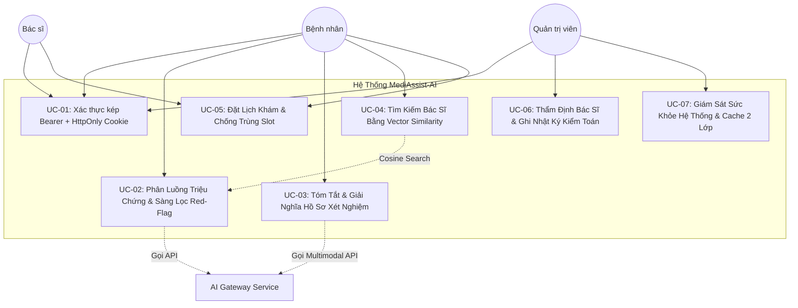

# Đặc Tả Use Case Chuẩn Doanh Nghiệp (Enterprise Use Cases Specification)
## MediAssist-AI Telehealth & Clinical AI Platform

> **Tiêu chuẩn tài liệu:** RUP (Rational Unified Process) & IEEE 830 Standard  
> **Dự án:** MediAssist-AI Telehealth Platform  
> **Trạng thái:** Hoàn chỉnh & Đã phê duyệt (Capstone Baseline)  
> **Các tác nhân chính (Actors):**
> 1. **Patient (Bệnh nhân / Người dùng cuối):** Tìm kiếm bác sĩ, trò chuyện triage triệu chứng, tải lên hồ sơ xét nghiệm.
> 2. **Doctor (Bác sĩ chuyên khoa):** Quản lý hồ sơ CCHN, xem tóm tắt lâm sàng AI, tiếp nhận lịch hẹn.
> 3. **Admin (Quản trị viên hệ thống):** Thẩm định bác sĩ, kiểm soát người dùng, cấu hình danh mục chuyên khoa.
> 4. **AI Gateway (Tác nhân bên ngoài):** OpenAI GPT-4o / Gemini 1.5 Pro & Embedding API.

---

## 1. Sơ Đồ Tổng Quan Use Case (Use Case Diagram)



---

## 2. Chi Tiết Các Use Case Lâm Sàng & Nghiệp Vụ

---

### UC-01: Xác Thực Kép Chuẩn Doanh Nghiệp (Dual-Transport Authentication)

* **Mã Use Case:** `UC-SEC-01`
* **Tác nhân chính:** Patient, Doctor, Admin.
* **Mục tiêu:** Cung cấp cơ chế đăng nhập bảo mật cao, kết hợp linh hoạt giữa Web Browser (`HttpOnly` Cookie chống XSS) và Mobile/Third-party Client (`Bearer` Authorization header).
* **Tiền điều kiện:** Người dùng đã có tài khoản trên hệ thống và trạng thái `is_active = true`.
* **Hậu điều kiện thành công:**
  - Token JWT được sinh ra với TTL 15 phút (Access Token) và 7 ngày (Refresh Token).
  - Trình duyệt lưu cookie an toàn `Set-Cookie: access_token=...; HttpOnly; SameSite=Strict; Secure`.
  - Frontend hydration từ localStorage giữ trạng thái đăng nhập tức thì không giật lag.

#### Luồng sự kiện chính (Happy Path):
1. Người dùng truy cập trang `/login` và nhập Email + Mật khẩu.
2. Trình duyệt gửi `POST /api/v1/auth/login` với body `{ email, password }`.
3. Backend `AuthService` kiểm tra số lần đăng nhập sai (`failed_login_attempts < 5`).
4. `DaoAuthenticationProvider` kiểm tra mã băm mật khẩu với `BCryptPasswordEncoder(12)`.
5. Hệ thống sinh JWT chứa `sub`, `role`, `fullName`.
6. Phản hồi trả về:
   - Header `Set-Cookie` chứa token `HttpOnly`.
   - Body JSON `{ success: true, data: { token, user: { id, fullName, email, role } } }`.
7. Frontend lưu trữ thông tin vào Zustand Auth Store và chuyển hướng người dùng theo role:
   - `ADMIN` $\rightarrow$ `/admin`
   - `DOCTOR` $\rightarrow$ `/doctor`
   - `PATIENT` $\rightarrow$ `/patient`

#### Luồng phụ & Ngoại lệ (Alternative / Exception Flows):
* **3a. Tài khoản bị tạm khóa do nhập sai quá 5 lần:** Hệ thống trả về `HTTP 423 Locked`, ghi log kiểm toán bảo mật và khóa tài khoản trong 30 phút.
* **4a. Sai thông tin đăng nhập:** Hệ thống tăng biến đếm `failed_login_attempts`, trả về `HTTP 401 Unauthorized` với thông báo chung *"Email hoặc mật khẩu không chính xác"* (tránh user enumeration attack).

---

### UC-02: Phân Luồng Triệu Chứng Bằng AI & Rào Chắn Cấp Cứu (AI Symptom Triage)

* **Mã Use Case:** `UC-CLIN-02`
* **Tác nhân chính:** Patient, Trợ lý AI (OpenAI/Gemini/Deterministic Scribe).
* **Mục tiêu:** Thu thập lời khai triệu chứng của bệnh nhân, nhận diện dấu hiệu nguy hiểm (Red-flag), phân loại mức độ khẩn cấp (`ROUTINE`, `URGENT`, `EMERGENCY`), tạo bản tóm tắt SBAR và tự động kết nối đề xuất Bác sĩ chuyên khoa qua `pgvector`.
* **Tiền điều kiện:** Bệnh nhân đã xác nhận đồng ý với *Tuyên bố từ chối trách nhiệm y tế (Medical Disclaimer)*.
* **REST Endpoints:**
  - `POST /api/v1/triage/assess`: Nhận diện triệu chứng, kiểm tra Red-Flag và trả về đánh giá SBAR kèm danh sách Bác sĩ đề xuất.
  - `GET /api/v1/triage/history`: Lấy danh sách lịch sử phân luồng của người dùng hiện tại.

#### Luồng sự kiện chính (Happy Path):
1. Bệnh nhân nhập mô tả triệu chứng: *"Tôi hay bị hồi hộp, đánh trống ngực và choáng váng khi vận động mạnh"*.
2. **Hard Rule Red-flag Check:** `RedFlagService` quét chuỗi triệu chứng bằng các mẫu regex tối cấp (Acute Coronary Syndrome, Stroke FAST, Anaphylaxis, Severe Hemorrhage).
3. Triệu chứng KHÔNG thuộc cấp cứu tức thời:
   - Hệ thống tiến hành phân loại mức độ khẩn cấp (`ROUTINE`).
   - Định hướng chuyên khoa mục tiêu (`Cardiology (Tim Mạch)`).
   - Tạo báo cáo lâm sàng chuẩn SBAR (Situation, Background, Assessment, Recommendation).
   - Tự động gọi `DoctorSemanticSearchService` sử dụng khoảng cách Cosine trên PostgreSQL `pgvector` để tìm top Bác sĩ chuyên khoa tim mạch đã qua thẩm định (`similarity_score > 0.90`).
4. Lưu thông tin phiên vào bảng `triage_sessions`.
5. Giao diện hiển thị thẻ kết quả Triage, lời khuyên của AI, câu hỏi gợi ý và danh thiếp Bác sĩ đề xuất kèm nút *"Đặt Khám Ngay"*.

#### Luồng cấp cứu (Red-Flag Emergency Flow):
* **2a. Phát hiện dấu hiệu đột quỵ / nhồi máu cơ tim / sốc phản vệ:**
  - Hệ thống ngắt quy trình gọi LLM ngay lập tức (0ms LLM latency, 0 token cost).
  - Trả về `isEmergency = true`, mức độ `EMERGENCY`.
  - Màn hình chuyển sang trạng thái cảnh báo đỏ nguy cấp với nút bấm gọi nhanh 115 và hướng dẫn xử trí tại chỗ.

---

### UC-03: Tóm Tắt & Giải Nghĩa Phiếu Xét Nghiệm Bằng AI Đa Phương Thức (Multimodal Document Summarization)

* **Mã Use Case:** `UC-CLIN-03`
* **Tác nhân chính:** Patient, Apache PDFBox Parser, pgvector Semantic Matching Engine.
* **Mục tiêu:** Chuyển đổi kết quả xét nghiệm máu/sinh hóa/nước tiểu từ tài liệu PDF phức tạp thành bảng chỉ số đối chiếu dễ hiểu cho người bệnh, cảnh báo bất thường và đề xuất bác sĩ chuyên khoa phù hợp tức thì.
* **REST Endpoints:**
  - `POST /api/v1/documents/analyze`: Tiếp nhận tệp PDF xét nghiệm qua `multipart/form-data` (tham số `file`), phân tích chỉ số sinh hóa, tóm tắt lâm sàng và kết hợp `pgvector` Cosine Similarity để gợi ý top bác sĩ chuyên khoa.
  - `GET /api/v1/documents/my`: Truy vấn lịch sử các tài liệu y tế đã phân tích của người bệnh đăng nhập (yêu cầu Bearer Token).

#### Luồng sự kiện chính (Happy Path):
1. Bệnh nhân tải lên tệp kết quả xét nghiệm (`.pdf` hoặc `.txt`, dung lượng $\le 15\text{MB}$) hoặc chọn dữ liệu mẫu sinh hóa (Mỡ máu / Men gan).
2. Hệ thống kiểm tra Content-Type, sử dụng `PdfExtractionService` (Apache PDFBox 3.0.4 `Loader.loadPDF`) để bóc tách văn bản thô.
3. `MedicalDocumentAnalysisService` phân tích các chỉ số cận lâm sàng (Cholesterol, Triglyceride, Glucose, Men gan AST/ALT/GGT, Creatinine, eGFR...) bằng biểu thức chính quy chuẩn hóa y khoa.
4. Tự động gắn nhãn trạng thái chỉ số: `ELEVATED` (Tăng cao), `LOW` (Thấp), `NORMAL` (Bình thường) cùng khoảng tham chiếu chuẩn.
5. Xác định chuyên khoa lâm sàng liên quan (`cardiology`, `gastroenterology`, `nephrology`, `neurology`...).
6. Soạn thảo tóm tắt lâm sàng (`clinicalSummary`), bản giải nghĩa bằng ngôn ngữ bình dân (`plainLanguageExplanation`) và bộ 3 câu hỏi tham vấn bác sĩ.
7. Gọi `DoctorSemanticSearchService` chạy truy vấn `pgvector` HNSW Cosine Similarity đối chiếu `clinicalSummary` với `bio_embedding` của các bác sĩ đã được xác minh (`is_verified = true`).
8. Lưu kết quả vào bảng `medical_documents` và `document_analyses`.
9. Giao diện hiển thị:
   - Thanh tiến trình phân tích 3 bước động.
   - Thẻ giải nghĩa dễ hiểu kèm khuyến nghị.
   - Bảng so sánh chỉ số cận lâm sàng với màu cảnh báo đỏ/vàng/xanh trực quan.
   - Danh sách thẻ bác sĩ đề xuất với điểm tương thích ngữ nghĩa (`%`), chuyên khoa và nút bấm *"Đặt Lịch Khám Ngay"*.

---

### UC-04: Tìm Kiếm Bác Sĩ Bằng Vector Similarity Search (Semantic Doctor Discovery)

* **Mã Use Case:** `UC-CLIN-04`
* **Tác nhân chính:** Patient, PostgreSQL với extension `pgvector`.
* **Mục tiêu:** Khớp triệu chứng người bệnh với bác sĩ chuyên khoa sâu có kinh nghiệm điều trị thực tế cao nhất thông qua khoảng cách vector cosine trên chỉ mục HNSW (`vector_cosine_ops`).
* **REST Endpoints:**
  - `GET /api/v1/triage/search/semantic?query={text}&limit={n}`: Tra cứu danh sách bác sĩ tương thích ngữ nghĩa từ câu truy vấn tự nhiên.

#### Luồng sự kiện chính (Happy Path):
1. Người dùng nhập câu tìm kiếm: *"Bác sĩ chuyên tầm soát hẹp mạch vành và rối loạn nhịp tim"*.
2. Hệ thống tạo vector embedding 1536 chiều bằng `EmbeddingService`.
3. Thực thi truy vấn HNSW Vector Search trên bảng `doctor_profiles` với điều kiện `is_verified = true`:
   ```sql
   SELECT dp.*, 1 - (dp.bio_embedding <=> CAST(:vector AS vector)) AS similarity_score
   FROM doctor_profiles dp ...
   ORDER BY dp.bio_embedding <=> CAST(:vector AS vector) ASC
   LIMIT 5;
   ```
4. Trả về danh sách bác sĩ xếp hạng theo độ tương đồng giảm dần (`similarity_score`).
5. Giao diện hiển thị thẻ Bác sĩ gồm: Ảnh đại diện, Học vị, Nơi công tác, Điểm tương đồng (`%`), Giá khám và Nút *"Đặt Khám Ngay"*.

---

### UC-05: Đặt Lịch Khám Từ Xa & Ngăn Chặn Race Condition (Telehealth Appointment Booking)

* **Mã Use Case:** `UC-OPS-05`
* **Tác nhân chính:** Patient, Doctor, Hệ thống thanh toán/đặt chỗ.
* **Mục tiêu:** Đảm bảo một khung giờ (Slot) của bác sĩ chỉ có duy nhất 1 bệnh nhân đặt thành công, ngăn chặn race condition bằng Optimistic Locking (`@Version`), isolation level `REPEATABLE_READ`, và Partial Unique Index.
* **REST Endpoints:**
  - `GET /api/v1/doctors/{id}/slots?date=YYYY-MM-DD`: Tra cứu slot 30 phút khả dụng trong ngày.
  - `POST /api/v1/appointments`: Đặt lịch khám mới (`{ doctorId, scheduledStart, notes }`). Trả về HTTP 201 kèm `appointmentCode`.
  - `GET /api/v1/appointments/my`: Lấy danh sách lịch hẹn của người dùng hiện tại (lọc theo role Patient/Doctor).
  - `PATCH /api/v1/appointments/{id}/status`: Cập nhật trạng thái (`SCHEDULED` -> `COMPLETED` / `CANCELLED`).

#### Luồng sự kiện chính (Happy Path):
1. Bệnh nhân vào trang danh bạ, chọn Bác sĩ, chọn ngày khám và khung giờ còn trống (Ví dụ: `09:00 - 09:30 ngày 12/09/2026`).
2. Bệnh nhân nhập triệu chứng và bấm *"Xác nhận đặt khám"*.
3. Trình duyệt gửi `POST /api/v1/appointments` kèm Bearer token.
4. Backend mở giao dịch `@Transactional(isolation = Isolation.REPEATABLE_READ)`:
   - Kiểm tra xem slot đã có cuộc hẹn nào ở trạng thái không bị hủy chưa qua câu lệnh:
     ```sql
     SELECT COUNT(a) > 0 FROM Appointment a 
     WHERE a.doctor.id = :doctorId AND a.scheduledStart = :scheduledStart 
       AND a.status NOT IN (AppointmentStatus.CANCELLED)
     ```
   - Sinh mã định danh giao dịch chuẩn: `AP-YYYYMMDD-XXXXXX`.
   - Tạo bản ghi mới vào bảng `appointments` với `version = 0`.
   - Ghi nhật ký kiểm toán vào `audit_logs` với action `APPOINTMENT_BOOKED`.
5. Backend trả về HTTP 201 Created cùng `AppointmentDto`.
6. Cuộc hẹn xuất hiện trên bảng điều khiển của cả Bác sĩ (`DoctorDashboard`) và Bệnh nhân (`PatientDashboard`).

#### Luồng xung đột (Conflict Exception Flow):
* **3a. Người khác đã đặt slot trước đó:** `existsConflict` phát hiện trùng giờ $\rightarrow$ Ném ngoại lệ `AppException(HttpStatus.CONFLICT, "SLOT_CONFLICT", ...)`. Backend trả về HTTP 409: *"Khung giờ này đã có bệnh nhân khác nhanh tay đặt trước. Vui lòng chọn khung giờ khác."*

---

### UC-06: Thẩm Định Bác Sĩ & Ghi Nhật Ký Kiểm Toán (Doctor Vetting & Audit Trail)

* **Mã Use Case:** `UC-ADM-06`
* **Tác nhân chính:** Admin, Doctor.
* **Mục tiêu:** Xác minh tính chính danh, bằng cấp và số Chứng chỉ hành nghề (CCHN) của bác sĩ trước khi cho phép hồ sơ hiển thị công khai trên ứng dụng.
* **REST Endpoints:**
  - `GET /api/v1/admin/doctors/pending`: Lấy danh sách hồ sơ bác sĩ chưa xác thực (`isVerified = false`).
  - `POST /api/v1/admin/doctors/{id}/vet`: Phê duyệt hoặc từ chối hồ sơ (`{ approve: boolean, rejectionReason: string }`).
  - `PUT /api/v1/doctors/me/profile`: Bác sĩ tự cập nhật thông tin CCHN, tiểu sử, số năm kinh nghiệm, và giá khám.

#### Luồng sự kiện chính (Happy Path):
1. Admin truy cập đường dẫn `/admin/doctors` (Trang Duyệt Bác Sĩ).
2. Hệ thống gọi `GET /api/v1/admin/doctors/pending` tải danh sách các bác sĩ đang chờ xác minh.
3. Admin kiểm tra số hiệu CCHN, cơ quan cấp phép, số năm kinh nghiệm và chuyên khoa.
4. Admin bấm *"Phê duyệt (Approve)"*:
   - Backend gọi `adminVettingService.vetDoctor(id, true, null, adminId)`.
   - Cập nhật `isVerified = true`, `verifiedAt = NOW()`.
   - Đồng bộ xóa cache: `cacheService.evict("doctors:verified")` trên cả L1 Caffeine và L2 Redis để danh bạ bác sĩ công khai cập nhật ngay lập tức.
   - Ghi nhật ký kiểm toán vào bảng `audit_logs`:
     `action: VET_DOCTOR_APPROVED, actor: admin_id, resource: doctor_profiles/{id}`.
5. Hồ sơ bác sĩ lập tức hiển thị công khai trên `DoctorSearchPage` cho tất cả bệnh nhân tra cứu và đặt lịch.
