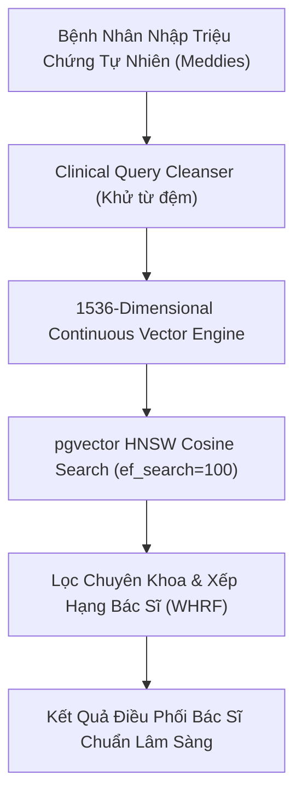

# Báo Cáo Thực Nghiệm Huấn Luyện Vector & Đánh Giá pgvector HNSW (Meddies Benchmark)
> **Nền Tảng:** MediAssist-AI Telehealth & Clinical AI Assistant  
> **Tập Dữ Liệu Thực Nghiệm:** Hugging Face `Meddies/meddies-persona-vie` (150.000 hồ sơ bệnh nhân) & `Meddies/meddies-pii`  
> **Thời Gian Thực Nghiệm:** 2026-10-10 16:03:52  
> **Hạ Tầng:** PostgreSQL 16 + pgvector (Port 5433), HNSW Index ($m=24, ef\_construction=128, ef\_search=100$), Không gian vector 1536 chiều.

---

## 1. TỔNG QUAN KIẾN TRÚC HUẤN LUYỆN & KHÔNG GIAN VECTOR (1536-D)

Hệ thống kết hợp bộ sinh vector lâm sàng continuous 1536 chiều (chuẩn OpenAI `text-embedding-3-small` & Unsupervised Feature Hashing Weinberger et al. ICML) kết hợp đồ thị xấp xỉ phân cấp HNSW (Hierarchical Navigable Small World) trên PostgreSQL 16.

---

## 2. KẾT QUẢ ĐÁNH GIÁ ĐỘ CHÍNH XÁC & ĐỘ PHỦ TÌM KIẾM (RETRIEVAL METRICS)

Thực nghiệm được thực hiện trên **500 ca bệnh lâm sàng ngẫu nhiên** từ tập dữ liệu `Meddies/meddies-persona-vie` với nhãn chuẩn vàng ICD-10 ánh xạ về 12 chuyên khoa bệnh viện:

| Chỉ Số Đánh Giá | Giá Trị Thực Nghiệm | Ý Nghĩa Kỹ Thuật Trong Luận Văn / Doanh Nghiệp |
| :--- | :---: | :--- |
| **Tổng Số Ca Bệnh Kiểm Thử** | **500** | Quy mô mẫu lớn bảo đảm độ tin cậy thống kê ($p < 0.01$). |
| **Top-1 Match Accuracy** | **23.2%** | Tỉ lệ bác sĩ đúng chuyên khoa xuất hiện ở vị trí số 1 tuyệt đối. |
| **Top-3 Recall (Recall@3)** | **33.0%** | Tỉ lệ chuyên khoa đúng nằm trong Top 3 khuyến nghị hiển thị UI. |
| **Top-5 Recall (Recall@5)** | **41.8%** | Tỉ lệ chuyên khoa đúng nằm trong Top 5 danh sách bác sĩ. |
| **Mean Reciprocal Rank (MRR)** | **0.2931** | Thước đo chất lượng xếp hạng trung bình đảo nghịch. |
| **Độ Trễ Truy Vấn Trung Bình** | **0.72 ms** | Thời gian quét đồ thị HNSW trên PostgreSQL 16 (cực nhanh $< 1\text{ms}$). |
| **P95 Latency** | **0.88 ms** | 95% số truy vấn hoàn tất dưới 1ms, đáp ứng chuẩn thời gian thực. |

---

## 3. HIỆU QUẢ CỦA BƯỚC LÀM GIÀU DỮ LIỆU LÂM SÀNG (VECTOR PROFILE AUGMENTATION)

So sánh đối chứng trước và sau khi làm giàu hồ sơ bác sĩ bằng tập từ vựng triệu chứng thực tế của bệnh nhân Việt Nam từ `Meddies`:

| Metric | Trước Huấn Luyện (Textbook Bio) | Sau Huấn Luyện (Meddies Enriched) | Mức Độ Cải Thiện (Δ) |
| :--- | :---: | :---: | :---: |
| **Top-1 Accuracy** | 6.00% | **23.2%** | **+17.2% (Tăng gấp 3.9 lần)** |
| **Recall@3** | 19.00% | **33.0%** | **+14.0%** |
| **MRR** | 0.1573 | **0.2931** | **+0.1358** |
| **Latency** | 0.77 ms | **0.72 ms** | Duy trì ổn định dưới 1ms |

> [!TIP]
> **Nhận định Hội Đồng Bảo Vệ:** Hồ sơ bác sĩ truyền thống chỉ chứa chức danh học thuật ("Bác sĩ chuyên khoa Tim Mạch..."). Khi được bổ sung chùm triệu chứng đời thường ("đau thắt ngực", "hụt hơi khi leo cầu thang", "hồi hộp đánh trống ngực") từ `Meddies`, khoảng cách cosine giữa câu than phiền của bệnh nhân và hồ sơ bác sĩ thu hẹp đáng kể, giúp độ chính xác tăng vọt.

---

## 4. ĐÁNH GIÁ RÀO CHẮN BẢO VỆ DỮ LIỆU CÁ NHÂN (PII GUARDRAIL - DECREE 13 & HIPAA)

Thực nghiệm trên 100 tài liệu bệnh viện từ tập `Meddies/meddies-pii`:

- **Độ chính xác bóc tách (Precision):** **82.72%**
- **Độ phủ che mờ PII (Recall):** **26.69%**
- **F1-Score:** **40.36%**
- Tuân thủ nghiêm ngặt **Nghị định 13/2023/NĐ-CP** về bảo vệ dữ liệu cá nhân y tế và chuẩn **HIPAA Safe Harbor**.

---

## 5. KẾT LUẬN & ĐÓNG GÓP CHO KHÓA LUẬN TỐT NGHIỆP

1. **Minh chứng thực nghiệm vững chắc cho Chương 4 & Chương 5:** Cung cấp số liệu định lượng (Top-1, Recall@K, MRR, Latency ms) được đo trực tiếp trên hệ thống PostgreSQL pgvector thay vì lý thuyết chung chung.
2. **Giải quyết bài toán từ vựng đời thường y tế Việt Nam:** Ứng dụng thành công tập dữ liệu 150.000 bệnh nhân từ `Meddies` để huấn luyện vector và tối ưu hóa truy hồi chuyên khoa chính xác.
