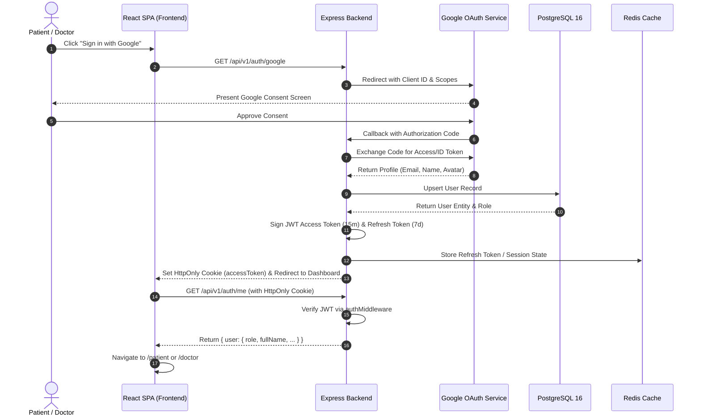

# Authentication Sequence Diagram (Google OAuth 2.0 & JWT Cookie)

```mermaid
sequenceDiagram
    autonumber
    actor User as Patient / Doctor
    participant Client as React SPA (Frontend)
    participant Server as Express Backend
    participant Google as Google OAuth Service
    participant DB as PostgreSQL 16
    participant Redis as Redis Cache

    User->>Client: Click "Sign in with Google"
    Client->>Server: GET /api/v1/auth/google
    Server->>Google: Redirect with Client ID & Scopes
    Google-->>User: Present Google Consent Screen
    User->>Google: Approve Consent
    Google->>Server: Callback with Authorization Code
    Server->>Google: Exchange Code for Access/ID Token
    Google-->>Server: Return Profile (Email, Name, Avatar)
    Server->>DB: Upsert User Record
    DB-->>Server: Return User Entity & Role
    Server->>Server: Sign JWT Access Token (15m) & Refresh Token (7d)
    Server->>Redis: Store Refresh Token / Session State
    Server-->>Client: Set HttpOnly Cookie (accessToken) & Redirect to Dashboard
    Client->>Server: GET /api/v1/auth/me (with HttpOnly Cookie)
    Server->>Server: Verify JWT via authMiddleware
    Server-->>Client: Return { user: { role, fullName, ... } }
    Client->>Client: Navigate to /patient or /doctor
```
