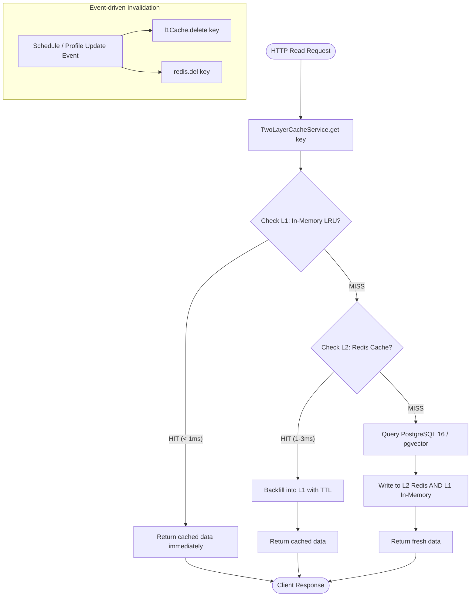

# Two-Layer Cache Architecture Diagram

```mermaid
flowchart TD
    Req([HTTP Read Request]) --> CacheGet[TwoLayerCacheService.get key]
    CacheGet --> L1Check{Check L1: In-Memory LRU?}
    
    L1Check -- HIT (< 1ms) --> RetL1[Return cached data immediately]
    
    L1Check -- MISS --> L2Check{Check L2: Redis Cache?}
    
    L2Check -- HIT (1-3ms) --> BackfillL1[Backfill into L1 with TTL]
    BackfillL1 --> RetL2[Return cached data]
    
    L2Check -- MISS --> DBQuery[Query PostgreSQL 16 / pgvector]
    DBQuery --> BackfillBoth[Write to L2 Redis AND L1 In-Memory]
    BackfillBoth --> RetDB[Return fresh data]

    RetL1 --> Client([Client Response])
    RetL2 --> Client
    RetDB --> Client

    subgraph Invalidation ["Event-driven Invalidation"]
        UpdateEvent[Schedule / Profile Update Event] --> EvictL1[l1Cache.delete key]
        UpdateEvent --> EvictL2[redis.del key]
    end
```
