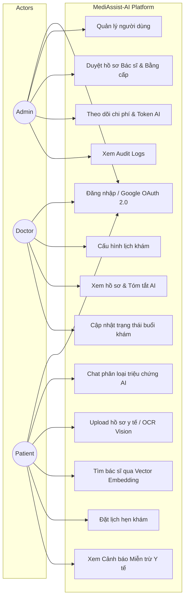

# System Use Case Diagram - MediAssist-AI

```mermaid
graph LR
    subgraph Actors
        Admin((Admin))
        Doctor((Doctor))
        Patient((Patient))
    end

    subgraph "MediAssist-AI Platform"
        UC_Login[Đăng nhập / Google OAuth 2.0]
        UC_ManageUsers[Quản lý người dùng]
        UC_VerifyDoctor[Duyệt hồ sơ Bác sĩ & Bằng cấp]
        UC_MonitorAI[Theo dõi chi phí & Token AI]
        UC_AuditLogs[Xem Audit Logs]

        UC_ManageSchedule[Cấu hình lịch khám]
        UC_ReviewRecords[Xem hồ sơ & Tóm tắt AI]
        UC_UpdateAppt[Cập nhật trạng thái buổi khám]

        UC_TriageChat[Chat phân loại triệu chứng AI]
        UC_UploadDoc[Upload hồ sơ y tế / OCR Vision]
        UC_SemanticMatch[Tìm bác sĩ qua Vector Embedding]
        UC_BookAppt[Đặt lịch hẹn khám]
        UC_Disclaimer[Xem Cảnh báo Miễn trừ Y tế]
    end

    Admin --> UC_Login
    Admin --> UC_ManageUsers
    Admin --> UC_VerifyDoctor
    Admin --> UC_MonitorAI
    Admin --> UC_AuditLogs

    Doctor --> UC_Login
    Doctor --> UC_ManageSchedule
    Doctor --> UC_ReviewRecords
    Doctor --> UC_UpdateAppt

    Patient --> UC_Login
    Patient --> UC_TriageChat
    Patient --> UC_UploadDoc
    Patient --> UC_SemanticMatch
    Patient --> UC_BookAppt
    Patient --> UC_Disclaimer
```
